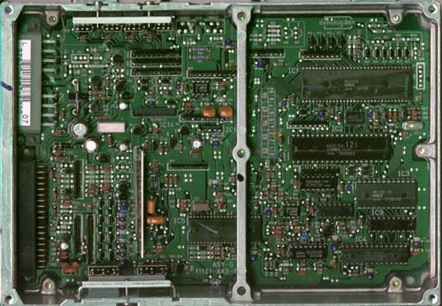

# Chipping the OBD0 PM6 ECU (1988–1991 Civic/CRX Si)

The OBD0 PM6 ECU is the factory engine control unit for the 1988–1991 Honda Civic Si and CRX Si (powered by the D16A6 SOHC engine). Chipping this ECU allows for custom tuning of fuel and ignition maps using editor suites like TurboEdit. 

However, the difficulty of the chipping process depends heavily on the model year of your ECU.

---

## Step 1: Identify Your ECU Version

Before starting any soldering work, open the ECU cover and identify whether you have an early-model or late-model board design.

### Late-Model (1990–1991) with External EPROM
Most 1990–1991 PM6, PM7, PR4, and PP5 ECUs were built with an external, desolderable ROM chip. These boards are straightforward to modify because the memory traces are already routed to a discrete chip location.

*Late-model OBD0 ECU featuring a desolderable factory ROM chip.*

### Early-Model (1988–1989) with Internal ROM
Most 1988–1989 PG7, PM6, PM7, and PM8 ECUs run on a microcontroller with internal memory. They lack a separate external EPROM chip. Chipping these early boards requires complex soldering to add missing logic latches and redirect the MCU address lines. 

*Early-model board layout without a separate external memory chip.*

> [!NOTE]
> If you have an early-model 1988–1989 ECU, see the specialized [Chipping early OBD0 ECUs](/cars/rom/chipping-an88-89ecu) guide for instructions on adding the required hardware.

---

## Step 2: Desoldering and Socketing (Late-Model ECUs)

For 1990–1991 ECUs with a factory external ROM, the chipping process involves replacing the permanent chip with a reusable socket.

### Materials Required
*   28-pin low-profile IC socket
*   Solder wick or a quality desoldering pump
*   Rosin-core electronic solder (60/40 leaded solder is recommended for ease of use)
*   Serrated utility knife or razor blade
*   Compatible programmed EPROM (e.g., SST `27SF256`)

### Procedure

1.  **Remove the Factory ROM:** 
    Using a sharp utility knife or razor blade, carefully slice through the 28 pins of the factory IC close to the plastic body of the chip. 
    
    > **Caution:**
    > Do not apply heavy downward pressure. A slipped blade can easily slice the delicate copper traces on the circuit board, permanently ruining the ECU.

2.  **Clean the Through-Holes:** 
    Once the chip body is removed, heat `each` remaining pin leg on the solder side of the board and pull it out using tweezers. Use desoldering braid or a desoldering pump to clear the factory solder from all 28 holes. The holes must be completely clear so the new socket can slide in without force.

3.  **Install the IC Socket:** 
    Insert a standard 28-pin IC socket into the board, ensuring the notch on the socket matches the notch marker printed on the ECU circuit board. Solder all 28 pins from the underside of the board. Inspect your work with a magnifying glass to ensure there are no cold joints or solder bridges.

4.  **Insert the EPROM:** 
    Insert your custom SST `27SF256` or equivalent EPROM chip into the socket, making sure the chip notch matches the socket notch.
