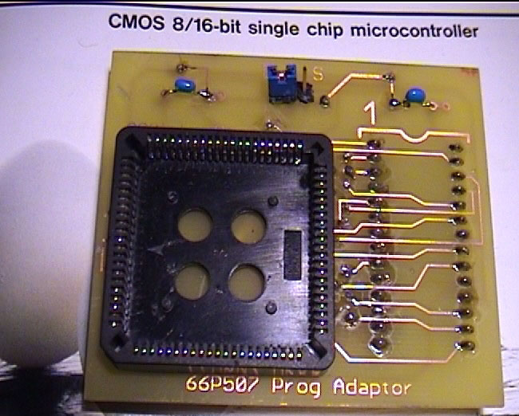

# Chipping OBD2 Honda ECUs (OKI `66507` / `66P507`)

A common misconception is that OBD2 Honda ECUs cannot be chipped. While it is significantly more complex and expensive than chipping OBD0 or OBD1 boards, it is entirely possible. 

Unlike older ECUs that use external memory chips or feature dedicated solder pads for an external EPROM, OBD2 Honda ECUs store their operating code directly inside the internal ROM of the main microcontroller—typically an OKI `66507` series SMT processor. Modification requires replacing this microcontroller entirely.

---

## 1. Hardware Modification & SMT Soldering

Because the factory microcontroller is a surface-mount device (SMD) in a PLCC84 package, standard desoldering pumps are insufficient.

### Recommended Chipping Procedure:

1. **Remove the OEM Processor:** Desolder the factory OKI 66507 processor from the board. Using a hot-air rework station is highly recommended to evenly heat all 84 pins without lifting the delicate copper pads on the multi-layer PCB.
2. **Clean the Pads:** Clean all solder pads on the PCB using solder wick and flux, ensuring a completely flat surface.
3. **Install a Socket:** Solder a PLCC84 surface-mount socket onto the board. This allows you to easily swap programmed microcontrollers later.
4. **Insert the Modified Processor:** Insert a pre-programmed OKI 66P507 (the OTP, or One-Time Programmable, version of the MCU) into the socket.

*Top-down view of a Spoon-modified P73 OBD2 ECU with the main MCU highlighted.*

---

## 2. Programming the OKI `66P507`

Because the OKI `66P507` is an OTP microcontroller, it can only be programmed once. You must write the correct ROM image on the first attempt.

To write data using a standard EPROM burner (such as a Willem or similar device), you must use a custom programming adapter board. This adapter maps the PLCC84 pinout of the OKI chip to the standard DIP28 layout of a 27C512 EPROM.

*A custom programmer adapter designed to mount a PLCC84 OKI microcontroller for programming.*

### Programming Steps:

1. Plug the custom adapter into your EPROM burner.
2. Place a blank OKI `66P507` MCU into the PLCC socket on top of the adapter.
3. Set the programming software to target a standard **27C512 EPROM**.
4. Restrict the target address range to **`$0000` to `$BFFF`** (representing the 48KB ROM code).
5. Set the programming voltage (Vpp) to **12.5V** and select a standard, slow programming algorithm to prevent errors.
6. Ensure the adapter's configuration jumper is set to position **"D"** (Data).
7. Initiate the programming cycle.

### Optional Read Protection (Copy Protection)

To lock the microcontroller and prevent it from being read or cloned:
1. After successfully writing the data, move the adapter jumper to position **"S"** (Security).
2. Write the value **`$00`** to address **`$0000`**. This blows the internal security fuse on the OKI chip.
 
> [!WARNING]
> Only execute this security step *after

* writing the primary ROM data. If you write to the security address first, the MCU will lock immediately, rendering it permanently unprogrammable and useless.

---

## 3. Programming Adapter Schematic

For advanced builders wishing to construct their own programming adapter, the schematic below maps the connections between the PLCC84 MCU socket and the DIP28 programmer interface:

*Click schematic to enlarge.*
