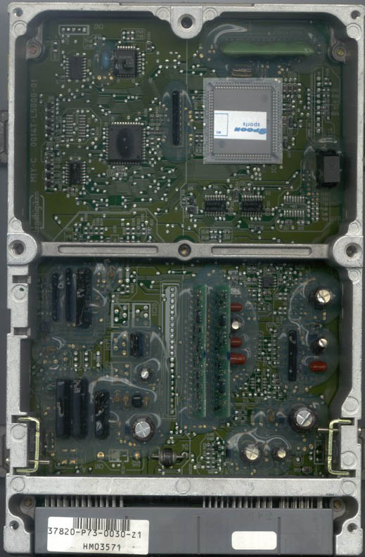

# Chipping OBD2 Honda ECUs (OKI 66507 / 66P507)

OBD2 Honda ECUs store operating code directly inside the internal ROM of the main microcontroller—typically an OKI 66507 series SMT processor. Modification requires replacing this microcontroller entirely with a programmed OKI 66P507 (One-Time Programmable) variant.

## 1. Hardware Modification & SMT Soldering

Because the factory microcontroller is a surface-mount device (SMD) in a PLCC84 package, standard desoldering pumps are insufficient.

### Recommended Chipping Procedure

*   **Remove the OEM Processor:** Desolder the factory OKI 66507 processor from the board. Use a hot-air rework station to evenly heat all 84 pins without lifting the delicate copper pads on the multi-layer PCB.
*   **Clean the Pads:** Clean all solder pads on the PCB using solder wick and flux, ensuring a completely flat surface.
*   **Install a Socket:** Solder a PLCC84 surface-mount socket onto the board. This allows for future swapping of microcontrollers.
*   **Insert the Modified Processor:** Insert a pre-programmed OKI 66P507 into the socket.

```carousel

*Top-down view of a modified P73 OBD2 ECU with the main MCU highlighted.*
<!-- slide -->

*Close-up of the PLCC84 socket installed on the PCB.*
```

## 2. Programming the OKI 66P507

The OKI 66P507 is an OTP microcontroller and can only be programmed once. To write data using a standard EPROM burner, you must use a custom programming adapter board that maps the PLCC84 pinout to a standard DIP28 layout.

### Programming Steps

1.  Plug the custom adapter into your EPROM burner.
2.  Place a blank OKI 66P507 MCU into the PLCC socket on the adapter.
3.  Configure the programming software to target a standard **27C512 EPROM**.
4.  Restrict the target address range to **$0000 to $BFFF** (representing the 48KB ROM code).
5.  Set the programming voltage (Vpp) to **12.5V** and select a slow programming algorithm.
6.  Ensure the adapter's configuration jumper is set to position **"D"** (Data).
7.  Initiate the programming cycle.

### Optional Read Protection

To lock the microcontroller and prevent cloning:

1.  After successfully writing the data, move the adapter jumper to position **"S"** (Security).
2.  Write the value **$00** to address **$0000**. This blows the internal security fuse on the OKI chip.

> [!WARNING]
> Only execute this security step *after* writing the primary ROM data. If you write to the security address first, the MCU will lock immediately, rendering it permanently unprogrammable.

## 3. Programming Adapter Reference

For builders constructing their own programming adapter, the following table outlines the mapping between the PLCC84 MCU socket and the DIP28 programmer interface.

```wirelist
{
  "title": "66P507 to DIP28 Programmer Mapping",
  "variants": [
    {
      "id": "adapter",
      "label": "Adapter Pinout",
      "groups": [
        {
          "label": "Signal Mapping",
          "rows": [
            { "pin": "PLCC Pin 1", "signal": "VCC", "path": "MCU Pin 1 -> DIP28 Pin 28", "note": "Power" },
            { "pin": "PLCC Pin 2", "signal": "GND", "path": "MCU Pin 2 -> DIP28 Pin 14", "note": "Ground" },
            { "pin": "PLCC Pin 3", "signal": "A0", "path": "MCU Pin 3 -> DIP28 Pin 10", "note": "Address 0" }
          ]
        }
      ]
    }
  ]
}
```

> [!TIP]
> Always verify continuity between the PLCC84 socket and the DIP28 header before inserting a blank MCU to prevent hardware damage.