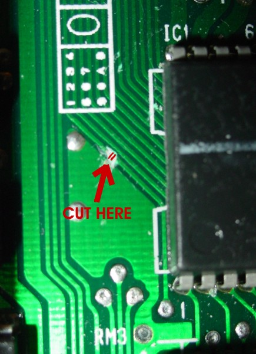
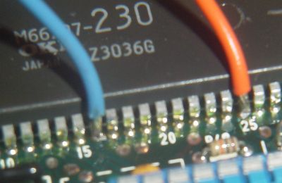
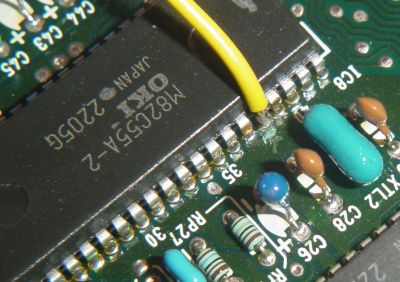
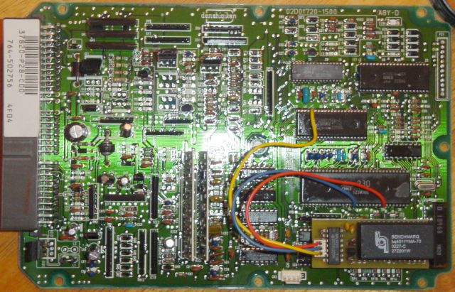

# Easy-RTP v1.0 OBD1 installation

These archived instructions describe installing a completed Easy-RTP v1.0 board in an OBD1 P28 ECU by interrupting the CPU write-enable circuit and connecting the RTP board to the required address and write signals.

> [!WARNING]
> The source explicitly labels these instructions preliminary and asks readers to double-check them. The procedure severs an ECU-board trace and requires soldering directly to IC pins. Verify every signal and pin against the target ECU before applying power.

Build the module first using the [Easy-RTP v1.0 assembly guide](/cars/rom/easy-rtp-v10). The source expects OBD1 boards to be similar, but only shows a P28 installation and separately lists different pins for a surface-mount JDM P30-900.

## Removable connection

The installation interrupts the write-enable (`WE`) signal from the MCU. The source uses a removable plug between the ECU and RTP board so a small jumper plug can reconnect the original circuit when the RTP board is removed.

Use small-gauge wire because the solder points are small. The source suggests wire-wrap wire and notes that a right-angle header on the RTP board would leave more clearance for the ECU case.

*Archived photo of the removable connections; the severed trace is visible in the background.*

## P28 installation procedure

1. Locate and sever the MCU `WE` trace shown in the archived marked-up image.

   
   *Archived image marking the write-enable trace cut.*

2. Connect the RTP board's `A15` wire to MCU Pin 16. The source says this MCU address line is otherwise unused and is used to address the writable ROM image.
3. Connect the MCU side of the severed `WE` trace, MCU Pin 25, to `WE in` on the RTP board. The source recommends tinning both the IC pin and wire before soldering.

   
   *Archived photo of the A15 and MCU-side WE connections.*

4. Connect the other side of the severed write-enable circuit to Pin 38 of the M82C55A. The source says this lets the RTP board enable NVSRAM writes only when A15 is high.

   
   *Archived photo of the connection to the opposite side of the severed circuit.*

5. Inspect every connection and confirm the severed trace is isolated before testing.

   
   *Archived photo of the completed installation.*

## Surface-mount JDM pin note

The source gives these alternate pins for a JDM P30-900 and says they most likely apply to other JDM ECUs. That broader compatibility was not confirmed.

| Signal | Surface-mount device pin | DIP device pin used above |
| --- | ---: | ---: |
| A15 on M66207 | 17 | 16 |
| WE/WR on M66207 | 27 | 25 |
| WE/WR on 82C55 | 40 | 38 |

## Restoring the original write-enable path

The source routes the two halves of the cut write-enable circuit to RTP-board connections 1 and 3. When the RTP module is absent, its proposed dummy plug simply joins those two wires so a standard ROM can be used.

> [!WARNING]
> Confirm the connector numbering and continuity on the actual installation. A wrongly wired jumper could connect unrelated signals or leave the original write-enable path open.

## Datalogging connection

After the RTP hardware is installed, the archived page says an RS232-to-TTL converter is needed for ECU-to-PC communication. See the [Honda ECU datalogging overview](/cars/diagnostics/data-logging) and [serial communication guide](/cars/tuning/serial-communication) for the historical interface context.

## Related

- [DIY Easy-RTP v1.0 build and installation guide](/cars/rom/easy-rtp-v10)
- [Honda ECU datalogging overview](/cars/diagnostics/data-logging)
- [OBD1 serial communication](/cars/tuning/serial-communication)
