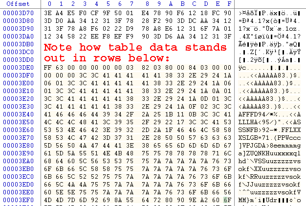
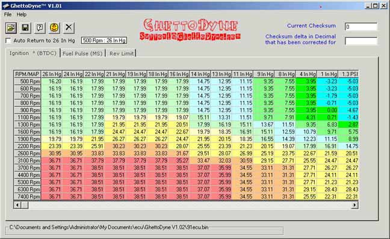
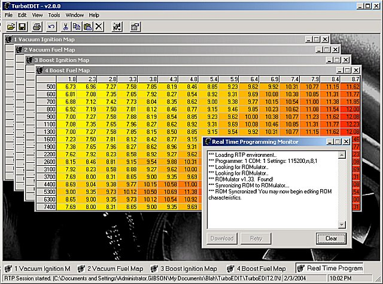
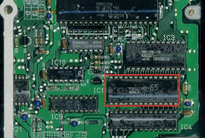
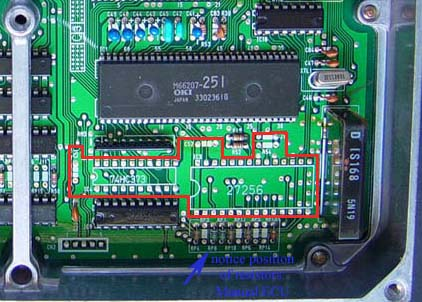
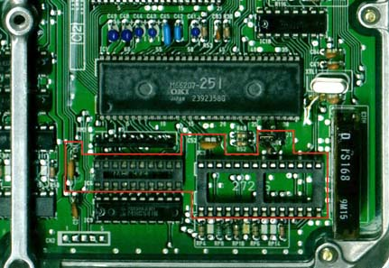

# Introduction To ECU Chipping

##  Introduction to ECU Chipping 

by David Blundell Please feel free to link to this article, but "mirroring" is highly discouraged, as you will not automatically receive updates. ###  How it all works 

With the move from carburetors to fuel injection, computers have assumed an important role in the proper functioning of an engine. The level of precise control possible with a [ECU](/cars/ecu/ecu) (Engine Control Unit - computer for running an engine) can not only allow for greatly improved fuel economy, but can also allow for fine tuning of an engine to a degree that is arguably impossible with the best carburetors. Many [ECU](/cars/ecu/ecu)s, including those made by Honda, do data interpolation, allowing them to intelligently compensate for engine conditions that fall "between" known states, allowing for an almost continuously variable response to varying engine conditions. Additionally, the [ECU](/cars/ecu/ecu) can make small corrections to fuel/timing based on the state of various engine sensors. It is probably fairly fair to say that from the factory, most manufacturers tune for fuel economy, emissions and poor quality gasoline as opposed to power and race gas. Honda is no exception to these rules about tuning. Basis for this can be seen very clearly by comparing European/US fuel and timing maps to Japanese timing maps for the same engine. Japanese have gasoline that is on average a minimum of about 10 octane points greater than gas sold in the US. Comparing JDM and USDM/EDM timing curves generally show the JDM maps having several degrees more spark advance, reflecting the manufacturer's expectation of better quality gasoline. You have to wonder about how much 205 HP out a 1.8L (ITR) can be improved on within the constraints of pump gas. It wouldn't surprise anyone if another 5-10 peak HP and a considerable amount of low-midrange torque could be squeezed out of an ITR by HOURS on a dyno, and some changes to the [ECU](/cars/ecu/ecu) program. This goes to show that even on Honda's "performance" motors, very conservative assumptions are made about the quality of gasoline used. If you are willing to run high octane gasoline consistently, significant performance improvements can usually be found by tuning the car for the better quality gas. This does bring us to an important point. Tuning is best something done on a dyno that can simulate loads (such as a Dynapack or Mustang dyno). Dynojets are only useful for tuning a much narrow range of operating conditions, namely acceleration at wide open throttle through the rev reange. When a Dyno is not available, something to give an objective measure of how the car is responding is a good second choice. Wideband O2 meters and [EGT](/cars/tuning/exhaust-gas-temp-sensor) probes can give you some idea of what is going on. Widebands generally provide more direct information about Air Fuel Ratio, but they are generally ineffective for timing adjustment. [EGT](/cars/tuning/exhaust-gas-temp-sensor) probes tell how how the exhaust leaving a motor is, which can be used to infer a lot of information. If Air Fuel Ratio is left relatively constant, most changes in EGTs can be attributed to timing adjustment. Air Fuel Ratios will cause changes in EGTs so make sure you have your AFRs nailed reasonably close to your target *before* trying to use an EGT to tune your timing. This article in intended as a **brief** introduction, so enough of that. Don't despair if you don't have access to a dyno, however. Accelerometers (like the G-Spot) measure acceleration forces with fairly good (&lt;1%) [precison](https://en.wikipedia.org/wiki/Accuracy_and_precision). If you can record this information as part of your Data Logging procedure, you can do some math knowing the weight of the vehicle and its gearing to come up with horsepower and torque output figures for the car. Again, this method has fairly good [precison](https://en.wikipedia.org/wiki/Accuracy_and_precision) but relatively poor [accuracy](https://en.wikipedia.org/wiki/Accuracy_and_precision). The numbers themselves don't mean a lot, but if you can produce significant and consistent improvements, you have tuned the car better. A final note about tuning tools - the "butt dyno" is a totally inappropriate way to determine how the car is performing - most of the changes you will make to a computer program will be subtle enough that you probably will not be able to "feel" them accurately. The butt dyno has almost zero precision - I've had many kids report "very different" results from no real changes to a chip. Also, the butt dyno is much better for detecting rapid increases in torque than consistently more torque. Consistent torque is what makes a car fast, not how quickly torque increases. What this means concretely is that a car may "feel" faster on the butt dyno because it has sharp spikes of torque, but in reality it is slower than a car with a smoother powerband with gradual increases in torque. Beware of most aftermarket "chips": more often than not these programs just dump more fuel and increase timing greatly while doing things like raising revlimiters far beyond safe levels. There are very limited gains to be had from most "performance chips." Tuning not "chipping" generally produces usable, real world gains. That being said, changing the program of a [ECU](/cars/ecu/ecu) is generally not that tricky. First, it would probably be wise to focus on some basics of how [ECU](/cars/ecu/ecu)s work so that it is more apparent where we could makes changes to have a positive effect on performance. Most [ECU](/cars/ecu/ecu)s seem to operate in two modes. In one mode, the [ECU](/cars/ecu/ecu) is monitoring as many engine sensors as possible, trying to get the best fuel economy. This mode is normally referred to as "closed loop" because it is a closed feedback system. In the other mode, the [ECU](/cars/ecu/ecu) runs a much simpler routine that is most often engaged at wide open throttle. This mode is normally called "open loop" because it does not continuously monitor sensors and compute fuel correction. Open loop conditions are generally stored in the form of a table where the [ECU](/cars/ecu/ecu) "looks up" fuel and timing values using a relatively simple algorithm. Modifying fuel and timing tables is the most basic way to retune a car, however it bears remembering that the [ECU](/cars/ecu/ecu) will be making adjustments to whatever information it has. In most cases, open loop table values serve as base values for closed loop fuel correction routines to adjust, but it is difficult to change the exact behavior of adjustment routines. Problematic closed loop correction routines require an understanding and possibly a re-write of the code running the [ECU](/cars/ecu/ecu) to be fixed properly. You can completely change the operating characteristics of an engine by changing the fuel and timing tables around. As an example, a PM6 (88-91 Civic/CRX Si) [ECU](/cars/ecu/ecu) is normally used to run a D16A6, ~100HP. By little more than changing the fuel, ignition tables and the revlimiter, a PM6 can run a DOHC ZC, ~135HP, like it came out of the factory. Additionally, little more than even more fuel/ignition map changes and revlimiter changes are all that is needed to make it run a B18A/B18B or a B20B! Virutally the same [ECU](/cars/ecu/ecu) hardware runs a D16Z6 SOHC VTEC and a B16A2/A3 DOHC VTEC motor - swapping chips will let one motor's [ECU](/cars/ecu/ecu) run the other motor, and vise versa. In another more extreme example, a friend of mine recently had success running a 2G accord engine with a GM computer! As I hope you have gathered, there is a certain amount of art and a lot of skill/experience involved in tuning a car well. An adequate explanation of how to tune a car perfectly is far beyond both the scope of this article and my expertise. Please, be careful changing your engine's fuel/timing tables - understand that timing changes can completely change the operating characteristics of the engine! Please be very careful, especially when doing baseline tunes - you can destroy your engine in seconds with a bad program. Use proper tools (wideband, EGT, accelerometer, dyno) whenever possible. We are now going to **assume** that you now know what fuel and timing adjustments you need to make, regardless of whether this is actually the case. With that hefty disclaimer out of the way, the tools and methods from this point forwards are going to become a lot more specific: - Hexediting and Raw ROM editing
- ROM Editors
    - Ghettodyne (OBD0)
    - Turboedit (OBD0)
    - BRE (Ben's ROM Editor - OBD0 VTEC)
    - Uberdata (OBD1)
    - Crome (OBD1)
- Chipping an ECU: hardware
    - Chips and ROM Burners
    - Soldering and Desoldering gear
    - OBD0 ECU Chipping
    - OBD1 ECU chipping
    - OBD2 ECU Chipping
- Troubleshooting

---

####  Hexediting and Raw ROM editing 

Hex is base a 16 numbering system. Instead of digits from 0 to 9, hex uses digits from 0 to F. So A = 10, B = 11, ... F = 15. Typically we distinguish hex numbers from other numbers by either putting 0x at the front of the number or putting an 'h' at the end. i.e. 0xFE and FEh are both the hex number FE. Fuel and timing tables are stored in the middle of the code running the [ECU](/cars/ecu/ecu). Distinguishing them from code is generally not THAT hard because they "look" different than the pseudorandom data that runs the computer. A hex editor will let you manipulate the raw data in the [ECU](/cars/ecu/ecu). [WinHex](http://www.x-ways.net/winhex/index-m.html) is a quality, shareware hexeditor available from www.download.com. You might want to grab some checksum utilities from www.keil.com as they're generally useful. In winhex: So, you've found the fuel and timing tables in your [ECU](/cars/ecu/ecu)'s program, edit away. How do you interpret all this? Well, first you mut know about the addresses. Each byte has its own address referenced by the left most column (the "offset" column) and the top row. As an example, look to the bottom right corner of the above picture. Notice the byte that has 6f as its value. Follow the row to the corresponding row in the offset column and you will see a 3ef0. Then follow 6f's column all the way up to the F on the top row. Put those values together and you have the address of the 6f byte: 0x3eff. Now what? This data is the binary representation of the actual machine code that runs in the ECU's processor and ROM data that the [ECU](/cars/ecu/ecu) uses. To figure out what it does you must use a disassembler to convert the binary code/data into the machine code instructions which are more human readable. Most [ECU](/cars/ecu/ecu)s have a Check Sum routine - the checksum gods must be appeased after any changes to the ROM are made or the car will not run properly. It would take a long time to tune a car if everyone only had hexeditors at their disposal. In many cases, ROM editors are available to assist in the tuning process. ---

####  ROM Editors 

Remember, anything you can do with a ROM editor can be done by hand with a hexeditor too. Although most ROM Editors are specific to one or more [ECU](/cars/ecu/ecu)s, most are fairly similar visually - Understanding Maps has a lot of pictures and more hands-on explanation of editor-based fuel and timing table adjustment. Most of the concepts will apply to any and all editors. ---

#####  Ghettodyne (OBD0) 

Ghettodyne (available at [http://web.archive.org/web/20110128180504/http://ghettodyne.com/](http://web.archive.org/web/20110128180504/http://ghettodyne.com/)) is a free ROM editor that was the first to support the PM6 (88-91 CRX/Civic Si) [ECU](/cars/ecu/ecu). **It is no longer being actively developed.** To give you an idea of what ghettodyne looks like: ---

#####  Turboedit (OBD0) 

[TurboEdit](http://web.archive.org/web/20220701161603/https://turboedit.org/) has since largely replaced Ghettodyne as the most actively developed OBD0 ROM editor. It supports ROMs based off the PM6 and PM7 codebase at this point. Close communication between [Team OBD0](/pgmfi/wiki/home/team-obd0) and Jason Parker, TE's author, ensure that it supports the latest features quickly. As you can see, the interface is very similar to earlier editors: - [Turboedit forum on PGMFI](/pgmfi/forum/forum.php?id=39) - editor mainly
- [8XC154 Development forum on PGMFI](/pgmfi/forum/forum.php?id=7) - new ROMs and code

---

#####  BRE (Ben's ROM Editor - OBD0 VTEC) 

BRE is arguably one of the best editors for OBD0Vtec [ECU](/cars/ecu/ecu)s, like the PR3 and PW0. It runs under Windows. Hopefully Ben will come by and add more information about it. - [BRE forum on PGMFI](/pgmfi/forum/forum.php?id=36)
- [OBD0 VTEC development forum on PGMFI](/pgmfi/forum/forum.php?id=14)

---

#####  Uberdata (OBD1) 

Uberdata was the first publicly available ROM Editor for OBD1 Civics/Integras, written by Blake Warner (Uberteg). It uses primarily the P72 and P75 code, but has been adapted to run almost any Honda motor. It has solid boost support, support for the Transtronics Romulator, and recently added support for inline assembly scripting. It runs on windows. - [Uberdata forum on PGMFI](/pgmfi/forum/forum.php?id=27)
- [The Home of Uberdata](http://www.ecimulti.org/uberdata)
- [OBD1 Development forum on PGMFI](/pgmfi/forum/forum.php?id=8)

---

#####  Crome (OBD1) 

Crome is the first scriptable OBD1 ROM Editor, written by John Cui. Core features are designed for the JDM P30 "203" code, but it has support for many other ROMs to lesser degrees. The new version of Crome (March 04) supports the PGMFI Real Time Programming solution, and has improved boost code compared with earlier versions. It also has a new plugin interface allowing HTML based front ends to scripts. - [Crome forum on PGMFI](/pgmfi/forum/forum.php?id=35)
- [OBD1 Development forum on PGMFI](/pgmfi/forum/forum.php?id=8)

---

####  Chipping an ECU: hardware 

#####  Chips and ROM Burners 

At this point, the assumption will be made (regardless of whether it is actually true) that you have successfully created a new ROM image and you want to put it into an [ECU](/cars/ecu/ecu). The next step towards reprogramming is to take the electronic image you have created and program it into an EPROM(Erasable Programmable Read Only Memory). EPROMs for automotive use are generally 128K, 256K or 512k in size. Almost all 88-95 Hondas use a 27 `C256` EPROM. There are many kinds of Chips For ECUs that you can use. Pay attention to the speed of the chip and whether your Rom Burner can program it. ROM burners are the devices used to program chips. It does not really matter which model you get as long as it can program Chips For ECUs. The Rom Burner Wiki entry has a list of some common types of burners used for [ECU](/cars/ecu/ecu) programming, and has links to reviews and prices in some cases. It doesn't matter WHICH programmer you have; being able to program the right chips matters. #####  Soldering and Desoldering gear 

I purchased a Xytronics soldering and Desoldering Station with temperature control for under $400 shipped from Howard Electronics Inc. Professional desoldering tools with integrated vacuum sources can be obtained readily from ebay or other merchants - Pace and Metcal gear is always on ebay. I've spoken with plenty of people who purchased professional gear for under $100 that has worked well for them. If you do a lot of [ECU](/cars/ecu/ecu)s, a quality Desoldering Station will be one of yoru favorite tools for the time and suffering it saves. On the cheaper/DIY side, there are several other tools that work adaquately. A cheap Desoldering Iron will work pretty well, especially with the right tip and some small mods. Often, an existing Desoldering Tool can be modified to make it more effective. Desoldering Braid can be very effective when used properly, and can even be superior to a Desoldering Station in some cases. A quality Soldering Iron is another tool that you will thank yourself for purchasing every time you use it. Small tips and less power will make things easier on you. Temperature control is a nice feature, although by no means required. I have had a lot of luck with the cheapie 12-15W 3-prong blue Rat Shack irons in a pinch. Learning To Solder and Desoldering Tips contain a lot of good tips for those starting out, but there really is no substitute for practice. Working on a couple of sacrificial [ECU](/cars/ecu/ecu)s/circuit boards prior to an [ECU](/cars/ecu/ecu) that needs to go in your vehicle is probably a really good idea. Much like welding, getting comfortable with the iron, solder and workspace you have is key! I messed up about half of the first dozen [ECU](/cars/ecu/ecu)s I did. Most were simple poor solder joints that were easily fixed, although I cooked two PR3s by not desoldering them fully and ripping the pads + traces off the board. Repairing a destructive soldering adventure like that can be very stressful and difficult. After buying my Desoldering Station, I've fried approximately 3 [ECU](/cars/ecu/ecu)s out of 200. (and one of those I still think was a bad alternator/voltage reg...) Part of this was certainly practice, but having the right tools made a **big** difference. ---

#####  OBD0 [ECU](/cars/ecu/ecu) Chipping 

If you have a OBD0 [ECU](/cars/ecu/ecu), chipping the [ECU](/cars/ecu/ecu) might not be straightforward. Almost ALL 90-91 PM6, PM7, PR4 and PP5(with catalytic converter) [ECU](/cars/ecu/ecu)s had external EPROMs, and are easy to change the program on. Almost all 88-89 PG7, PM6, PM7 and 88-91 PM8 [ECU](/cars/ecu/ecu)s did not have an external EPROM. It is possible to chip these [ECU](/cars/ecu/ecu)s, but it requires considerably more work and is beyond the scope of this article. See Chipping An88-89 ECU for more details. The following [ECU](/cars/ecu/ecu) is a PM7 that does not have an external ROM: If you are luckier and have an [ECU](/cars/ecu/ecu) with an external EPROM from the factory, the [ECU](/cars/ecu/ecu) you have will look more like this: An OBD0 [ECU](/cars/ecu/ecu) with an external EPROM is very simple to chip. First, cut all 28 pins with a razor blade or utility knife. BE CAREFUL YOU DO NOT SLIP AS YOU CAN PERMANENTLY DAMAGE THE CIRCUIT BOARD. It is not absolutely necessary to do this before desoldering, but removing the chip will make it much easier, particularly if you do not have a good desoldering station. Once the original ROM is desoldered and removed and you can see through the holes in the circuit board, add a socket for an EPROM and then place the new ROM you have created into the socket. ---

#####  OBD1 [ECU](/cars/ecu/ecu) chipping 

Now, with your new EPROM ready, crack the case of your [ECU](/cars/ecu/ecu). All 92-95 [ECU](/cars/ecu/ecu)s made by Honda were able to accept an external EPROMs, even if they did not come with one from the factory. All 92-95 [ECU](/cars/ecu/ecu)s use the same procedure for chipping. Beginners beware of Japanese [ECU](/cars/ecu/ecu)s as they use surface mount components that are marginally harder to work with than US/European [ECU](/cars/ecu/ecu)s. See here for Chipping JDMP30 [ECU](/cars/ecu/ecu).The section of the example P28 93 Civic Si [ECU](/cars/ecu/ecu) that is important for chipping is outlined in red in the following picture: (Honda was nice and outlined it in a dashed white line for you on the board too) First, you must de-solder the parts silkscreened in white on the circuit board. Once all the pads are desoldered and you can see through holes for components in the red section above, you need to start soldering in components. No bizarre components are used - everything should be readily obtainable from your local electronics store, Radio Shack, Digikey, Newark Electronics or just about any other electronic parts distributor. Honda was nice enough to label on the board where everything goes. Place the 74 HC373 chip on the board where indicated and solder it in place. `R54` should be filled with a 1k to 1.2k resistor(the exact value does not matter). `C51` and `C52` are 0.1µf ceramic disc capacitors(12V or better will work fine). Place a 28 pin socket for the ROM where 27256 is marked. (BTW, spend a bit more money and get the much higher quality machined-pin sockets instead of the cheapy bent metal leaf type.) Once the socket is in place, place a the ROM you programmed earlier in it. Finally, connect `J1` with a small wire to enable the external ROM. No changes other than cutting `J1` are needed to restore the [ECU](/cars/ecu/ecu) to its original state. Here you can see a chipped P28 [ECU](/cars/ecu/ecu). The person who chipped it used a socket for the `74HC373` as well as for the ROM socket, and used a real jumper instead of just connecting `J1` with a wire. Nevertheless, it will give you an idea of what it should look like when you are done: ---

#####  OBD2 [ECU](/cars/ecu/ecu) Chipping 

If you have a OBD2 [ECU](/cars/ecu/ecu), you are just going to have to wait or buy commercial Tech Tom gear. It is possible to remove the 66K MCU and replace it with another OTP 66P507 or FLASH 66Q589 (As the case may be) but this is far from trivial. Little is known about OBD2 code. See Chipping OBD2 by Doc ---

####  Troubleshooting 

At this point, you should have a working [ECU](/cars/ecu/ecu) with a new program. If you get a solid red light on a OBD0 [ECU](/cars/ecu/ecu) or a continuous CEL on OBD1 car and the car runs terribly with a very low rev limit and a stumbling idle, you probably have a bad connection. If the same thing happens 30-45seconds after you start the car, you probably failed to pray to the checksum gods. If the car runs weird, try putting a stock program in an verifying that the fuel/timing changes you made were not detrimental. ---

##  Conclusion 

Hopefully, at this point, you have learned a little about [ECU](/cars/ecu/ecu)s, how they work and break, and how to modify them. If you have further interest check out the rest of the Wiki, or Further Reading. The [ECU](/cars/ecu/ecu) is just a tool allowing precise fuel and timing delivery - knowing how to modify the [ECU](/cars/ecu/ecu) itself is only half the battle to having a well tuned car. Spend the time and budget the money for the right tools to tune the car, not just chip the [ECU](/cars/ecu/ecu).
