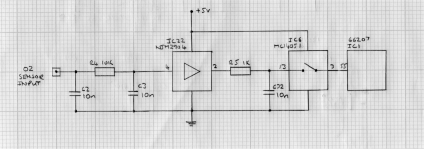
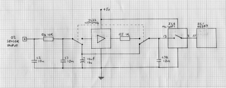
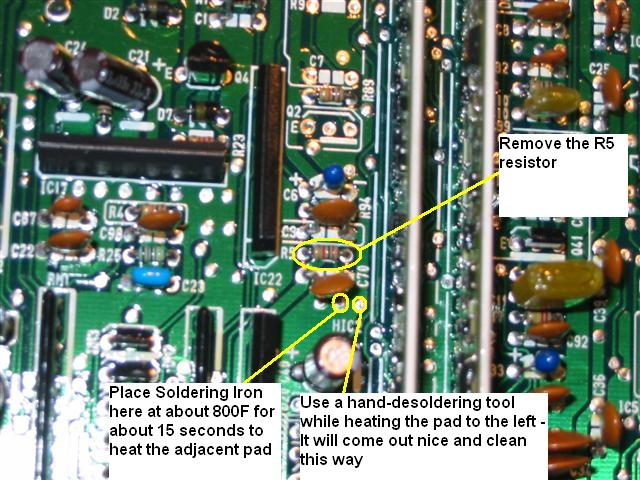
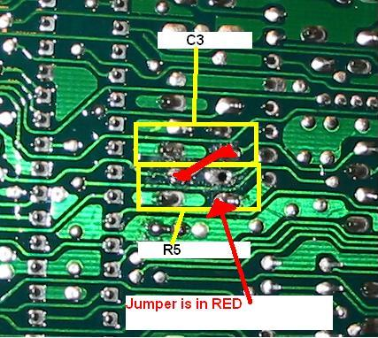

# ECU 0-5V Wideband O2 Input Modification

The standard Honda ECU O2 sensor input circuit is designed for narrowband sensors, which typically operate within a 0-1V range. Internally, the ECU's Analog-to-Digital Converter (ADC) is configured to read 0-5V, but the O2 input signal path includes an Op-Amp stage that limits the maximum voltage seen by the ADC to approximately 3.8V. 

To utilize a 0-5V wideband O2 signal, the Op-Amp stage must be bypassed to allow the full voltage range to reach the multiplexer (Mux).

## Modification Procedure

The modification involves bypassing the Op-Amp stage by lifting a specific resistor and creating a jumper connection to route the signal directly to the Mux.

> [!CAUTION]
> This modification involves delicate PCB work. Ensure you have proper soldering equipment and experience with surface-mount components to avoid damaging the ECU board.

### Visual Reference

```carousel

*Standard O2 input signal path showing Op-Amp limiting*
<!-- slide -->

*Modified signal path bypassing the Op-Amp for 0-5V input*
```

### Implementation Steps

1. **Locate the Op-Amp stage:** Identify the resistor responsible for the voltage limiting on the O2 input path.
2. **Bypass the circuit:** Lift the resistor leg to disconnect the Op-Amp from the signal path.
3. **Install jumper:** Use the capacitor lead or a suitable jumper wire to bridge the connection, routing the O2 input directly to the Mux.

```carousel

*Close-up of the target resistor and surrounding components*
<!-- slide -->

*Completed modification showing the capacitor lead used as a jumper*
```

## Verification
Once the modification is complete, apply a 5V signal to the O2 input pin. Use your tuning software to monitor the O2 voltage reading. The ECU should now register the full 0-5V range, confirming the Op-Amp has been successfully bypassed.