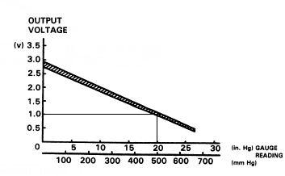

# OBD1 8-bit MAP Calibration in Millibars

This reference provides the MAP conversion formulas and P72/P75 calibration values used in OBD1 ROM code. These values are intended for understanding legacy ROM structures and should be verified against specific ECU code, fuel-cut offsets, and sensor hardware before implementation.

> [!NOTE]
> Most OBD1 ECUs follow similar logic, but verify the actual ROM code, fuel-cut offset, and sensor calibration before applying these formulas to non-P72/P75 applications.

## Basic MAP-Byte Formulas

The following formulas assume a stock MAP sensor maximum reading of 1764 mbar.

### Stock Configuration
Stock code utilizes a halved MAP byte value:
`pressure_mbar = (1764 / 255) * (map_byte / 2)`

### Uncorked Configuration
When the ROM's MAP value is uncorked, the division by two is removed:
`pressure_mbar = (1764 / 255) * map_byte`

### Voltage Formulas
The following formulas define the relationship between raw values and voltage, where the fuel-cut offset is 24 (located at address `0x4DCC` in the referenced code):

*   **Stock MAP:** `volts = (5 / 255) * ((raw / 2) + fuel_cut)`
*   **Boost MAP:** `volts = (5 / 255) * (raw + fuel_cut)`

## Voltage Conversion

The following linear conversions are derived from standard vacuum and absolute pressure points:

*   **Inches of Mercury (inHg):** `inHg = 20 * volts / 1.85 - 30.81`
*   **Millibars (mbar):** `mbar = 365.9 * volts - 29.9`

| Scale | Point 1 | Point 2 |
| :--- | :--- | :--- |
| **Vacuum** | 2.85 V = 0 inHg | 1.0 V = 20 inHg |
| **Absolute Pressure** | 2.85 V = 1013 mbar | 1.0 V = 336 mbar |

## Calibration Values

> [!CAUTION]
> The source documentation labels the final full-scale row as `256`. As an unsigned 8-bit value tops out at `255`, this value is preserved as an endpoint reference from the original technical notes.

### Full Raw-Value Calibration
| Source Raw Label | Voltage | Pressure |
| :---: | :---: | :---: |
| 0 | 0.471 V | 142.3 mbar |
| 24 | 0.706 V | 228.4 mbar |
| 48 | 0.941 V | 314.5 mbar |
| 80 | 1.255 V | 429.3 mbar |
| 128 | 1.725 V | 601.5 mbar |
| 176 | 2.196 V | 773.6 mbar |
| 208 | 2.510 V | 888.4 mbar |
| 224 | 2.667 V | 945.8 mbar |
| 240 | 2.824 V | 1003.0 mbar |
| 256 | 2.980 V | 1061.0 mbar |

### Halved Stock-Map Calibration
| Halved Stock Label | Voltage | Pressure |
| :---: | :---: | :---: |
| 0 | 0.471 V | 142.3 mbar |
| 12 | 0.706 V | 228.4 mbar |
| 24 | 0.941 V | 314.5 mbar |
| 40 | 1.255 V | 429.3 mbar |
| 64 | 1.725 V | 601.5 mbar |
| 88 | 2.196 V | 773.6 mbar |
| 104 | 2.510 V | 888.4 mbar |
| 112 | 2.667 V | 945.8 mbar |
| 120 | 2.824 V | 1003.0 mbar |
| 128 | 2.980 V | 1061.0 mbar |

## Sensor Interface

*Archived schematic for the three-wire MAP sensor interface.*
