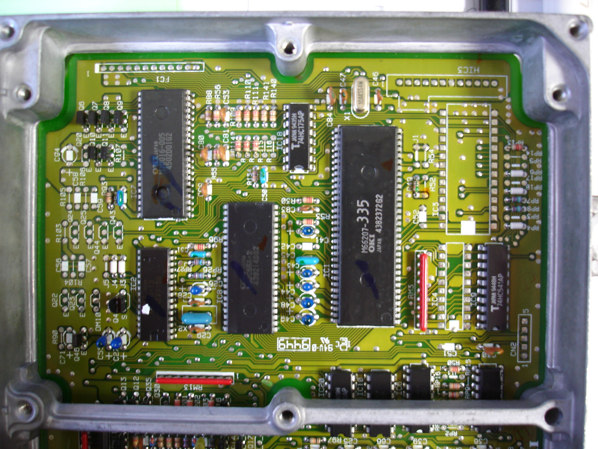
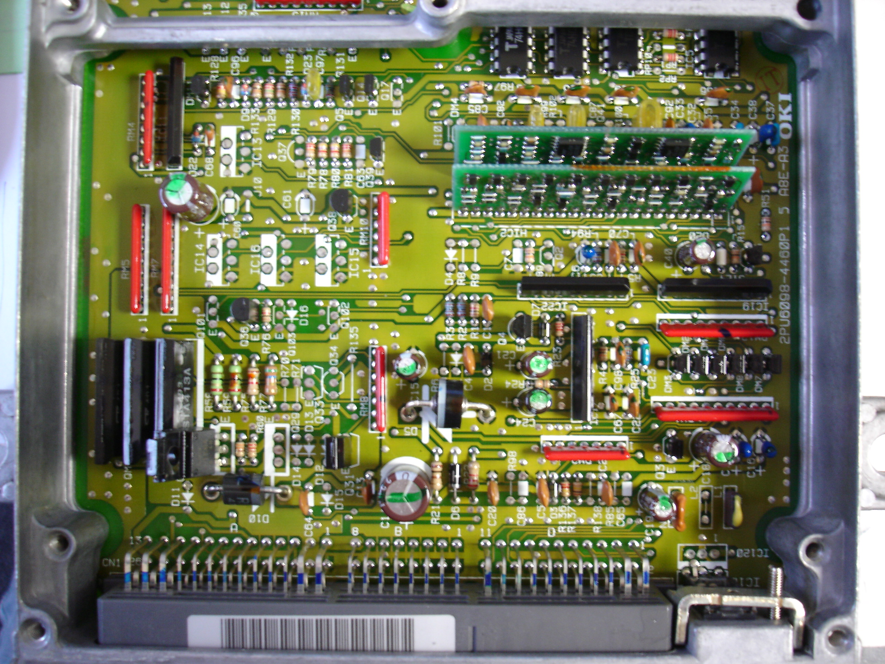
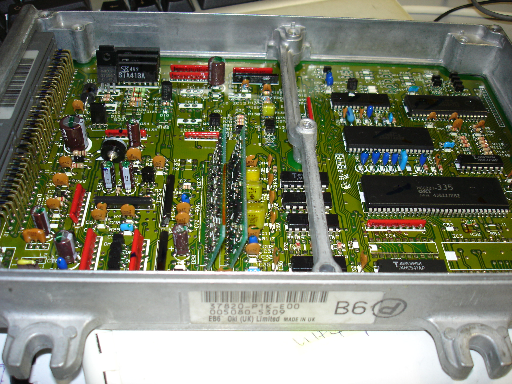
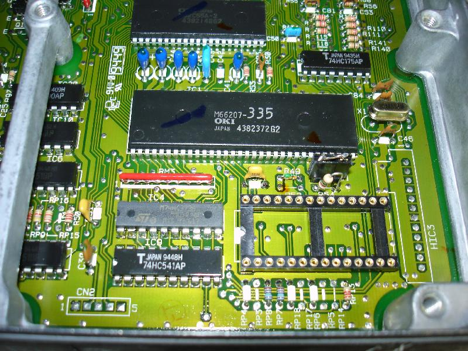

# P1K

P1J and P1K come from 96-00 UK civics with D14 engines. Despite the years, those are OBDI [ECU](/cars/ecu/ecu)s and seem to be easyly convertable for VTEC Those OBDI P1J or P1K [ECU](/cars/ecu/ecu)s share a strange board layout labeled as: "2PU6098-4460P1 5 A8E-A3", but get easyly chipped. VTEC converion seems easy, but is not yet tested.

<figure>
 
</figure>

<figure>
 
</figure>

<figure>
 
</figure>

<figure>
 
 <figcaption>some hardly visible components</figcaption>
</figure>

<figure>
 
 <figcaption>how they're chipped</figcaption>
</figure>
