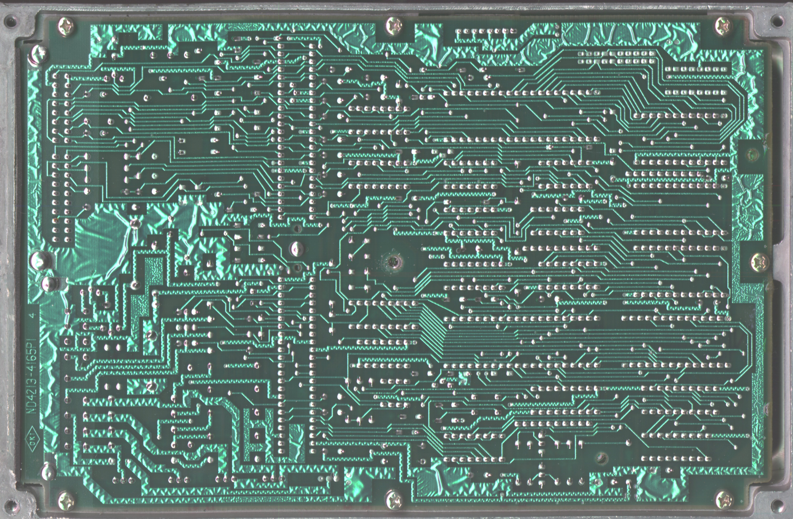
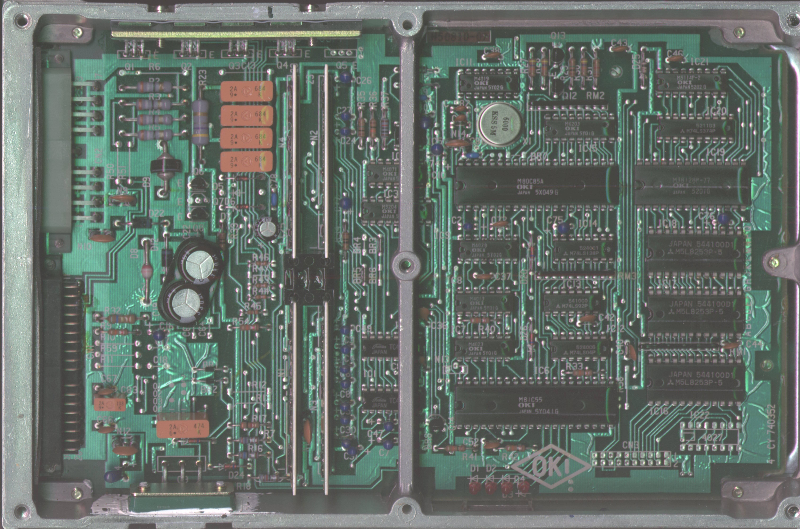

# PE7 ECU Technical Reference

The PE7 ECU was utilized in 1985–1987 EDM and USDM Honda Civic and CRX Si models equipped with the EW3/EW4 vacuum-advance engines.

## ROM Files
* [PE7-682-87_Civic_Si.bin](PE7-682-87_Civic_Si.bin): Stock ROM image from a PE7-682 (European 1987 Civic Si).

## Hardware Scans

```carousel

*Scan of the bottom (solder) side of the PE7 PCB*
<!-- slide -->

*Scan of the top (component) side of the PE7 PCB*
```

> [!NOTE]
> The PE7 is a vacuum-advance era ECU. Ensure all vacuum lines are properly routed and leak-free when performing diagnostics or tuning on this system.