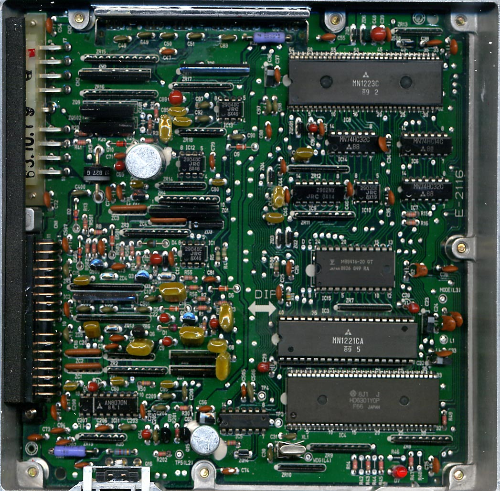
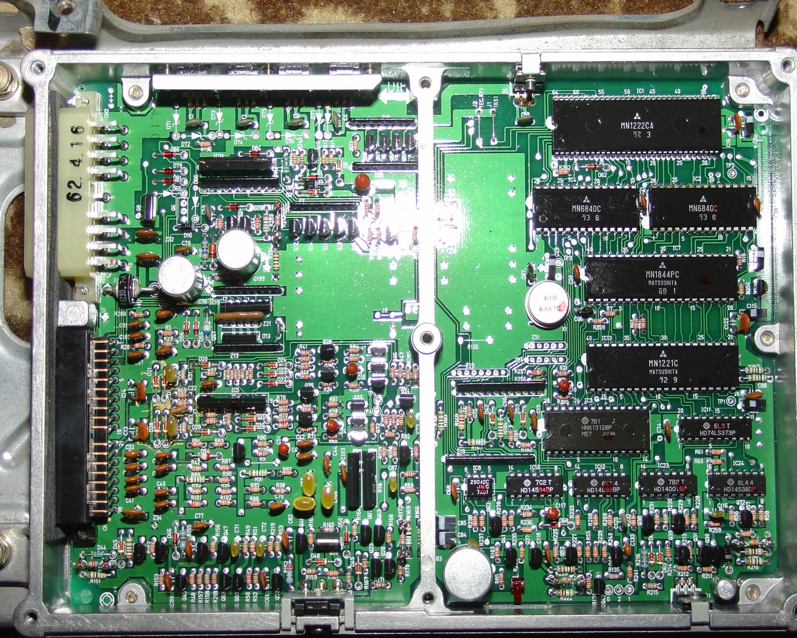
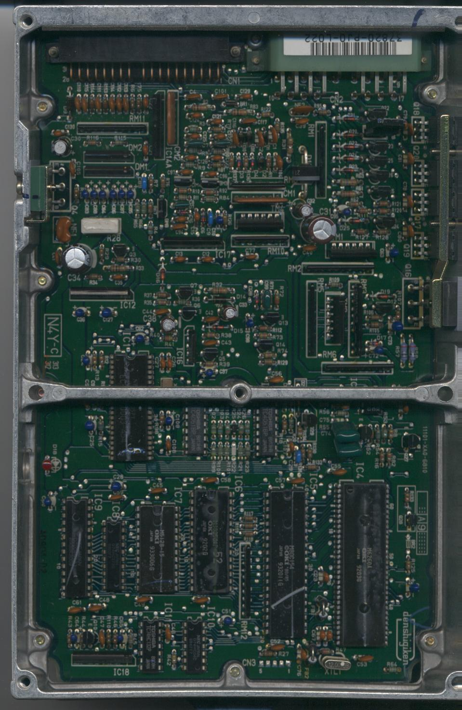
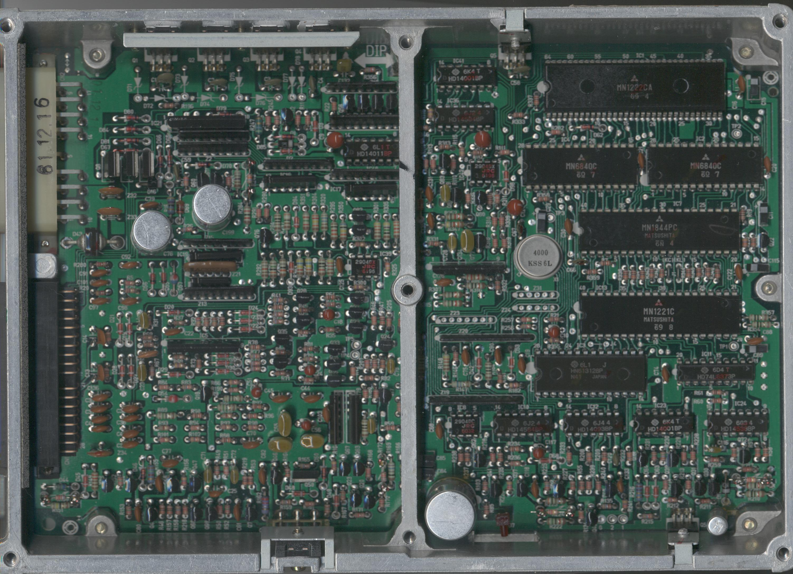

# PJ0 ECU Technical Reference

The PJ0 ECU, utilized in 1986–1989 Honda Accord and Prelude models equipped with the A20A engine, features various hardware revisions based on regional emissions requirements. While all variants utilize a vacuum-advance distributor, specific features such as O2 sensor feedback and EGR control vary by market.

## Hardware Overview

Most PJ0 ECUs were manufactured by Matsushita. Hardware architecture varies significantly between standard and California emissions-compliant units.

*   **Standard Units:** Many 1986–1987 models utilize an external 128k ROM.
*   **California Emissions Units:** These variants are based on the OKI 80C154 microcontroller and consistently utilize a 128k external ROM.

## ECU Revisions

The following images illustrate the physical differences between regional and emissions-specific PJ0 hardware.

```carousel

*Canadian 89 Accord ECU, manufactured by Matsushita*
<!-- slide -->

*EDM A20A4 ECU (no EGR, no O2 sensor) from an 89 EX-i*
<!-- slide -->

*California Emissions PJ0 ECU, OKI-based architecture*
<!-- slide -->

*USDM 86-87 Prelude SI PJ0 ECU*
```

> [!NOTE]
> Regional variants may lack specific emissions control hardware, such as O2 sensor inputs or EGR solenoid drivers. Verify your specific board revision before attempting to interface with emissions-related sensors.
