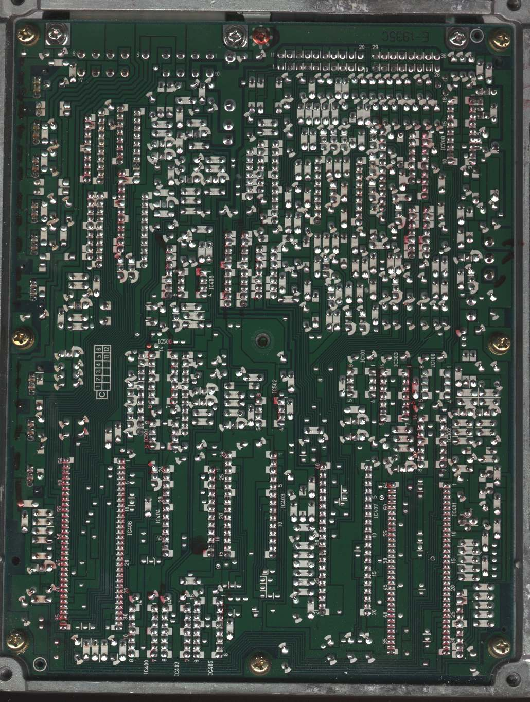
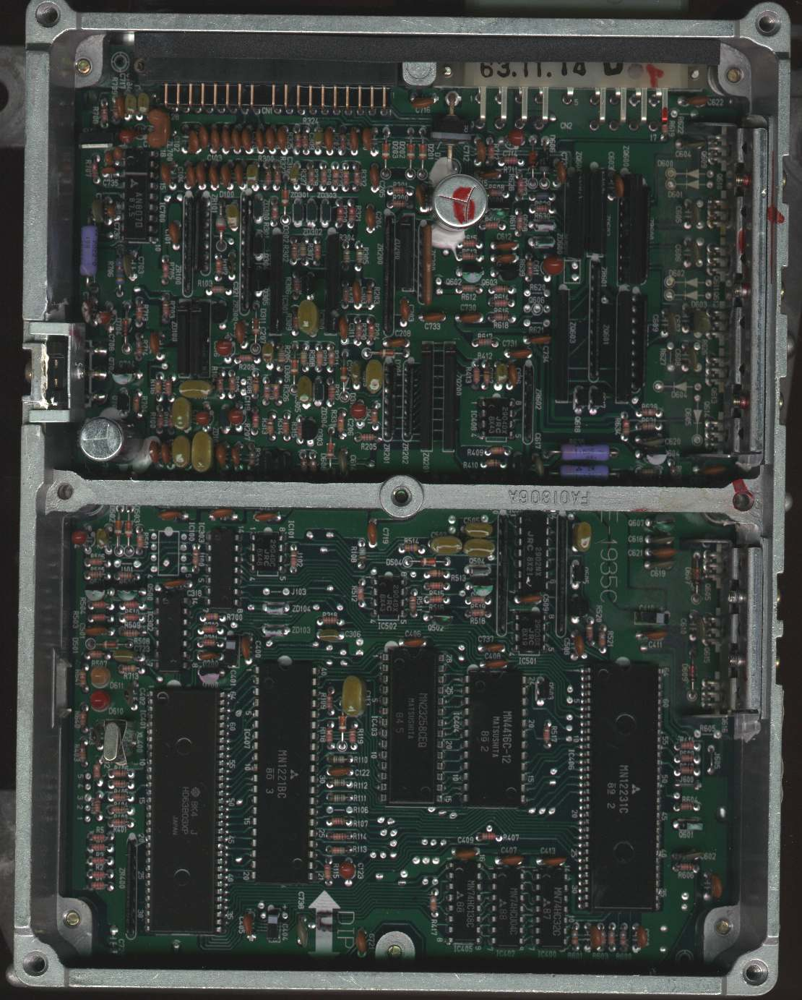
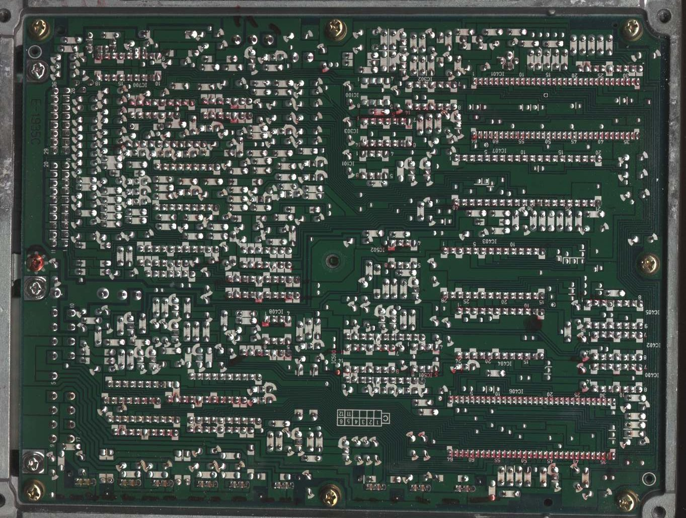
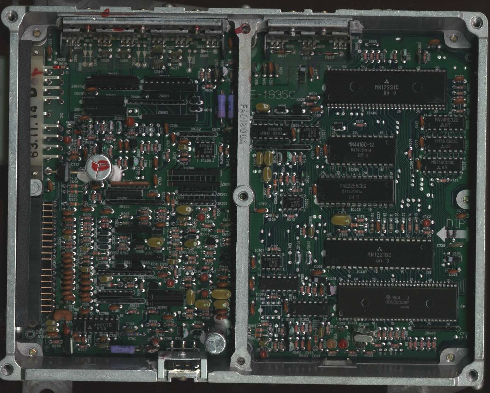

# PL2

PL2 : 8?-88+ Acura/Rover V6 (`C25`/`C27`)

<figure>
    
    <figcaption>PL2 [ECU](/cars/ecu/ecu) scan from Simon Stirley</figcaption>
</figure>

<figure>
    
    <figcaption>PL2 Scan from Simon Stirley</figcaption>
</figure>

<figure>
    
    <figcaption>PL2 solder side scan from Mark Lamond</figcaption>
</figure>

<figure>
    
    <figcaption>PL2 Top side scan from Mark Lamond</figcaption>
</figure>
