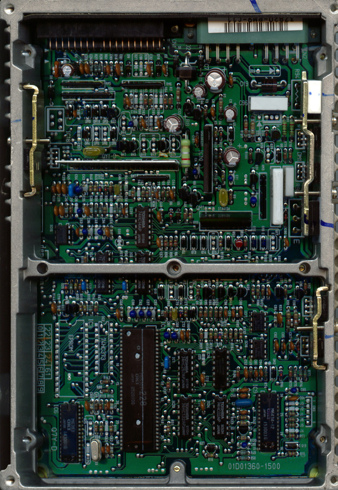
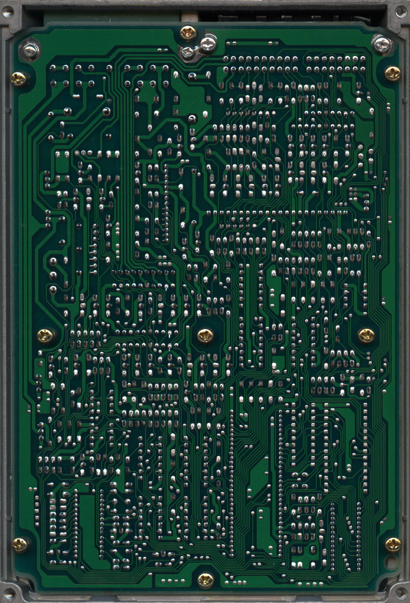

# PM9 ECU Technical Reference

The PM9 ECU is functionally equivalent to the PM5 ECU, with variations typically attributed to transmission configuration (4-speed vs. 5-speed). The PM9 is commonly found in the 1988–1991 Honda Civic HF.

## Hardware Revisions
The PM5 and PM9 platforms utilize two distinct hardware designs, similar to the PG7 architecture. Hardware identification is determined by the onboard processor:

*   **1988–1989:** Utilizes the 83C154 processor.
*   **1990–1991:** Utilizes the 66201 processor.

> [!NOTE]
> The 1990–1991 processor quadrant layout shares significant design similarities with OBD1-era ECU architectures.

## Component Overview

```carousel

*Top view of the PM9 PCB*
<!-- slide -->

*Bottom view of the PM9 PCB*
```

## Technical Specifications

| Feature | Specification |
| :--- | :--- |
| **Chassis** | EF (Civic/CRX) |
| **OBD Generation** | OBD0 |
| **Processor (88-89)** | 83C154 |
| **Processor (90-91)** | 66201 |
| **Primary Application** | Civic HF |
