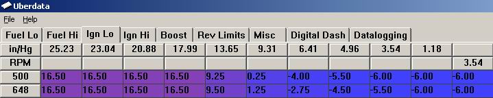

# Understanding Relative Pressure in Engine Tuning

Relative pressure is a measurement that disregards ambient atmospheric pressure (approximately 14.5 psi). When a container is described as having 10 psi of relative pressure, the absolute pressure is calculated as:

**Absolute Pressure = Relative Pressure + Atmospheric Pressure**
*10 psi + 14.5 psi = 24.5 psi absolute*

## Application in Tuning Software

Tuning software often utilizes relative pressure scales for fuel and ignition mapping. 

*Example of a fuel map utilizing relative pressure scaling*

> [!NOTE]
> Column 10 typically represents atmospheric pressure. Values may appear slightly lower than 14.5 psi due to interpolation or minor vacuum losses occurring even at Wide Open Throttle (WOT).

> [!IMPORTANT]
> Column 1 is an arbitrary reference point and does not represent an absolute vacuum (0 psi absolute). 

## Sensor Limitations
When configuring your ECU, ensure the selected MAP sensor is capable of reading the required pressure range. Refer to the specific sensor data sheets for the maximum absolute pressure limits of your OEM or aftermarket MAP sensor.

{{> map-sensor-reference }}