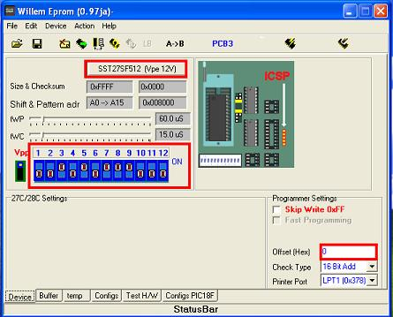
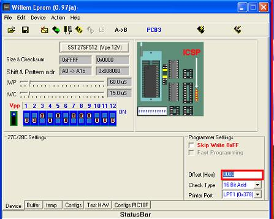
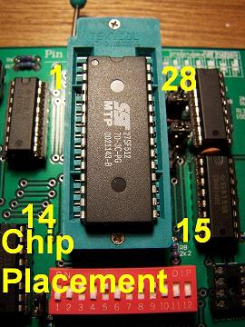
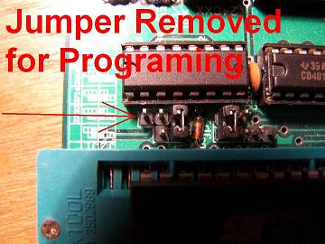
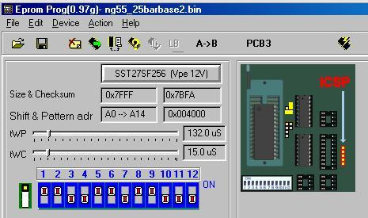

# Willem EPROM Programmer Guide

The Willem EPROM Programmer is an open-hardware design ROM burner used for socketing and burning custom ECU maps. Because it is an open-design board, it is sold under various names (e.g., "Enhanced Willem," "Dual Powered Willem") and manufactured by multiple vendors.

While cost-effective and capable of burning standard Honda ROM chips like the `27C256` (OTP), `29C256` (EEPROM), and SST `27SF256` / `27SF512` (flash), the programmer relies on a legacy parallel (LPT) port and requires specific configuration.

> [!WARNING]
> **Parallel Port (LPT) and OS Requirements**: 
> The Willem programmer requires a true hardware parallel port (standard base address `0x378h` or `0x278h`) to communicate with the PC. USB-to-Parallel printer adapter cables **do not work** because they do not support direct I/O port mapping. You must use a motherboard with an onboard LPT header or a dedicated PCI/PCI-e parallel card, and a compatible Windows OS (often requiring 32-bit versions or legacy port drivers like `UserPort` or `io.dll` to permit direct hardware access).

## Programming SST 27SF512 Chips (512k Flash)

The SST **27SF512** is a 512kbit (64 Kilobyte) flash memory chip. Because it is twice the size of a standard OBD0/OBD1 Honda ROM (32KB), you must configure the software to write the bin file to the upper half of the chip using a hardware or software **offset**.

### Step-by-Step Procedure

1. **Connect and Initialize**: Connect the parallel cable and power source (USB or DC adapter). Ensure your parallel port drivers (e.g., DLPortIO) are active.
2. **Configure DIP Switches**: Set the board's DIP switches according to the software's visual representation for the `SST27SF512` device.
3. **Insert the Chip**: Insert the SST 27SF512 into the ZIF socket. Align the chip so that Pins 14 and 15 are at the bottom slots (closest to the ZIF handle) with the notch facing upward.
4. **Erase the Chip**: In the software, click the **Erase** icon. 
   > [!NOTE]
   > If the erase operation fails, verify that the board's mode jumper is set to the **Erase** position.
5. **Set Jumper for Programming**: Swap the board mode jumper from the Erase configuration to the **Program/Normal** configuration.
6. **Apply the 32KB Offset**: In the bottom right corner of the Willem software, locate the **Offset (Hex)** input field. Change the value from `0` to `8000` (32,768 bytes). This shifts the data to the upper 32KB of the chip.
7. **Load and Burn**: Load your `.bin` file. Click the **Program** icon. When prompted to use the specified hex offset, select **Yes**.
8. **Verify**: The software will burn the data and automatically run a verification pass. Ensure both operations complete with a `100%` status.
9. **Final Verification**: Insert the chip into your ECU. Turn the ignition to the RUN position. The main relay should click and the Check Engine Light (CEL) should turn off after 2 seconds.

### Hardware Configuration

```carousel

*Willem Software Device Configuration for 27SF512*
<!-- slide -->

*Willem Software Buffer and Offset Configuration*
<!-- slide -->

*Willem Board DIP Switch Configuration*
<!-- slide -->

*SST 27SF512 Chip Placement in ZIF Socket*
<!-- slide -->

*Willem Board Jumper Position for Chip Erasing*
<!-- slide -->

*Willem Board Jumper Position for Chip Programming*
```

## Programming SST 27SF256 Chips (256k Flash)

The SST **27SF256** is a native 256kbit (32 Kilobyte) chip, matching the standard Honda ROM size. No software offsets are required, but the board configuration jumpers must be adjusted.

### Erasing the SST 27SF256
The SST 27SF256 is electrically erasable. Specific jumpers must be repositioned to permit the high erase voltage to route correctly.


*Willem Board Jumper Configuration for Erasing SST 27SF256*

### Burning the SST 27SF256
To burn the SST 27SF256, return the jumpers to the PCB3 burn position.


*Willem Board Jumper Configuration for Burning SST 27SF256*
