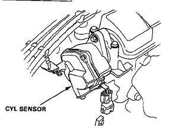

# Cylinder Position (CYP) Sensor Operation and Diagnostics

The Cylinder Position (CYP) sensor is a critical component for determining engine phase and enabling sequential ignition timing. The sensor operates as a magnetic pickup, generating a pulse when a ferrous target passes the sensor coil.

## Sensor Location and Configuration

The physical location of the CYP sensor varies based on the engine architecture:

*   **SOHC Engines:** The CYP sensor is integrated within the distributor housing.
*   **DOHC Engines:** The CYP sensor is mounted externally at the end of the exhaust camshaft.

> [!NOTE]
> On the 1991 CRX, the CYP sensor is a two-wire magnetic sensor located at the front of the distributor assembly.

## Functional Role

The ECU utilizes the signal from the CYP sensor to establish the engine's firing order. Upon receiving the CYP signal, the ECU initiates the sequential ignition sequence (1-3-4-2).

> [!IMPORTANT]
> If the CYP sensor signal is lost or erratic, the ECU will trigger the Malfunction Indicator Lamp (MIL). Symptoms of a faulty sensor or signal interference include engine pinging, misfires, and improper ignition timing.

## Diagnostic Considerations

*   **Signal Interpretation:** Excessive ignition advance or retard does not necessarily indicate a faulty CYP sensor; verify sensor output before assuming component failure.
*   **Signal Integrity:** Ensure the sensor wiring is free from electromagnetic interference, as the low-voltage magnetic pulse is sensitive to electrical noise.

*Cylinder Position (CYP) sensor assembly*
