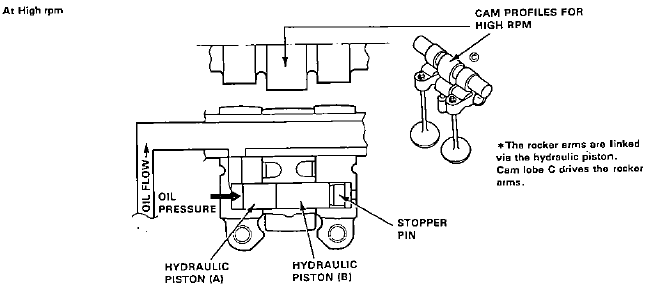

# High Cam

in a [VTEC](/cars/sensors/vtec) motor, the [High Cam](/cars/sensors/high-cam) is used at higher [RPM](/cars/sensors/rpm)s. This Cam Shaft is generally optimized for power and higher-RPMs. See also: [Low Cam](/cars/sensors/low-cam)

- [High Cam](/cars/sensors/high-cam) of VTEC camshaft: 
     

| **Attachment:** | **Modify:** | **Size:** | **Date:** | **Who:** | **Comment:** | | :--- | :--- | :--- | :--- | :--- | :--- | |  [vtechigh.gif](vtechigh.gif) | mod | 8630 | 30 Mar 2004 - 08:08 | tekphobia | [High Cam](/cars/sensors/high-cam) of VTEC camshaft |
