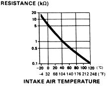

# Intake Air Temperature (IAT) Sensor Specifications

The Intake Air Temperature (IAT) sensor is a thermistor used by the ECU to monitor the temperature of the air entering the engine. The ECU uses this data to calculate air density and adjust fuel trim and ignition timing accordingly.

## Sensor Characteristics

The IAT sensor operates as a variable resistor. As air temperature increases, the resistance of the sensor decreases, resulting in a lower voltage signal sent to the ECU.

*Resistance/Temperature curve for the stock Honda IAT sensor*

## Temperature vs. Voltage Reference

The following table outlines the relationship between intake air temperature and the corresponding voltage output. These values were established and tested by AEM.

| Temp (°C) | IAT Voltage (V) |
| :--- | :--- |
| 100 | 0.000 |
| 95 | 0.156 |
| 89 | 0.312 |
| 83 | 0.468 |
| 77 | 0.624 |
| 72 | 0.780 |
| 66 | 0.936 |
| 61 | 1.090 |
| 56 | 1.248 |
| 51 | 1.404 |
| 46 | 1.560 |
| 42 | 1.716 |
| 38 | 1.872 |
| 34 | 2.028 |
| 31 | 2.184 |
| 27 | 2.340 |
| 24 | 2.496 |
| 21 | 2.652 |
| 18 | 2.808 |
| 15 | 2.964 |
| 12 | 3.120 |
| 9 | 3.276 |
| 7 | 3.432 |
| 5 | 3.588 |
| 3 | 3.744 |
| 1 | 3.900 |
| -1 | 4.056 |
| -3 | 4.212 |
| -5 | 4.368 |
| -6 | 4.524 |
| -7 | 4.680 |
| -9 | 4.836 |
| -10 | 4.992 |

> [!IMPORTANT]
> Ensure the sensor connector is clean and free of corrosion. High resistance in the wiring harness or connector pins will result in skewed temperature readings, leading to incorrect fuel enrichment or timing retard.
