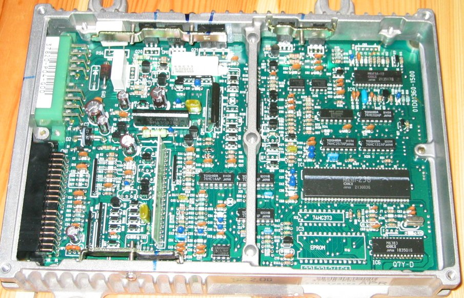
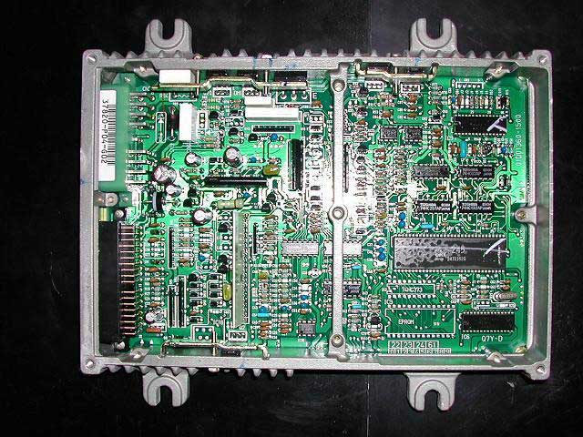
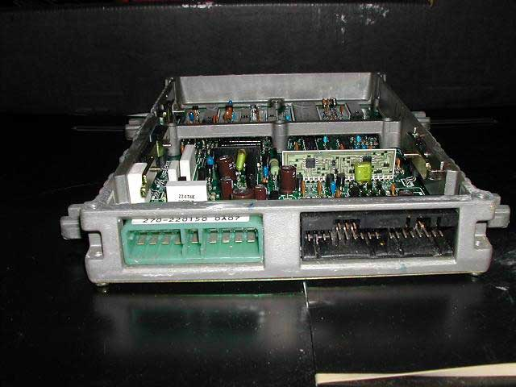
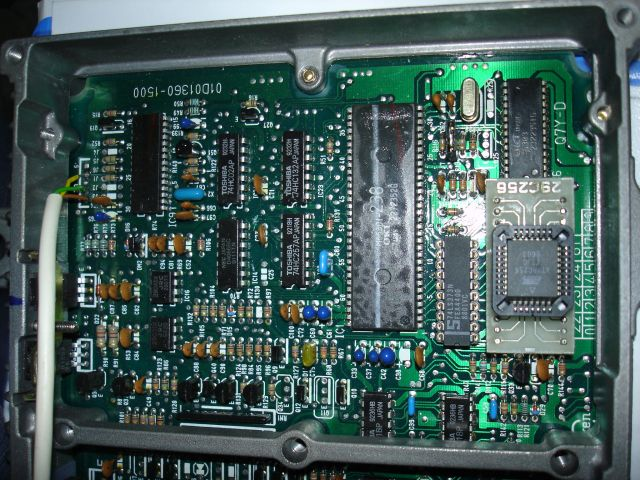
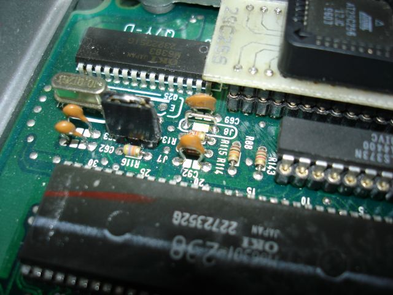

# P04 ECU Technical Reference

The P04 ECU was utilized in European-market Honda Civic vehicles equipped with the D15B2 engine and Dual Point Fuel Injection (DPFI) system. The hardware design is nearly identical to late-model PM5 ECUs.

## Application Data

The following table lists confirmed P04 ECU variants and their corresponding vehicle applications:

| Model Year | Vehicle | Engine | ECU Part Number |
| :--- | :--- | :--- | :--- |
| 1992 | Civic 1.5 LSi | D15B2 | 37820-P04-G00 |
| 1993 | Civic 1.5 LSi | D15B2 | 37820-P04-G02 |
| 1995 | Civic 1.5 LSi | D15B2 | 37820-P04-G04 |

> [!NOTE]
> The P04 ECU is specific to European market configurations and utilizes the DPFI fuel delivery system.

## Hardware Overview

```carousel

*P04-G00 ECU unit*
<!-- slide -->

*Internal PCB layout*
<!-- slide -->

*Internal PCB layout detail*
```

## Modification and Chipping

The P04 architecture supports modification for tuning purposes. Below are examples of a chipped P04-G01 unit.

```carousel

*Top view of a chipped P04-G01 PCB*
<!-- slide -->

*Close-up view of the modified chip socket area*