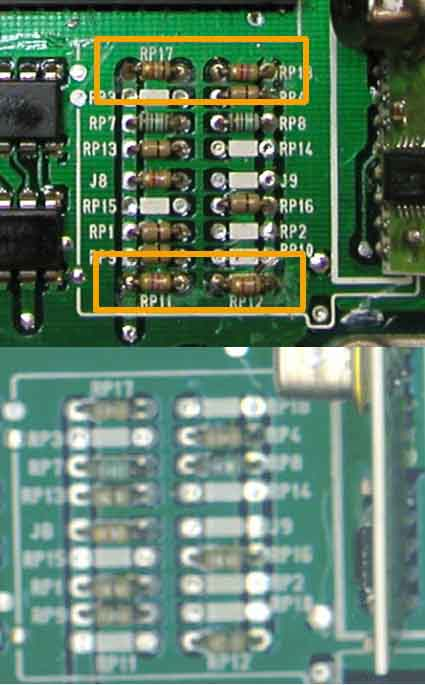
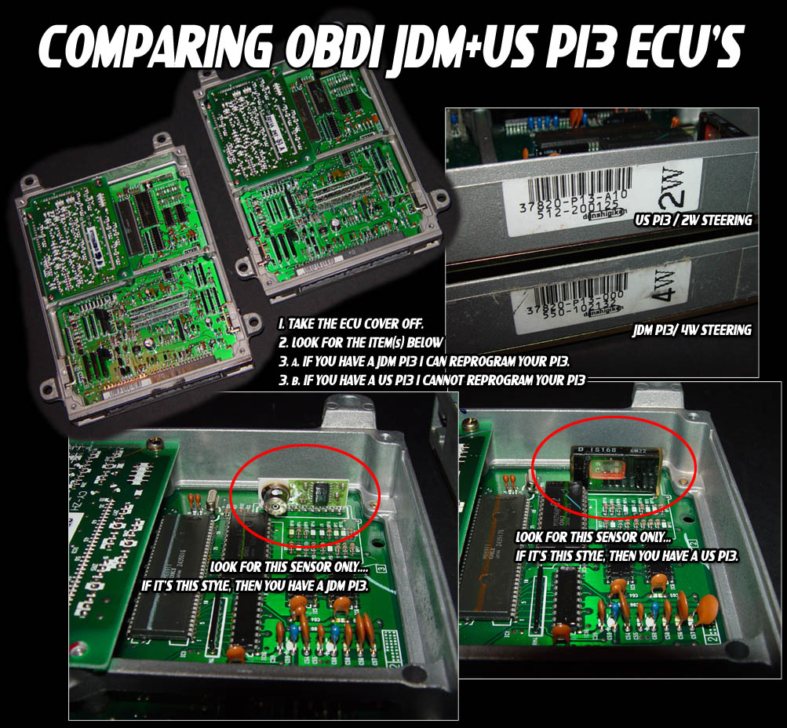
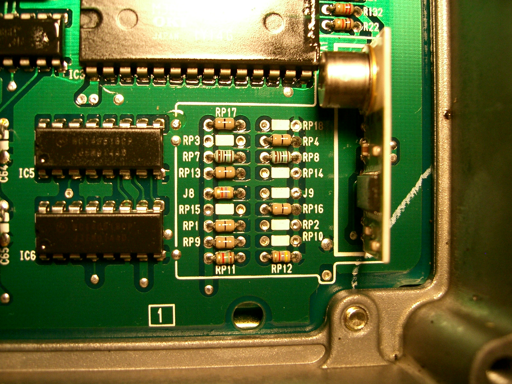

# OBD1 Honda P13 ECU Reference Guide

The P13 Engine Control Unit (ECU) is the factory controller for the 1993–1995 OBD1 Honda Prelude VTEC equipped with the 2.2L DOHC VTEC H22A engine. 

## Overview

Unlike standard OBD1 Civic/Integra ECUs, the P13 utilizes a unique circuit board architecture and a non-standard fuel and ignition map structure (1x40 RPM axis scaling). This guide provides the essential RAM and ROM memory address locations required for custom tuning, datalogging, and hardware modification.

### Board Identification & Variations

Circuit board layouts differ significantly between JDM and USDM models:

```carousel

*Comparison of USDM (top) and JDM (bottom) resistor and component locations.*
<!-- slide -->

*Visual board layout and component positioning differences between JDM and USDM P13 ECUs.*
```

## RAM Address Mapping

The following memory addresses are used for runtime diagnostic monitoring and datalogging:

| Location | Bytes | Description | Notes |
| :--- | :---: | :--- | :--- |
| **00A4** | 1 | MAP Sensor | Raw analog voltage (0V-5V) |
| **00AB** | 1 | TPS Sensor | Scaled input (`0x00`-`0xFF`) |
| **00AE** | 2 | Current RPM | 16-bit RPM value |
| **00D9** | 1 | ECT Sensor | Engine Coolant Temperature |
| **00DF** | 1 | VSS Sensor | Speed in km/h |
| **00ED** | 1 | Active MAP Column | Load pressure pointer |
| **00EE** | 1 | Low Cam Active Row | Low cam RPM pointer |
| **00EF** | 1 | High Cam Active Row | VTEC RPM pointer |
| **0110-0114** | 2 ea | CEL Diagnostics | Active fault code registers |
| **016A** | 2 | Rev Limit Cut | 16-bit fuel cut RPM |
| **016C** | 2 | Rev Limit Resume | Fuel cut recovery point |
| **021D.1** | 1b | VTEC Status Flag | 1 = Active, 0 = Inactive |
| **0224.0** | 1b | A/C Switch Input | 1 = Active (Pin B5) |
| **03D0** | 1 | O2 Sensor | Narrowband feedback |
| **03D2** | 1 | IAT Sensor | Intake Air Temp |
| **03D3** | 1 | Baro Sensor | Barometric pressure |

## ROM Address Mapping

These hex address offsets apply to the 28-pin EEPROM for stock P13 calibrations:

| Location | Bytes | Description | Notes |
| :--- | :---: | :--- | :--- |
| **0C21** | 2 | High Cam Rev Resume | VTEC fuel cut recovery |
| **0C26** | 2 | High Cam Rev Limit | VTEC fuel cut |
| **0D22** | 4 | Checksum Jump | See [Disabling Checksum](#disabling-checksum) |
| **2EAC** | 1 | Speed Limiter | Set to `0xFF` to disable |
| **35CA** | 1 | VTEC ECT Check | `0x44` = Enabled, `0xFF` = Disabled |
| **5403** | 2 | Low Cam Rev Resume | Low cam recovery |
| **5407** | 2 | Low Cam Rev Limit | Low cam fuel cut |
| **6000** | 40 | Low Cam RPM Scaler | 1x40 row index |
| **6028** | 40 | High Cam RPM Scaler | 1x40 row index |
| **60AA** | 200 | Low Cam Fuel Table | 10x20 map |
| **6172** | 200 | High Cam Fuel Table | 10x20 map |
| **63F8** | 200 | Low Cam Ignition | 10x20 map |
| **659C** | 200 | High Cam Ignition | 10x20 map |

## Advanced Tuning Calibration

### Disabling Checksum
> [!IMPORTANT]
> Modifying ROM bytes will trigger a Check Engine Light (CEL) due to a checksum mismatch. 

To disable the checksum routine:
1. Navigate to hex address **`0x0D22`**.
2. Replace the bytes `90 9D F1 7F` with `03 36 0D 00`.

### Datalogging Registers
- **Serial Receive Buffer (SRBUF):** `0x07D`
- **Serial Transmit Buffer (STBUF):** `0x07C`
- **Interrupt Vector:** Starts at `0x0043`. Custom routines should be placed at `0x00DB`.

## Hardware Modifications

### Auto to Manual Transmission Conversion
JDM Automatic P13 ECUs can be converted to manual specifications by modifying the resistor jumpers:


*Relocate jumpers on RP11 and RP12 to toggle between automatic and manual configurations.*

### Knock Sensor Bypass
> [!NOTE]
> If swapping an H22A into a chassis without a knock sensor, you must bypass the sensor check to avoid Error Code 23. Refer to the [Knock Sensor bypass guide](/cars/rom/remove-a-knock-sensor).