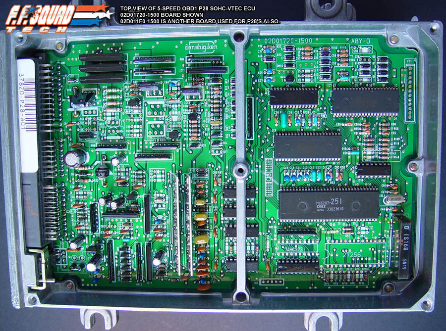
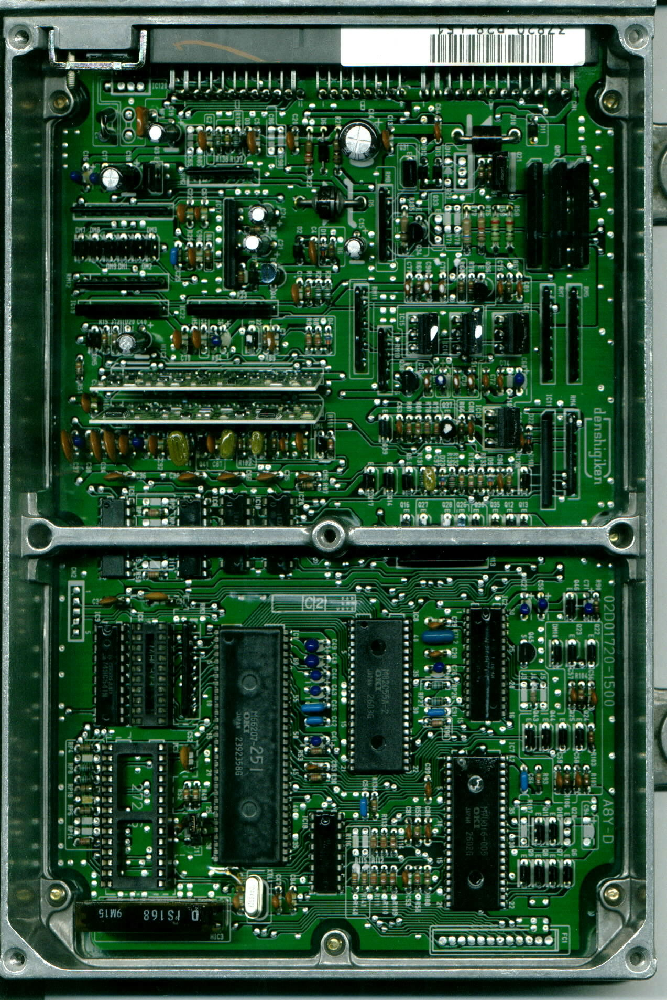
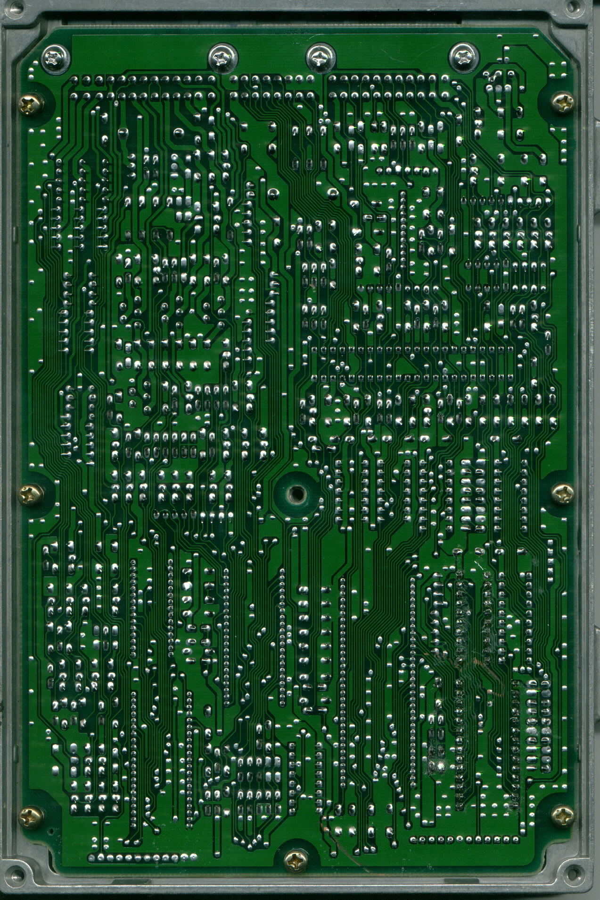

# OBD1 Honda P28 ECU Reference Guide

The P28 Engine Control Unit (ECU) is the most widely used OBD1 Honda ECU for custom socketing and tuning. Originally equipped in 1992–1995 Honda Civic EX/Si and Del Sol models with the SOHC VTEC D16Z6 engine, its architecture is highly versatile and easily adapted to various engine configurations.

## Overview

Because OBD1 Honda ECUs share a common architecture, the P28 can be modified to control non-VTEC or DOHC VTEC engines (such as the B16A or B18C) by socketing the board and installing custom ROMs. This guide details the essential RAM and ROM addresses used in the standard `304` ROM codebase.

> [!NOTE]
> European market (EDM) P28-G01 ECUs share a circuit board design similar to JDM models. For OBD2-era versions, refer to the P28-G03 ECU (used in 1996–1998 EDM Del Sols).

### ECU Hardware Scans

Use the following resources for hardware modifications, component socketing, or trace repairs:

```carousel

*Top view of the P28 manual transmission circuit board*
<!-- slide -->

*Top view of the P28 automatic transmission circuit board*
<!-- slide -->

*Back view of the P28 automatic transmission circuit board*
```

## RAM Address Mapping

The following table outlines the memory map for RAM addresses used during runtime diagnostics and sensor logging.

| Location | Bytes | Description | Notes |
| :--- | :---: | :--- | :--- |
| **00BB** | 1 | MAP Sensor | Manifold Absolute Pressure analog input (0V-5V, scaled `0x00`-`0xFF`) |
| **00C4** | 2 | Current RPM | Engine speed (uses OBD1 16-bit RPM scale) |
| **00CC** | 1 | VSS Sensor | Vehicle Speed Sensor value in km/h |
| **00D9** | 1 | ECT Sensor | Engine Coolant Temperature sensor reading |
| **00DA** | 1 | O2 Sensor | Oxygen Sensor signal |
| **0210.3** | 1b | Power Steering Pressure (PSP) | PSP switch input. Grounding pin B8 sets this bit to 1 |
| **0216.4** | 1b | VTEC Enable RAM Flag | Active VTEC status bit. Set if ROM address `0x60E6` is not `0x00` |
| **0227.4** | 1b | Knock Enable RAM Flag | Active Knock control status bit. Set if ROM address `0x60E7` is not `0x00` |

## ROM Address Mapping

The following table details hex address offsets within the 28-pin EEPROM chip for fuel maps, ignition maps, and software parameters.

| Location | Bytes | Description | Notes |
| :--- | :---: | :--- | :--- |
| **0652** | 6 | Injector Test Jump #1/2 | Change to `03 5F 06` to disable |
| **1292** | 1 | VTEC Coolant Temp Check | `0x44` enables check, `0xFF` disables |
| **1580** | 6 | Injector Test Jump #2/2 | Change to `03 9A 15` to disable |
| **238A** | 6 | O2 Heater Jump Routine | Change to `03 C5 23` to disable |
| **2BAD** | 6 | Checksum Jump Routine | Change to `03 B6 2B` to disable |
| **445C** | 6 | VTEC Solenoid Check Jump | Change to `03 7A 44` to disable (Code 21) |
| **447D** | 6 | VTEC Pressure Check Jump | Change to `03 95 44` to disable (Code 22) |
| **60E6** | 1 | VTEC Enable | `0xFF` enables, `0x00` disables |
| **60E7** | 1 | Knock Sensor Enable | `0xFF` enables, `0x00` disables |
| **60E9** | 1 | Barometric Sensor Enable | `0xFF` enables, `0x00` disables |
| **60F2** | 1 | ELD Sensor Enable | `0xFF` enables, `0x00` disables |
| **60FA** | 1 | VTEC VSS Check | `0x00` enables, `0xFF` disables |
| **60FB** | 1 | Debug Mode | `0xFF` enables, `0x00` disables |
| **6542-6549** | 8 | VTEC Crossover Point | RPM crossover parameters |
| **7000** | 10 | Low Cam mBar Scale | Load scaling index |
| **700A** | 10 | High Cam mBar Scale | Load scaling index |
| **7014** | 20 | Low Cam RPM Scale | RPM scaling index |
| **7028** | 20 | High Cam RPM Scale | RPM scaling index |
| **7050-7117** | 200 | Low Cam Fuel Table | 10x20 base fueling map |
| **7122-71E9** | 200 | High Cam Fuel Table | 10x20 VTEC fueling map |
| **72E4-73AB** | 200 | Low Cam Timing Table | 10x20 ignition advance map |
| **73AC-7473** | 200 | High Cam Timing Table | 10x20 VTEC ignition advance map |
| **7550-7617** | 200 | Low Cam Target Lambda | Closed-loop target AFR |
| **7618-76DF** | 200 | High Cam Target Lambda | Closed-loop target AFR |