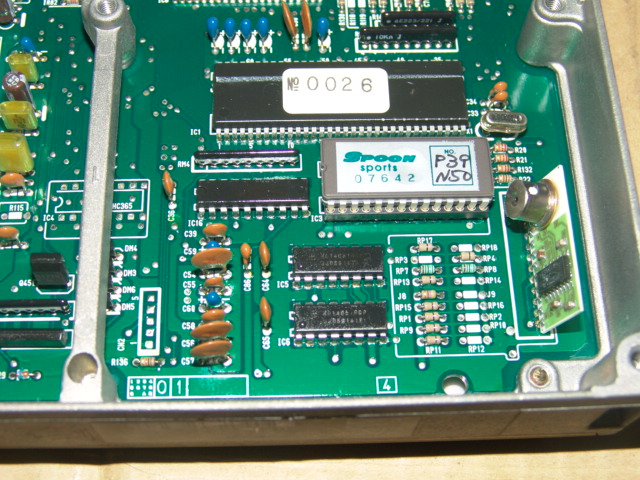
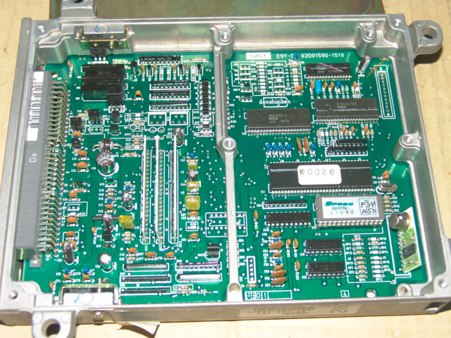
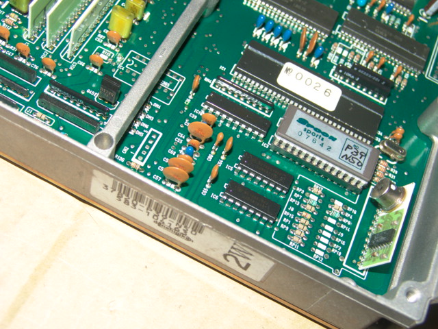
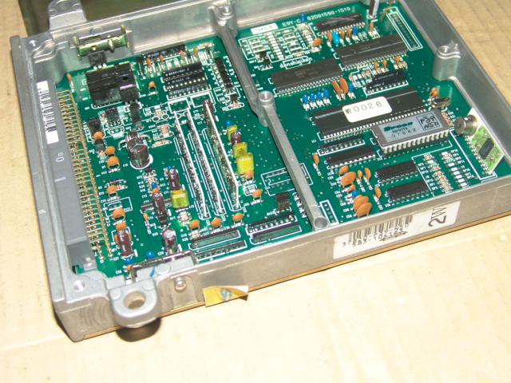
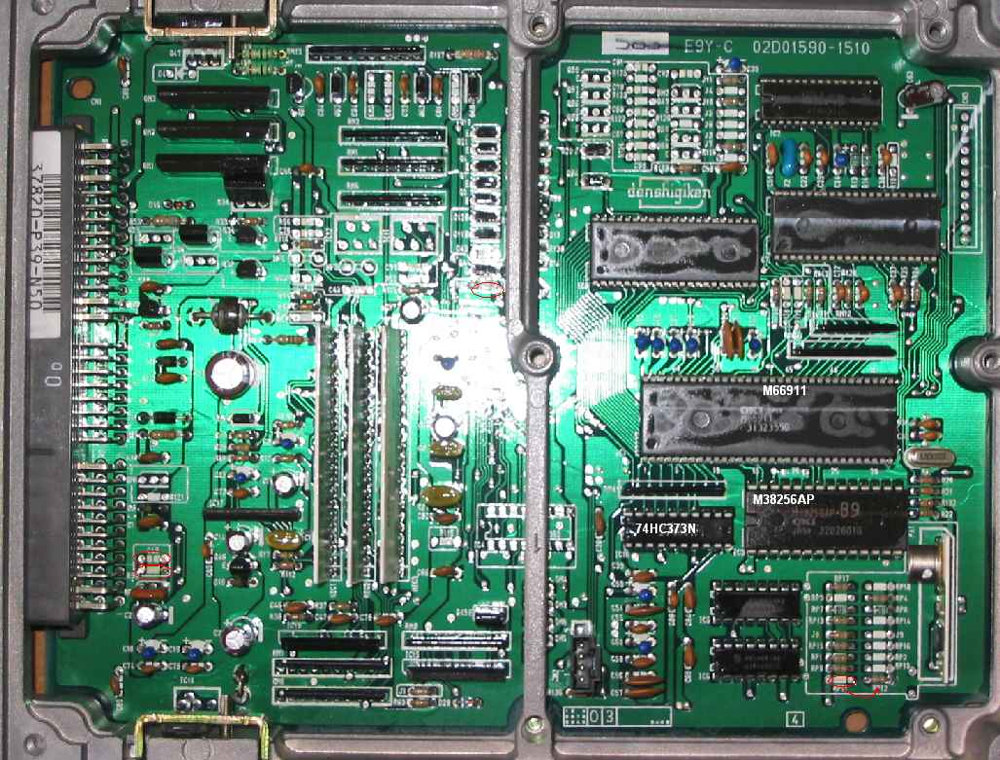

# P39

P39 92-95 [OBD1](/cars/wiring/obd1) [JDM](/cars/sensors/jdm) PRELUDE BB4 [DOHC](/cars/sensors/dohc) Non-VTEC(F22B)

<figure>
 
 <figcaption>Resistor close up. P39 auto ECU</figcaption>
</figure>

<figure>
 
 <figcaption>P39 Spoon Auto [ECU](/cars/ecu/ecu)</figcaption>
</figure>

<figure>
 
 <figcaption>Another Resistor close up. P39 auto ECU</figcaption>
</figure>

<figure>
 
 <figcaption>P39 Spoon Auto [ECU](/cars/ecu/ecu) (side shot)</figcaption>
</figure>

<figure>
 
 <figcaption>Auto P39 [ECU](/cars/ecu/ecu) converted to Manual. RP11-> RP12</figcaption>
</figure>
