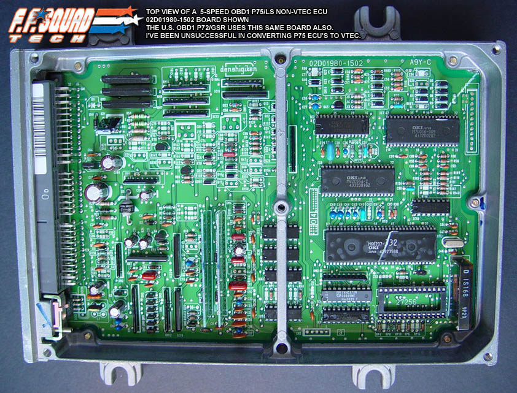

# P74/P75 OBD1 ECU Reference

The P74 and P75 ECUs were utilized in 1994–1995 Acura Integra models equipped with the 1.8L B18B engine.

## ECU Board Scan

The following image provides a high-resolution reference for the P75 OBD1 circuit board layout.

*Top view of the P75 OBD1 ECU PCB*

> [!NOTE]
> This ECU is functionally identical to the P74 variant. Both units are commonly used as platforms for OBD1 tuning and socketing modifications.

## Technical Specifications

*   **Vehicle Application:** 1994–1995 Acura Integra (RS, LS, GS)
*   **Engine:** B18B (1.8L DOHC Non-VTEC)
*   **OBD Standard:** OBD1
*   **Transmission:** Manual and Automatic variants exist; verify board components for specific transmission control requirements.

{{> ecu-socketing-guide }}
