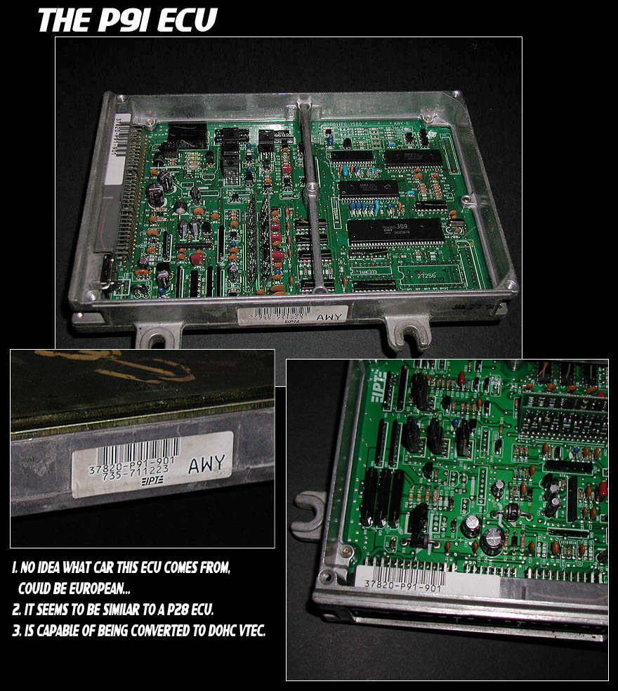
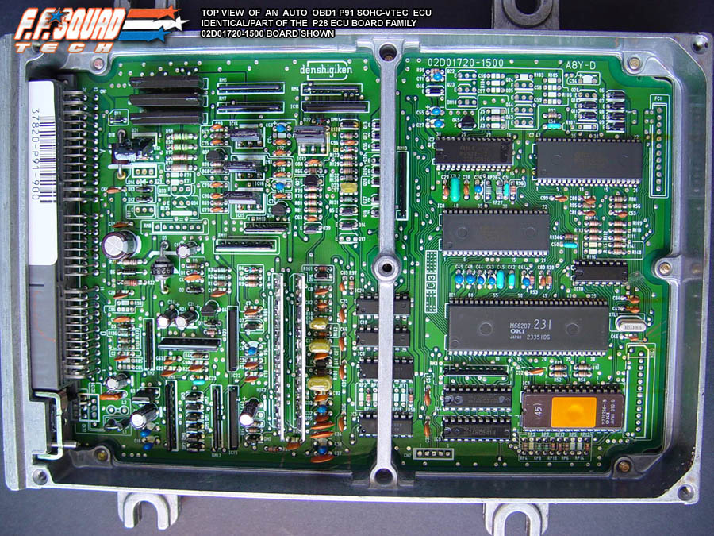

# P91 OBD1 ECU Reference

The P91 is an OBD1 engine control unit (ECU) utilized in 1992–1995 JDM Honda Civic Coupe models equipped with a 1.6L SOHC VTEC engine.

## Identification

Use the following visual references to identify the P91 ECU and its internal board layout.

```carousel

*External identification markings on the P91 ECU casing*
<!-- slide -->

*Top view of the P91 PCB layout*
<!-- slide -->

*Detailed view of the P91-900 variant PCB*
```

> [!NOTE]
> The P91 is specific to JDM (Japanese Domestic Market) configurations. Ensure compatibility with your specific wiring harness and engine sensor suite before installation.

## Technical Specifications

*   **OBD Standard:** OBD1
*   **Market:** JDM (Japan)
*   **Engine Application:** 1.6L SOHC VTEC
*   **Chassis Application:** 1992–1995 Civic Coupe