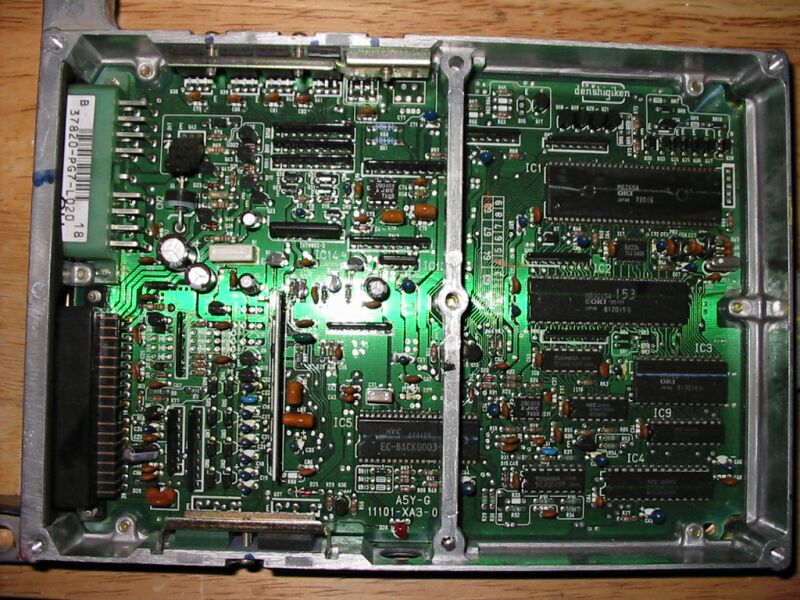
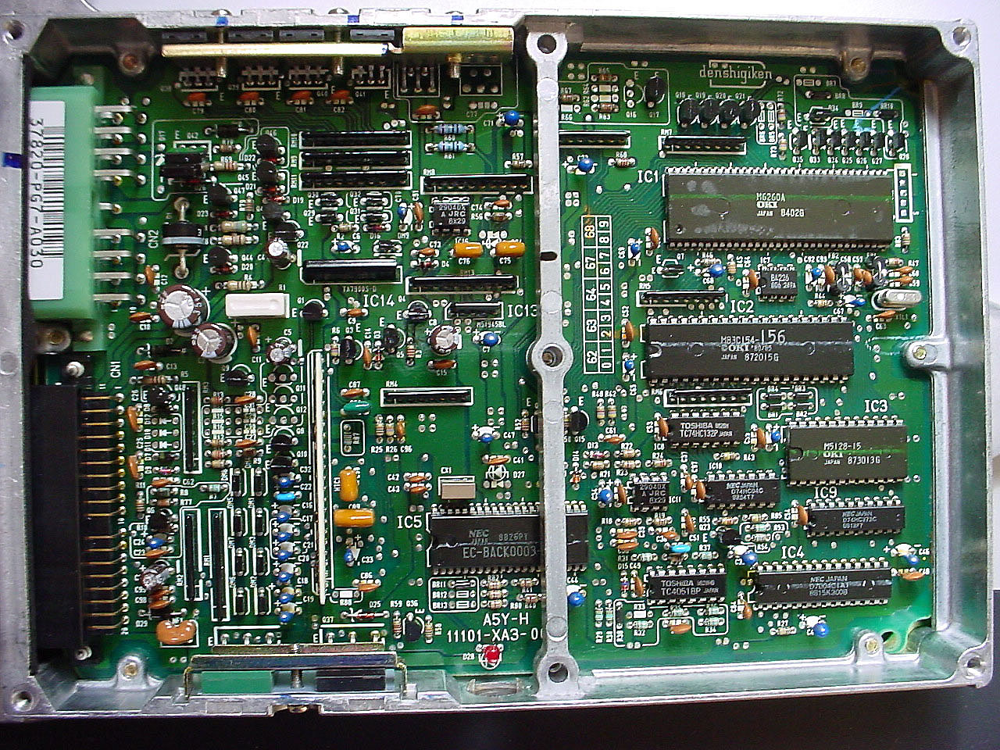

# PG7 ECU Identification and Variants

The PG7 ECU designation covers two distinct hardware revisions used in the Acura Integra (D16A1 engine). These units are not interchangeable.

> [!WARNING]
> Honda utilized the same "PG7" designation for two fundamentally different ECU architectures. Ensure you verify the specific revision before attempting installation or tuning.

## ECU Variants

*   **1986–1987 Integra:** D16A1 engine with vacuum-based ignition advance.
*   **1988–1989 Integra:** D16A1 engine with electronic ignition advance.

## Hardware Reference

```carousel

*88-89 Electronic Advance PG7 Manual Transmission*
<!-- slide -->

*Internal view of the 88-89 PG7 MT ECU*