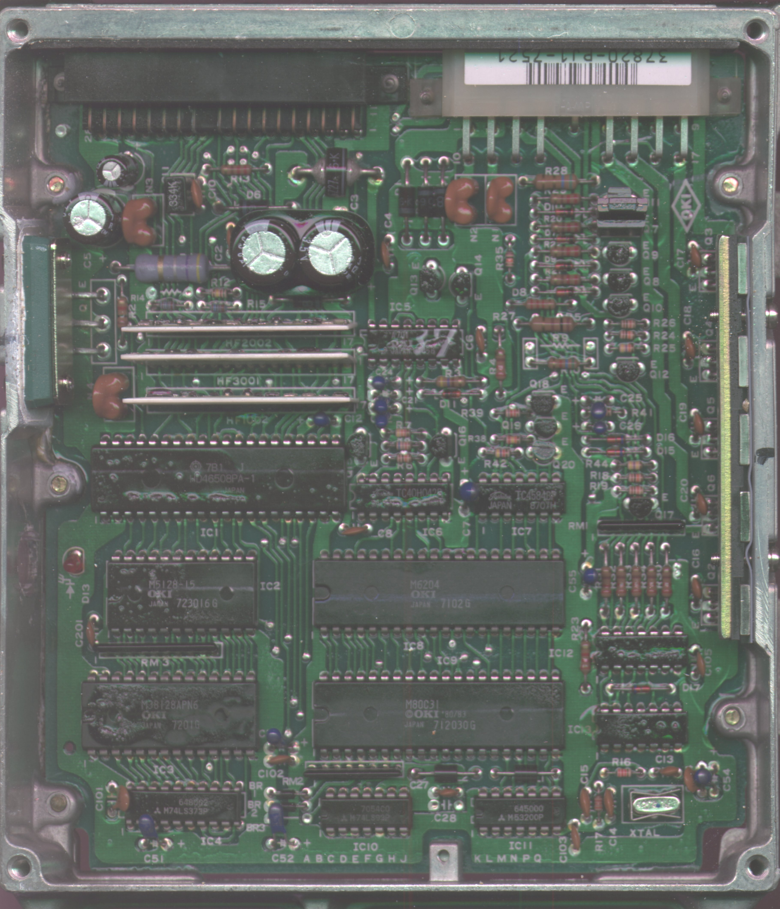
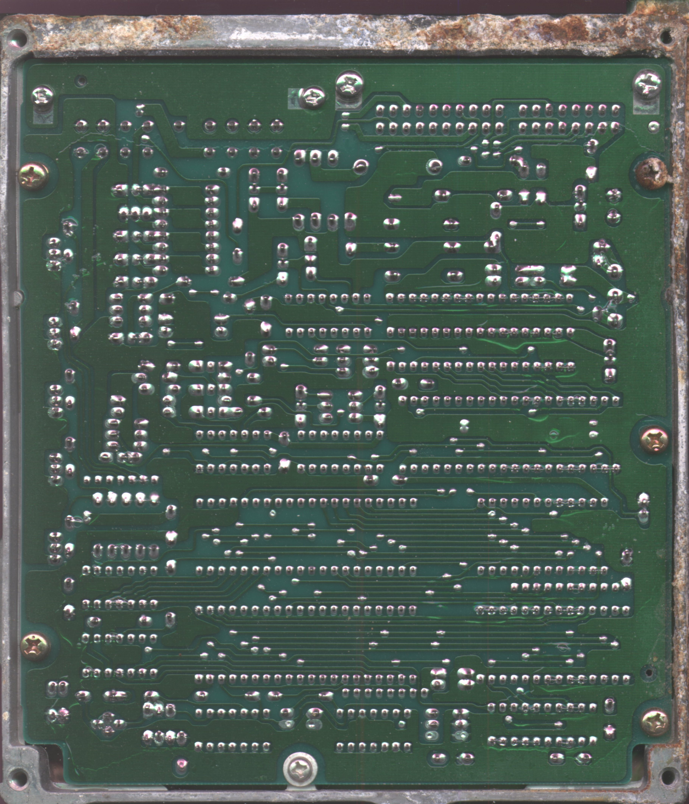

# PJ1 ECU Technical Reference

The PJ1 ECU was utilized in 1985–1987 European Domestic Market (EDM) Honda Integra 1.6i-16 and CRX MK1 1.6i-16 vehicles.

```carousel

*PJ1 component (top) side view*
<!-- slide -->

*PJ1 solder (bottom) side view*
```

> [!NOTE]
> This unit is a legacy OBD0-era controller. Ensure proper static discharge precautions are taken when handling the PCB.
