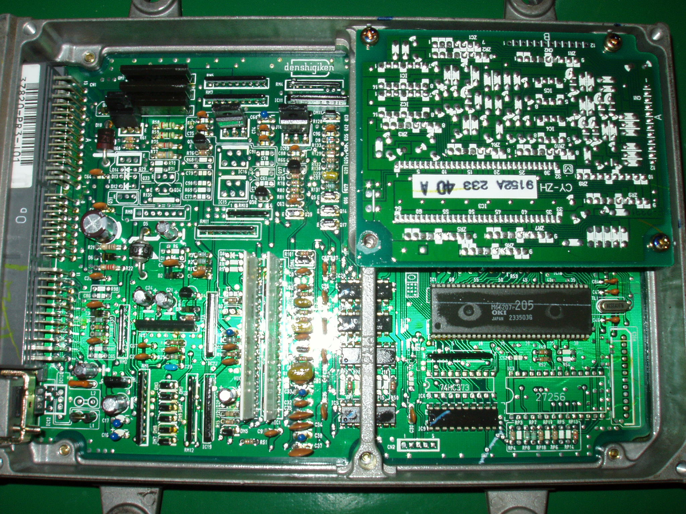
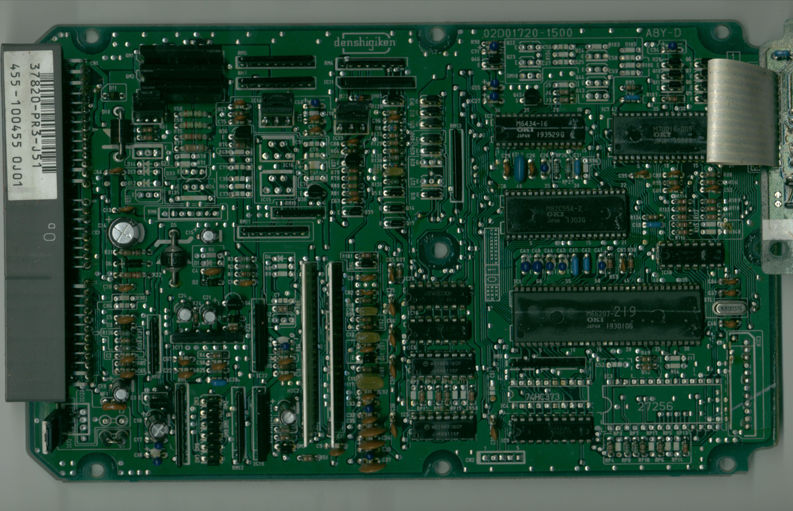
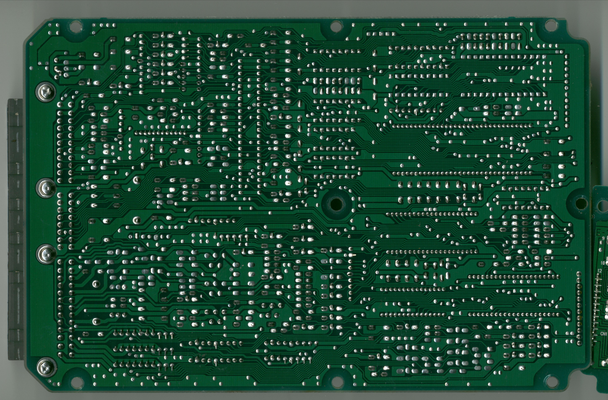

# Honda PR3 ECU Reference Guide

The PR3 Engine Control Unit (ECU) is a prominent Honda controller equipped in B16A DOHC VTEC vehicles between 1989 and 1993. 

> [!IMPORTANT]
> There are two completely different generations of ECUs designated as **PR3** (OBD0 and OBD1). They feature entirely different physical hardware casings, microprocessors, and wiring pinouts, and are **not compatible** in any way.

## OBD0 vs. OBD1 PR3 Identification

### OBD0 PR3 (1989–1991)

*   **Application:** Sourced from first-generation JDM B16A models (Civic EF9, CRX EF8, Integra DA6).
*   **Hardware:** Features the OKI M66x301 microcontroller and dual knock sensor board. Uses the same code structure as the PW0 ECU.
*   **Auto/Manual Jumper:** Check the board layout for transmission jumper identification.

### OBD1 PR3 (1992–1993)

*   **Application:** Sourced from 1992–1993 JDM Integra RSi and XSi models (second-generation B16A).
*   **Hardware:** Built on the same standardized motherboard as the P28 and P30 ECUs (typically circuit board part number `02D01720-1500`).

## OBD0 PR3 ROM Address Map

Below are the hex address offsets within the 28-pin EEPROM chip for the OBD0 version of the PR3 ECU:

| Location | Bytes | Description | Notes |
| :--- | :---: | :--- | :--- |
| **31D8** | 1 | Low Cam Rev Limiter | Low cam engine RPM fuel cut |
| **31DE** | 1 | High Cam Rev Limiter | Warm/VTEC engine RPM fuel cut |
| **31E0** | 1 | High Cam Rev Recovery | RPM where VTEC fuel cut recovers |
| **3418** | 1 | VTEC Disengage Speed | Lower VTEC cut-off speed threshold |
| **3419** | 1 | VTEC Engage Speed | VTEC engagement speed threshold |
| **3BE6** | 255 | Low Cam Ignition Map | 15x17 low cam ignition advance map |
| **3CE5** | 255 | High Cam Ignition Map | 15x17 VTEC ignition advance map |
| **3DE4** | 255 | Low Cam Fuel Table | 15x17 base fueling lookup map |
| **3EE3** | 15 | Low Cam Multipliers | Column multiplier coefficients for fuel map 1 |
| **3EF2** | 255 | High Cam Fuel Table | 15x17 VTEC fueling lookup map |
| **3FF1** | 15 | High Cam Multipliers | Column multiplier coefficients for VTEC fuel map |

> [!TIP]
> The OBD0 PR3 applies column multipliers to fuel maps to scale raw 8-bit cell values. Refer to the [Understanding Maps guide](/cars/fueling/understanding-maps) for information on load multiplier formulas.

## ECU Circuit Board Layouts

Refer to the following high-resolution board scans for diagnostic troubleshooting and repair of the PR3:

```carousel

*Top side component view of the JDM PR3 J01 ECU board.*
<!-- slide -->

*Top side component view of JDM PR3 J51 ECU board.*
<!-- slide -->

*Solder trace view on the bottom side of the PR3 J51 board.*
