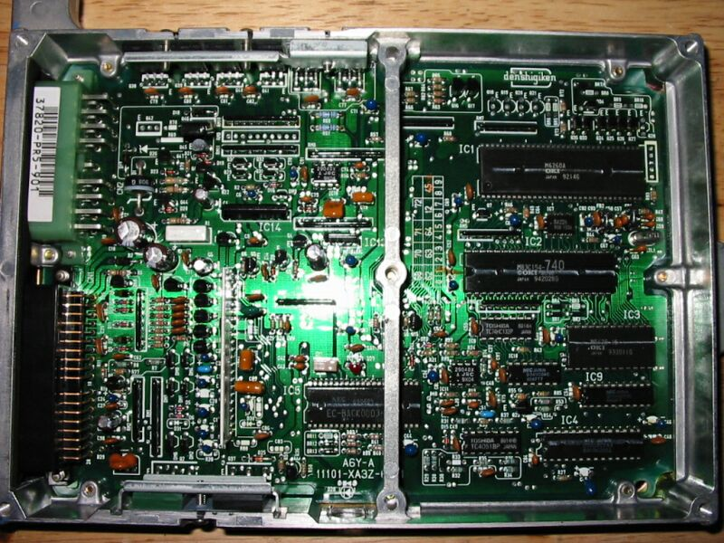

# PR5 ECU Technical Overview

The PR5 ECU was utilized in the 1990–1991 JDM Integra ZXi (1.6L SOHC). It serves as the Japanese Domestic Market (JDM) equivalent to the USDM D16A6 engine control unit.

## ECU Identification

The PR5 is an OBD0-based ECU. It is commonly found in automatic transmission configurations for the ZXi trim level.

### Hardware Reference

```carousel

*Top view of the PR5 automatic ECU*
<!-- slide -->

*Identification label on the PR5 housing*
```

> [!NOTE]
> Ensure the ECU part number matches your specific engine harness and transmission configuration before installation, as JDM pinouts may vary from USDM counterparts.

## Technical Specifications

*   **Engine:** D16A (SOHC)
*   **Market:** JDM (Japan)
*   **OBD Standard:** OBD0
*   **Transmission:** Automatic (Typical)

> [!IMPORTANT]
> When swapping or tuning OBD0 ECUs, verify the resistor box requirements for your specific fuel injectors, as the PR5 may require specific impedance matching depending on the vehicle's original wiring harness.