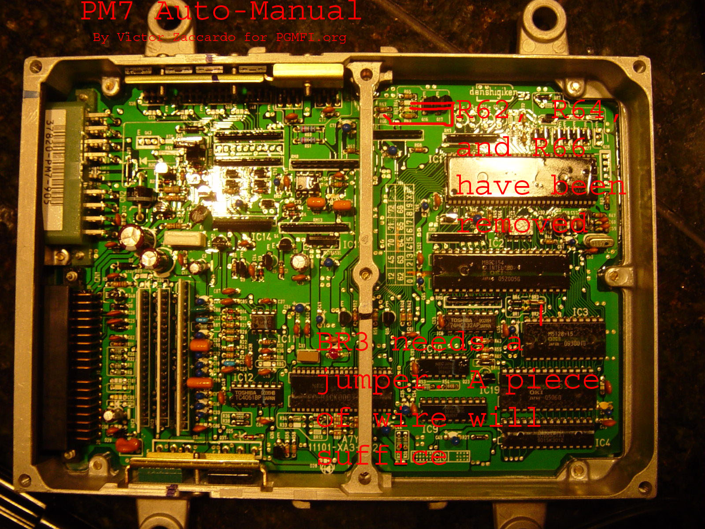

# PS9 Auto Manual

Remove `R62`,`R64`,`R66` right by the center divider to turn an auto [ECU](/cars/ecu/ecu) into a 5 spd. [JDM](/cars/sensors/jdm) [ECU](/cars/ecu/ecu)s also require the addition of BR3. This also applies to PG7, PM6 and PM7 [ECU](/cars/ecu/ecu)s which share the same pc board.

<figure>
 
</figure>
