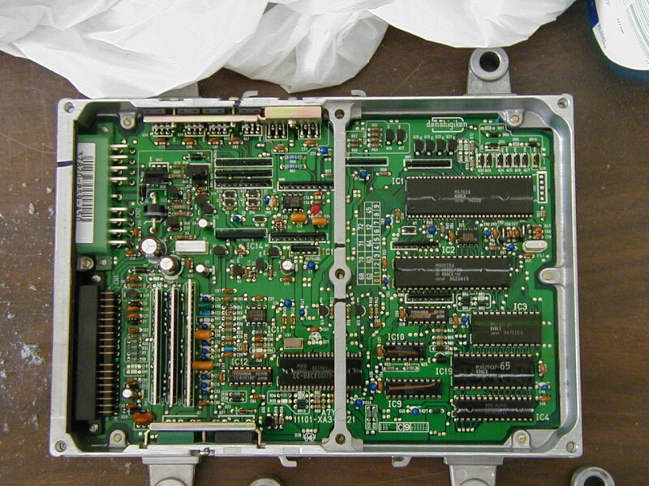

# PS9 ECU Technical Overview

The PS9 ECU was utilized in 1990–1991 USDM Civic EX models equipped with the 1.6L SOHC engine and automatic transmission. Architecturally, the PS9 is identical to the PM6 ECU, with the addition of dedicated circuitry required to manage automatic transmission functions.

*Internal view of the USDM PS9 automatic transmission ECU*

> [!NOTE]
> The PS9 shares the same base logic and hardware as the PM6, making it a functional equivalent for manual transmission applications provided the transmission control components are not required.

## Technical Specifications

*   **Application:** 1990–1991 USDM Civic EX
*   **Engine:** 1.6L SOHC
*   **Transmission:** Automatic
*   **Base Architecture:** PM6

## Compatibility and Usage

Because the PS9 is essentially a PM6 with added transmission control logic, it is often used as a donor or replacement for PM6-based systems. When using a PS9 in a manual transmission vehicle, the automatic transmission control pins remain unused, and the ECU operates identically to a standard PM6 unit.
