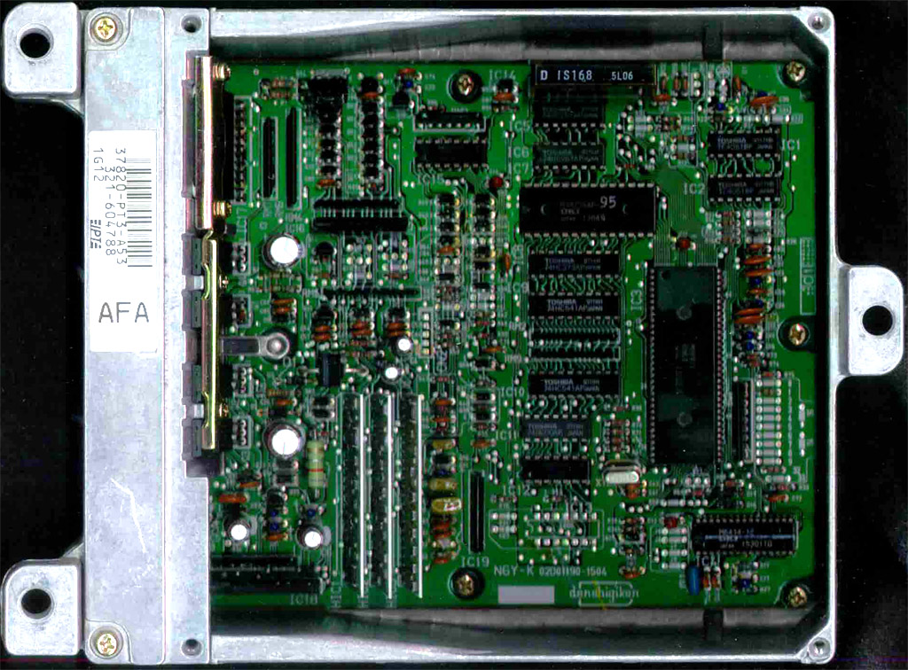
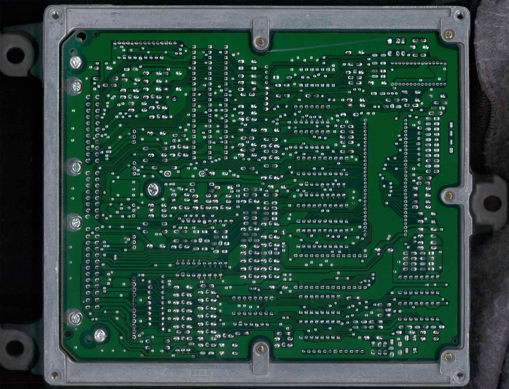
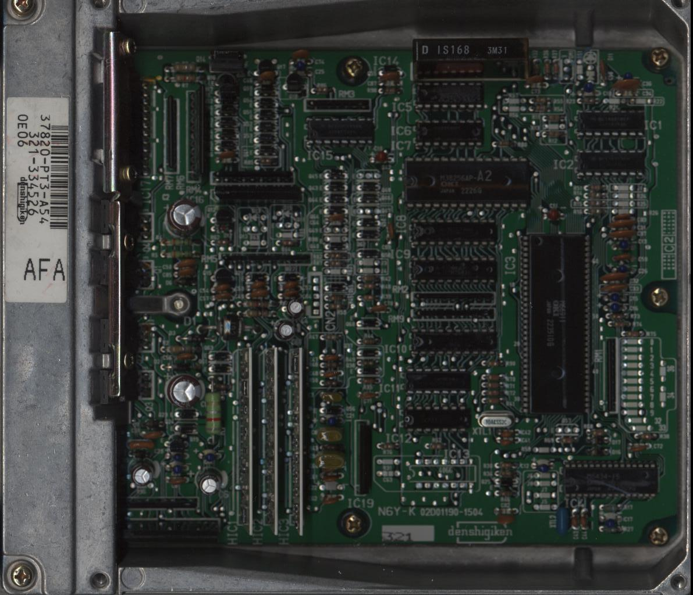
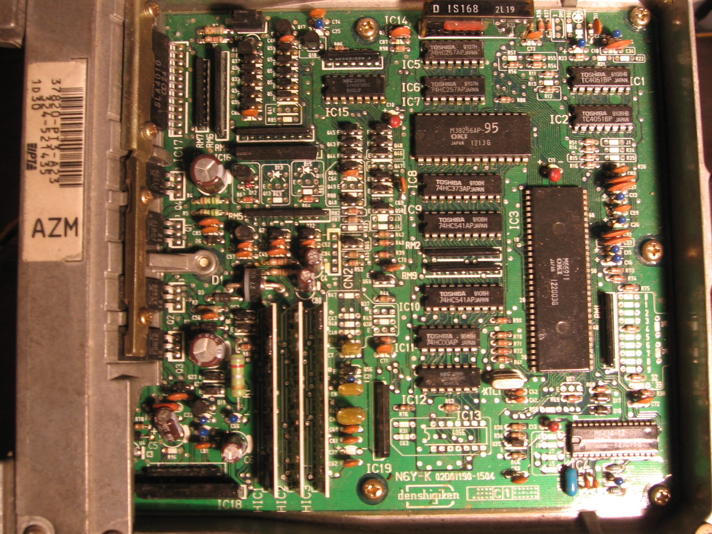
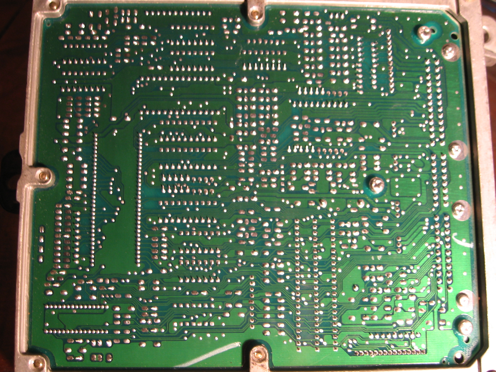
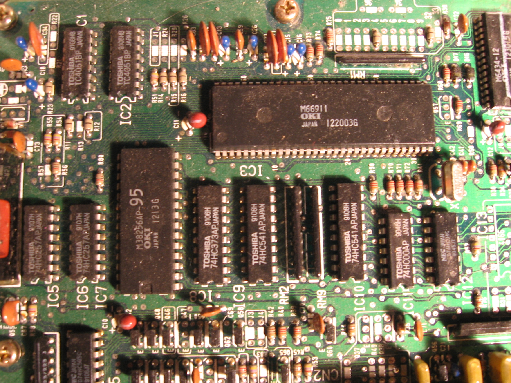

# PT3 ECU Technical Reference

The PT3 ECU is an OBD1 engine control unit utilized in 1990–1993 USDM Honda Accord vehicles equipped with the SOHC non-VTEC F22A1 engine. This unit shares the same printed circuit board (PCB) architecture as the EDM PT5 Accord ECU (part number 02D01190-1504).

## PCB Overview

The PT3 architecture is consistent across various regional variants. The following images detail the component layout and board design.

```carousel

*Top view of the PT3 PCB assembly*
<!-- slide -->

*Bottom view of the PT3 PCB assembly*
```

## Variant Specifications

The PT3 ECU was produced in several configurations depending on transmission type and regional emissions requirements.

| Variant | Application | Transmission |
| :--- | :--- | :--- |
| PT3-A23 | 1991 USDM EX Accord | Manual |
| PT3-A54 | 1992 Canadian LX Accord | Automatic |

> [!NOTE]
> The PT3-A23 variant utilizes the OKI 66911 processor, 38256 memory, and 74HC373 latch ICs.

## Component Gallery

```carousel

*PT3-A54 variant for automatic transmission*
<!-- slide -->

*Front view of the PT3-A23 manual transmission ECU*
<!-- slide -->

*Back view of the PT3-A23 manual transmission ECU*
<!-- slide -->

*Detail of OKI 66911, 38256, and 74HC373 IC placement*
