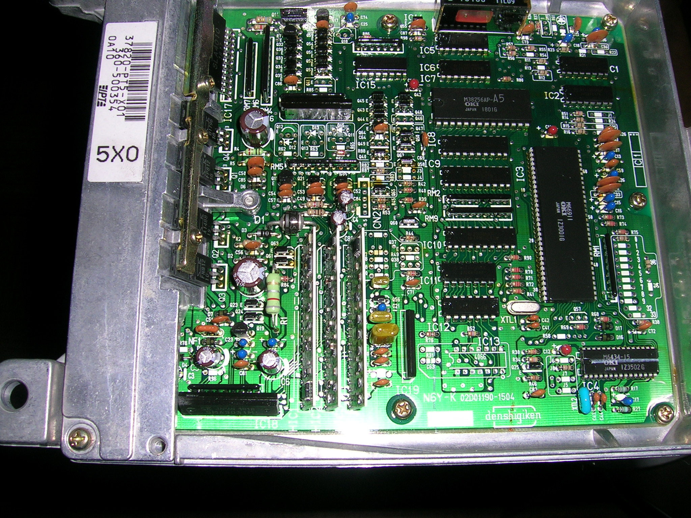
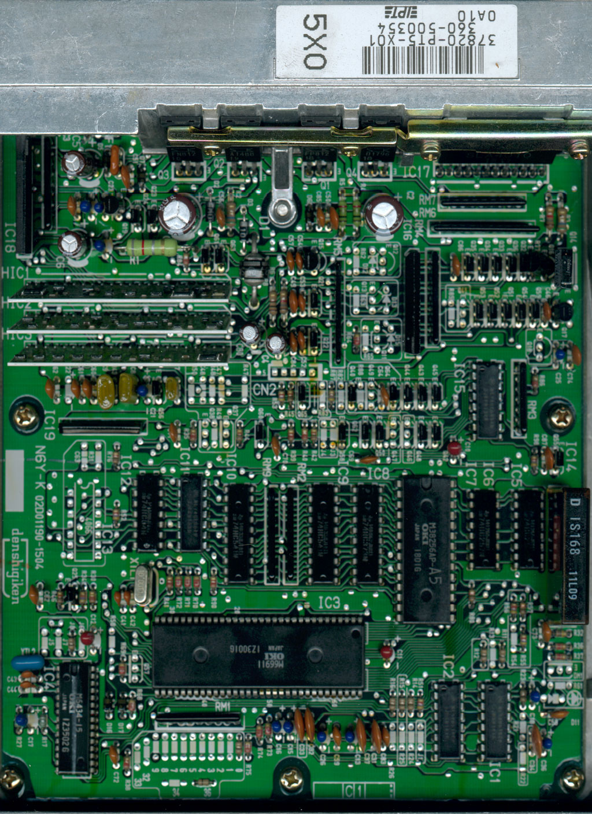

# PT5 EDM OBD1 ECU Technical Reference

The PT5 is an OBD1 ECU utilized in 1990–1993 European (EDM) Honda Accord models equipped with the SOHC non-VTEC F20A7 engine. 

> [!NOTE]
> This unit shares the same printed circuit board (PCB) architecture as the PT3 Accord ECU (Board ID: 02D01190-1504).

## PCB Overview

The PT5 utilizes the 02D01190-1504 board layout. Use the following carousel to inspect the component layout and board configuration.

```carousel

*Front view of the PT5 EDM ECU PCB*
<!-- slide -->

*Back view of the PT5 EDM ECU PCB*
```

## Technical Specifications

*   **Application:** 1990–1993 EDM Accord
*   **Engine:** F20A7 (SOHC Non-VTEC)
*   **OBD Standard:** OBD1
*   **PCB ID:** 02D01190-1504