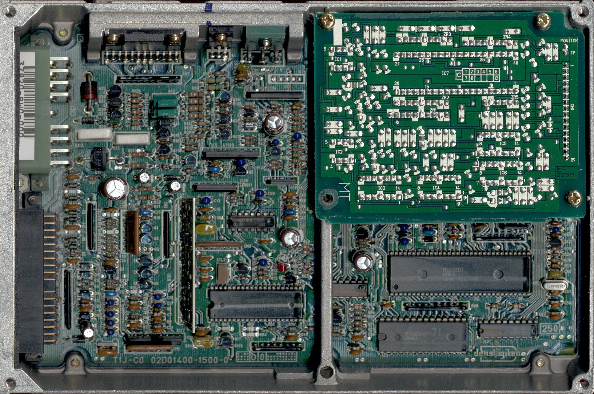
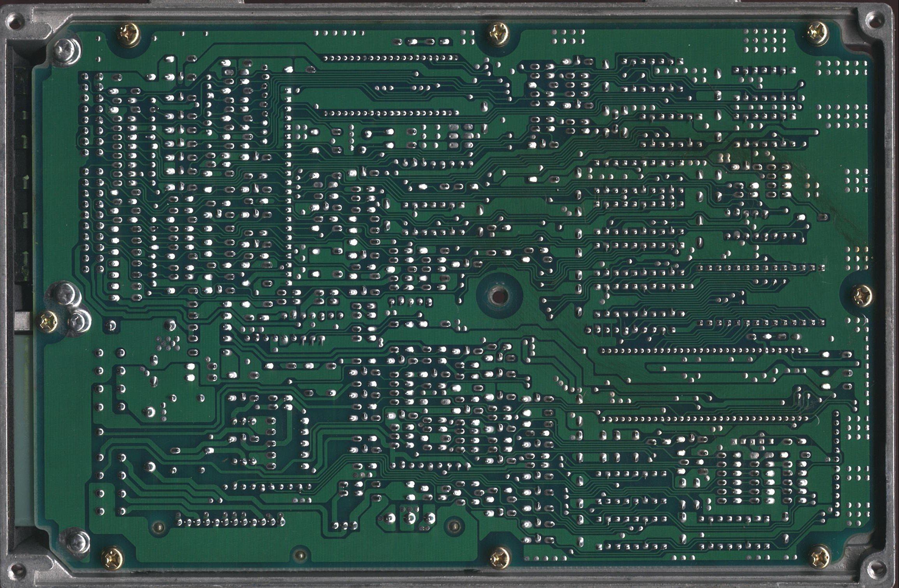

# OBD0 Honda PW0 ECU Reference Guide

The PW0 Engine Control Unit (ECU) is an OBD0 controller utilized in JDM and European-market vehicles from 1989 to 1991. It was standard equipment in the JDM Civic SiR (EF9), CRX SiR (EF8), and Integra XSi/RSi (DA6), managing the first-generation DOHC VTEC 1.6L B16A engine.

## Overview

The PW0 features a robust internal architecture utilizing an OKI-based microcontroller and dual knock sensor inputs on JDM variants. This guide outlines critical ROM address locations for modifying parameters, including checksums, VTEC crossovers, and rev limits.

### ECU Board Scans

```carousel

*Front of PW0 PCB showing main components*
<!-- slide -->

*Back of PCB showing solder points*
```

---

## JDM PW0 ROM Address Map

The following table details hex address offsets within the EEPROM for standard JDM PW0-000 calibrations.

| Location | Bytes | Description | Notes |
| :--- | :---: | :--- | :--- |
| **20B2** | 1 | Checksum Bypass | Change `0xC9` to `0xCB` to bypass checksum |
| **391A** | 1 | High Cam Rev Limiter | Warm/VTEC engine RPM fuel cut |
| **391C** | 1 | Low Cam Rev Limiter | Low cam engine RPM fuel cut |
| **3922** | 1 | High Cam Rev Recovery | RPM where VTEC fuel cut recovers |
| **3AD8** | 1 | VTEC Disengage Speed | Lower VTEC cut-off speed threshold |
| **3AD9** | 1 | VTEC Engage Speed | VTEC engagement speed threshold |
| **3ADA** | 1 | VTEC Disengage RPM | Crossover low RPM hysteresis limit |
| **3ADB** | 1 | VTEC Engage RPM | Crossover high RPM activation point |
| **3BE6** | 255 | Low Cam Ignition Map | 15x17 low cam ignition advance map |
| **3CE5** | 255 | High Cam Ignition Map | 15x17 VTEC ignition advance map |
| **3DE4** | 255 | Low Cam Fuel Table | 15x17 base fueling lookup map |
| **3EE3** | 15 | Low Cam Multipliers | Column multiplier coefficients |
| **3EF2** | 255 | High Cam Fuel Table | 15x17 VTEC fueling lookup map |
| **3FF1** | 15 | High Cam Multipliers | Column multiplier coefficients |

---

## European PW0 ROM Address Map

The following table details hex address offsets within the EEPROM for European-spec PW0 calibrations.

| Location | Bytes | Description | Notes |
| :--- | :---: | :--- | :--- |
| **1F21** | 1 | Checksum Bypass | Change `0xC9` to `0xCB` to bypass checksum |
| **3928** | 1 | High Cam Rev Limiter | Warm/VTEC engine RPM fuel cut |
| **392A** | 1 | Low Cam Rev Limiter | Low cam engine RPM fuel cut |
| **3930** | 1 | High Cam Rev Recovery | RPM where VTEC fuel cut recovers |
| **3AEC** | 1 | VTEC Disengage Speed | Lower VTEC cut-off speed threshold |
| **3AED** | 1 | VTEC Engage Speed | VTEC engagement speed threshold |
| **3AEE** | 1 | VTEC Disengage RPM | Crossover low RPM hysteresis limit |
| **3AEF** | 1 | VTEC Engage RPM | Crossover high RPM activation point |
| **3BE6** | 255 | Low Cam Ignition Map | 15x17 low cam ignition advance map |
| **3CE5** | 255 | High Cam Ignition Map | 15x17 VTEC ignition advance map |
| **3DE4** | 255 | Low Cam Fuel Table | 15x17 base fueling lookup map |
| **3EE3** | 15 | Low Cam Multipliers | Column multiplier coefficients |
| **3EF2** | 255 | High Cam Fuel Table | 15x17 VTEC fueling lookup map |
| **3FF1** | 15 | High Cam Multipliers | Column multiplier coefficients |

---

## Fuel Column Multiplier Formula

Because 8-bit cell values (0–255) provide limited resolution, the PW0 ECU applies a column-specific multiplier coefficient to each load column.

$$\text{Column Multiplier} = \frac{2^{\text{Multiplier Value}}}{4}$$

> [!IMPORTANT]
> The final calculated injector pulse-width uses this multiplier to scale the raw fuel map cell value into the final injection duration. Refer to the fuel mapping documentation for specific load scaling procedures.