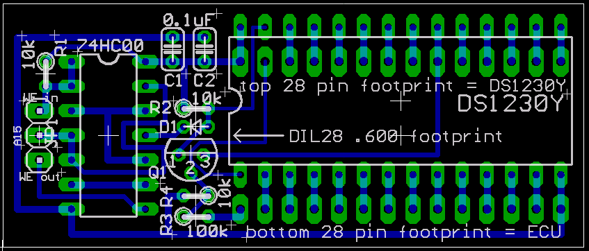

# DIY Easy-RTP v1.0 Build and Installation Guide

Real-Time Programming (RTP) allows tuners to edit an ECU's fuel and ignition maps while the engine is running, eliminating the need to burn and swap EPROM chips for every tuning iteration. The Easy-RTP v1.0 is a DIY EPROM emulator board designed to house a 28-pin Non-Volatile SRAM (NVSRAM) chip, such as the Dallas DS1230Y, for use with socketed Honda OBD1 ECUs.

> [!WARNING]
> This design requires board-level soldering and live ECU memory changes. Disconnect power while wiring and verify all cuts and jumpers with a multimeter before applying power.


*Eagle CAD trace layout diagram for the Easy-RTP v1.0 PCB.*

---

## Parts List

### Core Components
* **NVSRAM IC**: Dallas/Maxim **DS1230Y** (or compatible 32KB 28-pin 600-mil DIP NVSRAM).
* **Logic Gate IC**: **74HC00** (Quad 2-input NAND gate).
* **Capacitors**: Two **0.1 uF** ceramic capacitors.
* **Resistors**: Two **10 kohm** resistors.
* **ECU Interface Headers**: Two **1x14 pin headers** (0.1" pitch, machine pin headers recommended).
* **ROM Socket**: One **28-pin DIP Socket**.

### Optional Components (27C256 Emulation)
Required only if using a programmer that cannot natively program the selected NVSRAM.
* **Resistors**: One **10 kohm** and one **100 kohm**.
* **NPN Transistor**: One **2N4401** (or equivalent).
* **Diode**: One **1N4148** (or equivalent).

---

## Assembly Procedure

1. **Install Interface Headers**: Solder the two 1x14 pin headers from the bottom (trace side).
2. **Install NVSRAM Socket**: Solder the 28-pin DIP socket in the top set of holes. Ensure the chip alignment notch faces **Left**.
3. **Install J1 Jumper**: Solder a 3-pin male header or a 3-wire jumper at the **J1** location.
4. **Solder Capacitors**: Install the two 0.1 uF capacitors at **C1** and **C2**.
5. **Solder Core Resistors**: Solder the 10 kohm resistors at **R1** (left) and **R2** (center).
6. **Configure Emulation Mode**:
    * **Standard**: Solder a solid wire jumper or 0-ohm resistor across **D1**.
    * **27C256 Emulation**: Solder the **1N4148** diode at **D1**, the NPN transistor at **Q1**, the 10 kohm resistor at **R3**, and the 100 kohm resistor at **R4**.
7. **Finalize**: Solder the **74HC00** IC in place and insert the **DS1230Y** NVSRAM into the socket.

### Assembly Gallery

```carousel

*Top of the raw PCB.*
<!-- slide -->

*ECU interface pins inserted from the bottom.*
<!-- slide -->

*Completed board with DS1230Y installed.*
```

---

## OBD1 Installation Reference

Installation requires piggybacking the module into the ECU's 28-pin ROM socket. You must isolate the write-enable (WE) line on the ECU PCB to allow the RTP board to control memory writes.


*Completed Easy-RTP module installed piggybacked into a USDM OBD1 ECU.*


*Highlighting the location to slice the trace on the bottom of the OBD1 board to isolate the write pin.*

---

## OBD0 Modification

Running the Easy-RTP v1.0 on an OBD0 ECU requires additional logic to handle different ROM addressing.

### Additional Components
* **74LS86N** (Quad 2-input XOR gate)
* **10 kohm** resistor
* Thin insulated jumper wire

### Modification Steps
> [!WARNING]
> This procedure involves modifying the base NAND IC and isolating specific ECU pins. Verify all signal paths against the schematic before proceeding.

1. **Prepare XOR Gate**: Trim all pins on the 74LS86N except Pins 4, 5, 6, 7, and 14.
2. **Piggyback**: Mount the 74LS86N on the base 74HC00 NAND IC. Solder Pins 4, 7, and 14 to the corresponding pins below.
3. **Signal Routing**: Bend Pins 5 and 6 upward and wire according to the specific OBD0 signal requirements.
4. **Isolate ECU Pin 16**: Cut the connection to ECU Pin 16 on both sides of the board, then reconnect the original circuit so only the ECU pin remains isolated.
5. **Connect RTP Board**: Connect one RTP wire to the isolated ECU Pin 16 and the other to Pin 21 of the ECU's 24-pin M5128 SRAM.

---

## Design Files
* [Easy-RTP v1.0 Eagle CAD Files (ZIP)](easyrtpv1-eagle.zip)
* [Easy-RTP v1.0 Board Schematic PDF](rtp_EasyRtpV10-v1.pdf)
