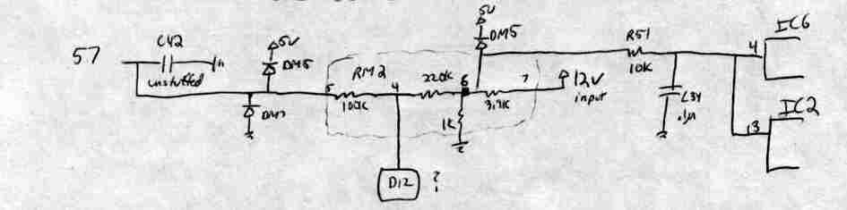
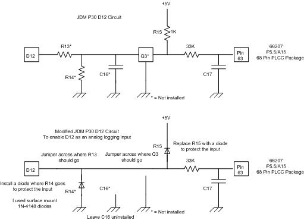
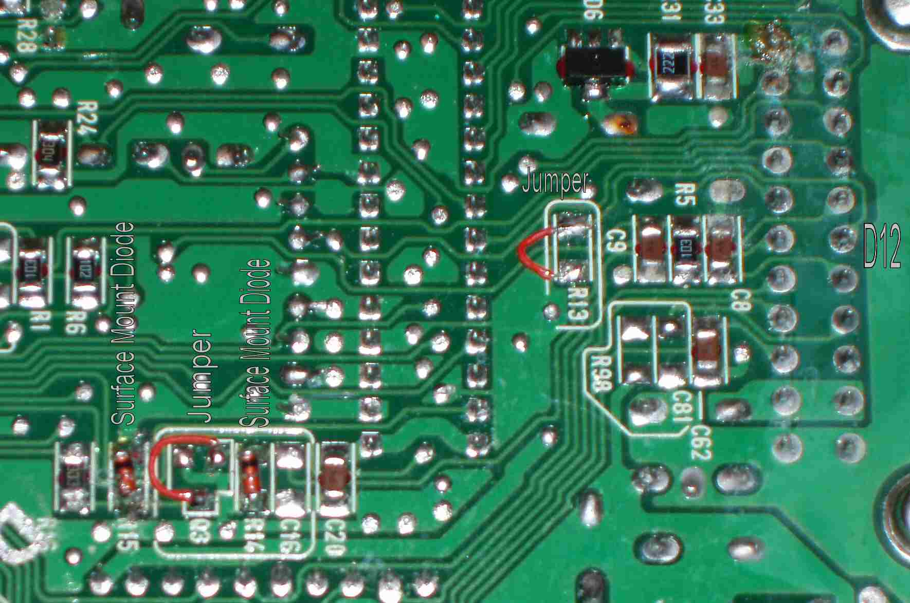

# JDM P30 D12 Analog-Input Modification

This modification enables the use of the D12 input on a JDM OBD1 P30 ECU to log a 0-5 V analog signal, such as the output from an EGT thermocouple amplifier.

> [!WARNING]
> This procedure involves modifying ECU board circuits. While successful tests have been reported on specific P30 variants, compatibility with other OBD1 ECUs is not established. Verify circuit integrity and software behavior before implementation.

## P30 Variant Comparison

The following table outlines the differences between USDM and JDM P30 ECU architectures regarding the D12 input circuit.

| Detail | USDM P30 | JDM P30 |
| :--- | :--- | :--- |
| **D12 Components** | Fully installed | Partially missing |
| **D12 Circuit** | Simplified | Complex |
| **D12 Analog Input** | AI3 (66207 Pin 57) | AI5 (66207 Pin 63) |
| **Grounded Input** | AI5 (66207 Pin 59) | AI3 (66207 Pin 61) |
| **High 8 ADC Bits** | RAM 067h | RAM 06Bh |
| **Low 2 ADC Bits** | RAM 066h (MSB 2 bits) | RAM 06Ah (MSB 2 bits) |

> [!NOTE]
> The labels in the table above reflect the JDM context. Ensure your specific board revision matches these pin assignments before proceeding.

### Circuit Schematics
```carousel

*Archived schematic of the USDM P30 D12 circuit.*
<!-- slide -->

*Archived before-and-after schematic for the JDM P30 D12 modification.*
```

## Modification Procedure

Perform the following modifications on the underside of the ECU PCB:

1. **Replace R15:** Remove the existing component and replace it with a diode.
2. **Install R14:** Install a 1N-4148 surface-mount diode to provide protection for the 66207 analog input.
3. **Jumper R13:** Install a jumper across the R13 pads.
4. **Jumper Q3:** Add a jumper across the non-ground connections of Q3 to route the D12 signal into the modified circuit.
5. **Retain Components:** Leave the 33kΩ R16 resistor and C17 (tantalum capacitor) in their original positions.


*High-resolution view of the modified JDM P30 board.*

## AI5 Software Considerations

OBD1 firmware may utilize AI5 for internal functions. If conflicts arise, the following invasive modification may be required to force the ECU to treat the JDM board like a USDM board:

1. **Isolate:** Cut the traces leading to both AI3 and AI5 at the 66207 MCU.
2. **Ground:** Permanently ground AI5.
3. **Route:** Bridge the D12 circuit to the AI3 input.

> [!IMPORTANT]
> This pin-swap method is an unverified historical proposal. It has not been documented for broader compatibility and should be treated as experimental.

## Related Resources

- [Logging an external 0-5 V sensor through D12](/cars/tuning/how-to-log-external-data-such-as-an-egt-sensor)
- [Honda ECU datalogging overview](/cars/diagnostics/data-logging)
- [P30 ECU reference](/cars/sensors/p30)