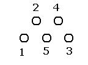
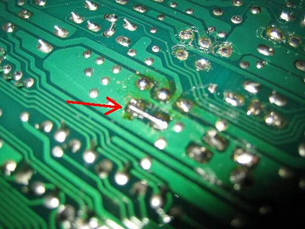
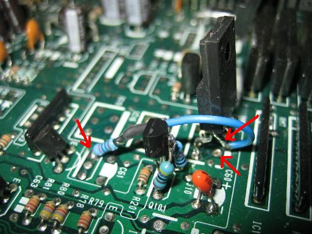

# 5050s

Use this method if you install a 5050s in `IC14` and you get a MIL code 21. **STEP 1** modify and install the VTEC parts as normal but stop at the installation of `IC14` **STEP 2** install the 5050s in the `IC14` position and do not solder pin 4 of the 5050s **STEP 3** on the [PCB](/cars/wiring/pcb) of the [ECU](/cars/ecu/ecu) bridge pads 2 and 4 ( do not bridge the legs of the 5050s ) **STEP 4** get a 820R resistor and solder 4cm of wire to one side and solder the other end of the resistor to the emitter of `Q102` ( as a 5v ref ) **STEP 5** solder the other side of the wire to pin 4 of the 5050s, you might want to trim back the leg a bit so it doesn't stick out to much. and thats it, enjoy your VTEC I tested a [ECU](/cars/ecu/ecu) with this method on the Engine Simulator in VTEC for over 5 minuits continuously and it did not mis a beat and nothing got to hot. link to thread [https://web.archive.org/web/http://forum.pgmfi.org/viewtopic.php?t=12672](/pgmfi/forum/topic.php?id=12672)cheers John b16A2

| **Attachment:** | **Modify:** | **Size:** | **Date:** | **Who:** | **Comment:** | | :--- | :--- | :--- | :--- | :--- | :--- | |  [5050s-VTEC007.jpg](5050s-VTEC007.jpg) | mod | 37420 | 27 Jan 2007 - 14:30 | b16a2 | link pin 2 and 4 | |  [5050s-VTEC006.jpg](5050s-VTEC006.jpg) | mod | 46044 | 27 Jan 2007 - 14:31 | b16a2 | final layout | |  [image003.jpg](image003.jpg) | mod | 2848 | 27 Jan 2007 - 14:32 | b16a2 | 5050s layout |
