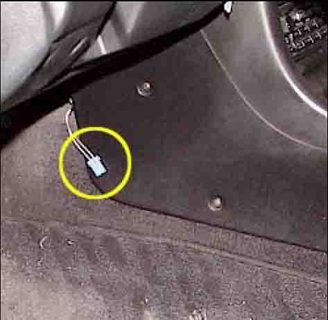
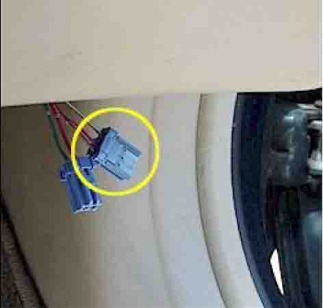
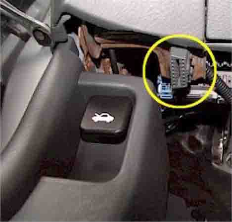
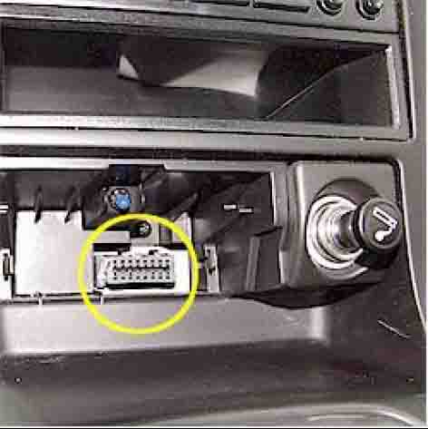
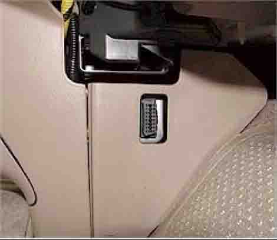
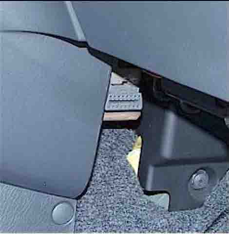
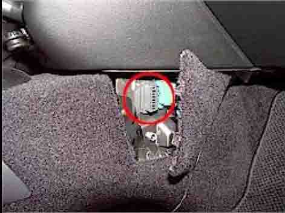

# Honda Data Link Connector (DLC) Reference

The **Data Link Connector (DLC)** is the diagnostic interface port used to communicate with Honda Engine Control Units (ECUs). Depending on the vehicle's model year and On-Board Diagnostics (OBD) generation, Honda utilizes either a proprietary legacy 3-pin connector or the standardized SAE 16-pin J1962 connector.

---

## Proprietary 3-Pin Data Link Connector (OBD0 / OBD1)

On OBD0 and OBD1 vehicles (roughly 1988–1995), Honda used a proprietary **3-pin DLC** port to transmit serial K-Line diagnostic data. 

* **2-Wire vs. 3-Wire Configuration**: Depending on the specific model and trim, this connector may be populated with either two or three wires:
  * **3-Wire Models**: Provide a constant +12V power supply line, Ground, and a Serial Data line. This allows diagnostic scanners (such as the dealer-level Vetronix Mastertech) to power up directly from the port.
  * **2-Wire Models**: Only contain the Ground and Serial Data lines. When using a diagnostic tool on these models, the scanner must be plugged into an external 12V power source (such as the cigarette lighter socket or battery clips).
* **Service Check Connector (SCS)**: The 3-pin DLC is always located directly adjacent to a separate **2-pin blue connector**. This is the Service Check Connector (SCS) or Service Check Signal port, which is shorted with a jumper or paperclip to read flashing CEL codes on the dashboard.

### 3-Pin Connector Locations

* **Right Lower Edge of Passenger Dash**:
  * 1994–1995 Accord (L4)
  * 1992–1995 Civic
  * 1993–1995 Civic del Sol
* **Behind Front of Center Console**:
  * 1992–1995 Honda Prelude *(Note: Typically a 2-wire setup requiring external tool power).*
* **Behind Passenger Glove Box**:
  * 1995 Honda Odyssey
* **Left Driver Kick Panel**:
  * 1994–1995.5 Honda Passport

### 3-Pin DLC Hardware Views


*Proprietary 3-pin blue DLC connector (right) and 2-pin blue SCS connector (left) on a 1992–1995 Civic.*


*Close-up of the integrated diagnostic port bracket.*

---

## Standardized 16-Pin Data Link Connector (OBD2)

Starting with the V6 Accord in 1995, and standard on all USDM vehicles by 1996, Honda adopted the standardized **16-pin OBD2 DLC** (SAE J1962). 

* **Communication Protocol**: Honda uses the **ISO 9141-2** protocol for OBD2 communications. Pins 7 (K-Line) and 15 (L-Line) are utilized for communication.
* **Pin Configuration**: Out of the 16 pins, Honda populates up to 7 pins for standard emissions diagnostics. The remaining pins are used for proprietary Honda systems (ABS, SRS, etc.).

### 16-Pin OBD2 DLC Locations

Because OBD2 standardized the connector but not its exact cockpit placement, Honda utilized several locations depending on chassis architecture:

````carousel

<!-- slide -->

<!-- slide -->

<!-- slide -->

<!-- slide -->

````

### Location Guide by Model

* **Under Driver Side Dashboard (Pointing Down)**:
  * 1998–2002 Accord
  * 1996–2000 Civic
  * 1996–1997 Passport
* **Behind Center Console Ashtray**:
  * 1995–1997 Accord V6
  * 1996–1997 Accord L4
* **Behind Center Console Access Cover**:
  * 1996–1997 Odyssey
* **Behind Front Center Console Trim**:
  * 1996–1997 Civic del Sol
  * 1997–2001 CR-V
* **Behind Center Console Removable Accent Panel**:
  * 1997–2001 Prelude
