A wideband oxygen sensor (also known as UEGO - Universal Exhaust Gas Oxygen sensor) is a crucial tool for tuning your Honda's engine. Unlike the stock narrowband O2 sensor, a wideband provides precise air/fuel ratio measurements across a wide range, allowing for accurate tuning and monitoring of your engine's performance.

This guide walks you through the process of installing and configuring a wideband sensor on an OBD1 Honda ECU. Although this guide is written primarily for AEM brand widebands, the same concepts and wiring principles apply to other major brands (using the battery offset and scaling values specified in their manuals).

## Overview

A wideband O2 sensor uses a complex sensor element and a controller box/circuit to heat and read the sensor. It outputs a 0-5V analog voltage, offering high resolution and accuracy across a wide range of air/fuel ratios (typically 10:1 to 20:1 AFR). In contrast, stock narrowband sensors output a narrow 0-1V signal, indicating only whether the mixture is richer or leaner than stoichiometry (14.7:1 AFR), which is not precise enough for tuning.

## Wiring

This wiring method is compatible with both the Hondata S300 and other hardware solutions, as it connects directly to the stock O2 sensor signal pin. If you are using a Hondata S300, you can also use the board's onboard analog inputs for a cleaner installation.

> [!TIP]
> Use a T-tap splice connector to connect wires to the factory harness without cutting. If your ECU uses a jumper harness, connect to those wires instead to keep your factory chassis wiring intact.

### Wiring Reference Table

::: widget wideband-wiring-table :::

> [!TIP]
> Connecting the Brown wire (differential ground) provides the best signal quality with the least interference, requiring little to no voltage offset correction in your tuning software.

## Configuration in HTS (Honda Tuning Suite)

### Download HTS
Download the latest version of Honda Tuning Suite from the official website: [hondatuningsuite.com](http://www.hondatuningsuite.com).

### Open Wideband Settings
Launch Honda Tuning Suite, then navigate to **File** > **Settings** > **Wideband** to open the configuration dialog.

### Select ECU Pin
Select pin **D14** for the wideband's signal input.

> [!NOTE]
> Due to the physical layout of the D14 circuit, pin D14 has a voltage limit of `3.8V`, which corresponds to an AFR reading of approximately `16.0` or higher. See the [Hondata D14 circuit limitations thread](https://www.hondata.com/forum/viewtopic.php?t=10423) for details.

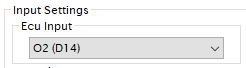
*ECU PIN selection for wideband input in HTS.*

### Configure Conversion Table
Configure the *Voltage to Lambda/AFR conversion table* by selecting a preset or specifying custom offsets. HTS has preconfigured values for both older AEM gauges (30-4100/30-4110) and newer models (X-Series, which are corrected in version 2.22F2).

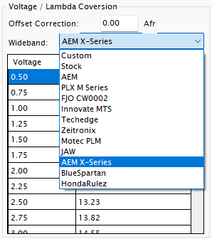
*Preconfigured wideband scaling presets in HTS 2.22F2.*

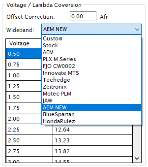
*Preconfigured wideband scaling presets in HTS 2.15.*

### Custom Offsets
If your wideband model is not listed, select **Custom** from the dropdown and input your wideband's voltage-to-lambda scaling values from the manufacturer manual. Ensure the output range is suitable; if 3.75V does not reach 15 AFR, configure the controller's output range to fit within D14's 3.8V limit. Alternatively, you can use EGR input pin D12, but this requires desoldering resistors on the ECU board and [only works on USDM/non-JDM ECUs](https://www.hondata.com/forum/viewtopic.php?t=8259).

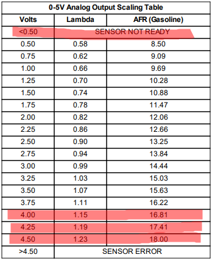
*AEM X-Series voltage scaling table.*

### Calibrate Voltage Offset
If you are using a physical gauge, compare the gauge's reading to the HTS display. Adjust the offset value (using the `-` and `+` buttons) until the values match exactly.

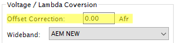
*Offset correction factor settings in HTS.*

## Configuration in Hondata SManager

The configuration process in Hondata SManager (for S300 boards) follows similar principles to HTS.

### Wiring
Connect your wideband's analog output to any of the S300 board's analog input pins (labeled **A0** through **A7**). If your wideband has an analog ground wire, connect it directly to the S300's analog ground pin (**GND**).

> [!TIP]
> To prevent voltage offsets, use thick-gauge wire for grounding, keep ground wires short, and ground both the wideband controller and the ECU to the same physical ground point.

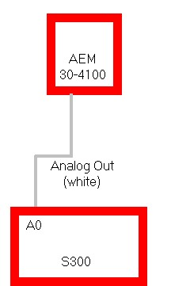
*AEM 30-4100 single analog output connection to S300.*

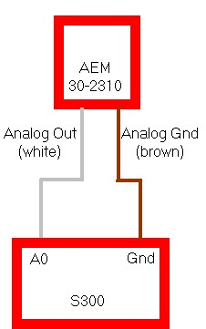
*AEM 30-2310 analog output and ground connection to S300.*

### Configuration Steps
1. Download SManager from [hondata.com/software](https://hondata.com/software).
2. Launch SManager and navigate to **Parameters** > **Closed Loop** or **Closed Loop Advanced** settings.
3. Under **Closed Loop**, configure your operating parameters.

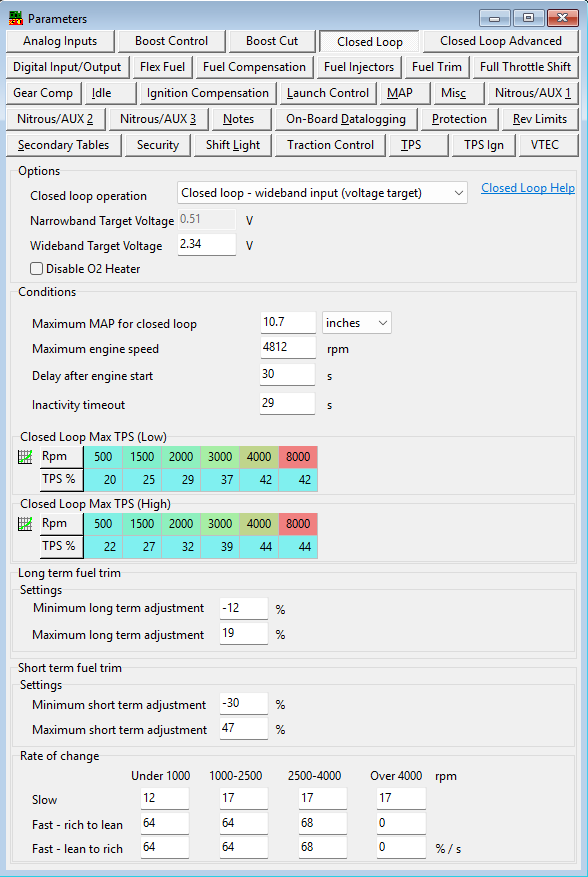
*Closed loop general parameters in SManager.*

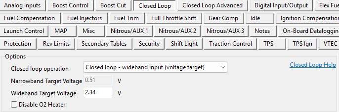
*Closed loop operation mode settings.*

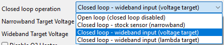
*Selecting the closed loop input source in SManager.*

4. Under **Closed Loop Advanced**, set your input source to the S300 analog pin you wired (A0-A7) and input any necessary voltage offsets.

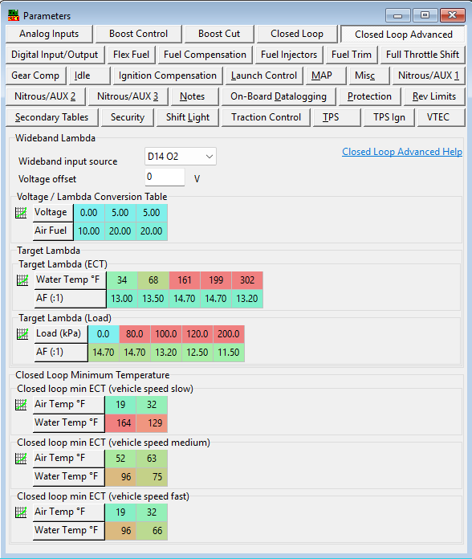
*Advanced Closed loop settings overview.*

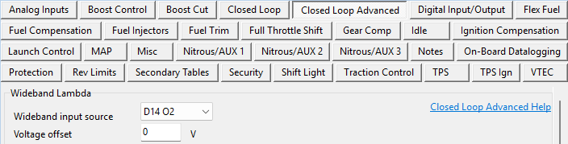
*Selecting the analog input pin and inputting voltage offset.*

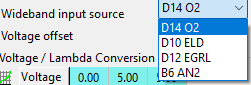
*S300 analog input options list.*

### Help File
Hondata provides comprehensive documentation in their help files, accessible both within SManager and online at the [Hondata SManager Help Index](https://www.hondata.com/help/smanager/index.html?analog_wideband.htm).
