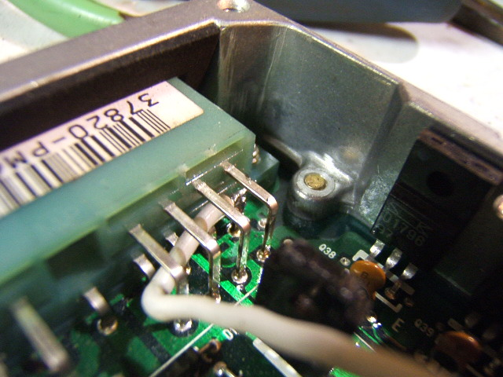
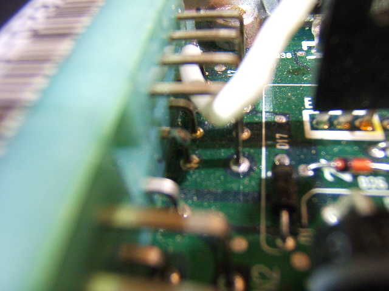
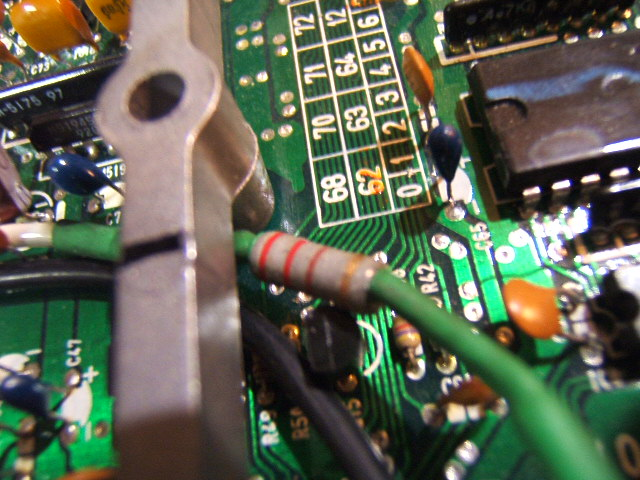
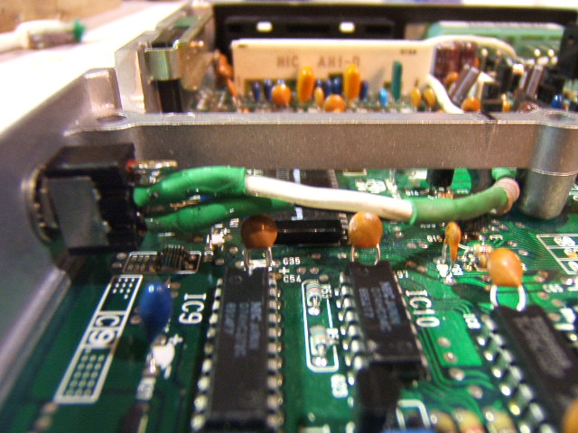
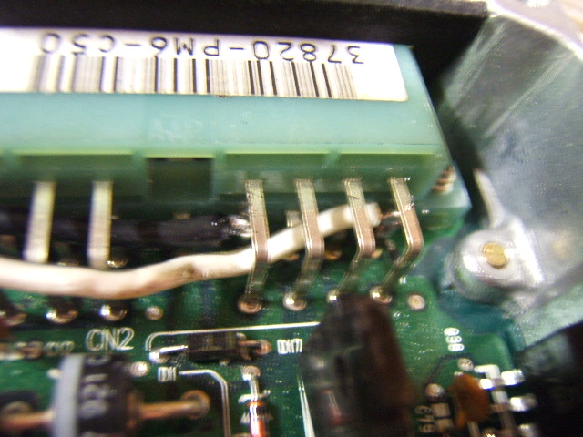
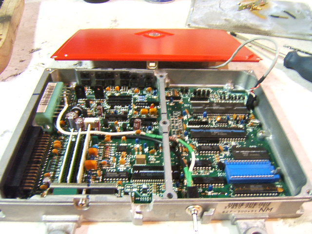
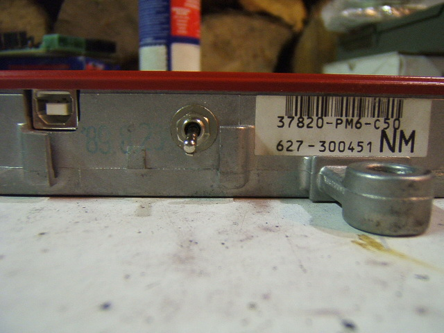
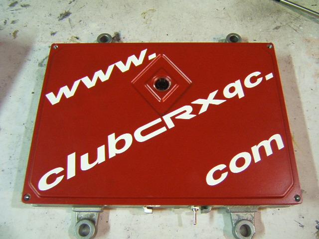

# OBD0 ECU Auto to Manual Conversion

When running an automatic OBD0 ECU (such as a PM6 from a Civic/CRX EX or LX) in a manual transmission vehicle, the ECU's transmission control routine checks for the presence of the automatic lock-up solenoid. If this solenoid is not detected, the ECU triggers a Check Engine Light (CEL) for **Code 19** (Automatic Transmission Lock-up Control Solenoid).

While the standard method to convert an ECU involves desoldering internal jumpers (such as RP1/RP2) or modifying the circuit board, this guide details a simple external harness modification developed by community member *defensio*. By faking the solenoid load using a resistor on the wiring harness, you can run a manual car on an automatic ECU without opening the ECU casing.

---

## The 220-Ohm Resistor Hack

To bypass the Code 19 check, you must wire a **220&Omega; resistor** between the ECU's lock-up solenoid output pin and ground. This mimics the electrical resistance of the factory solenoid coil, satisfying the ECU's current-draw monitoring circuit.

### Wiring Specification
* **Target Pin 1 (Output)**: Pin **`A8`** (Automatic Lock-up Solenoid output on OBD0 automatic ECUs).
* **Target Pin 2 (Ground)**: Pin **`A2`** (ECU Power Ground).
* **Resistor**: **220&Omega;** (1/4 Watt or 1/2 Watt resistor is sufficient).

### Harness Modification Steps

1. Locate the wires corresponding to Pins **`A2`** (Ground) and **`A8`** (Lock-up Solenoid) on your OBD0 wiring harness plugs.
2. Strip a small section of insulation from both wires near the connector.
3. Solder a 220&Omega; resistor inline between the two wires, bridging them.
4. Insulate the exposed solder joints using electrical tape or heat-shrink tubing to prevent short-circuits.

---

## Walking Through the Build (Visual Guide)

````carousel

<!-- slide -->

<!-- slide -->

<!-- slide -->

<!-- slide -->

<!-- slide -->

<!-- slide -->

<!-- slide -->

````

---

## Advanced Application: OBD0 VTEC Solenoid Repurposing

This harness hack is highly popular for **OBD0 VTEC conversions** (such as running a JDM B16A engine on an automatic USDM PM6 ECU). 

On JDM OBD0 VTEC ECUs (like the PW0 or PR3), Pin **`A8`** is the native control pin for the VTEC Solenoid. Because USDM automatic PM6 ECUs also use Pin `A8` to drive the automatic lock-up solenoid, you can upload JDM VTEC software onto a chipped USDM automatic ECU, and Pin `A8` will seamlessly act as the VTEC solenoid output.

### Using a Mode Toggle Switch
By wiring a Single Pole Double Throw (SPDT) switch between the ECU Pin `A8`, the 220&Omega; resistor (tied to Ground), and the engine's VTEC solenoid wire, you can create a switchable harness:
* **Manual / VTEC Mode**: Connects Pin `A8` directly to the VTEC Solenoid.
* **Auto Check Bypass Mode**: Connects Pin `A8` to the 220&Omega; resistor to bypass the automatic transmission diagnostic check.
