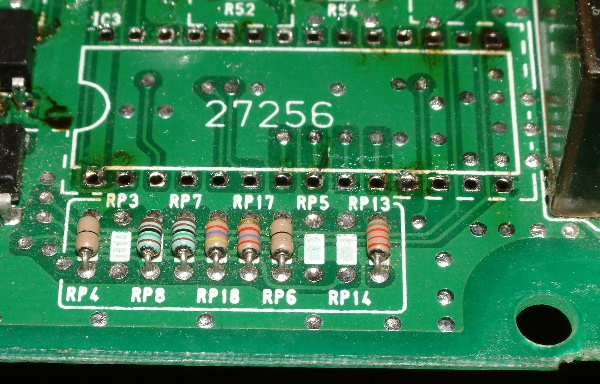
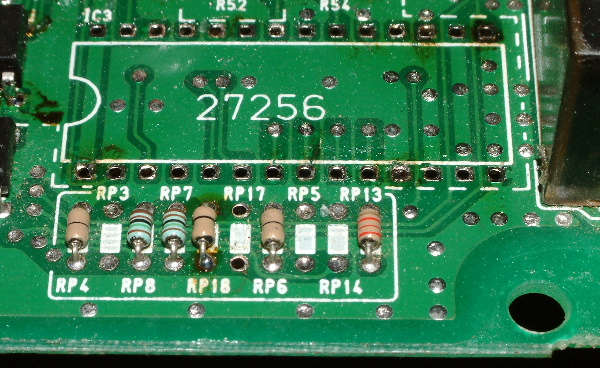

# OBD1 Civic/Integra Auto to Manual Conversion

USDM and JDM OBD1 Honda ECUs (such as the P28, P30, P72, and P06) share almost identical hardware boards for both automatic and manual transmission cars. You can convert these ECUs between automatic and manual configurations by modifying a few surface-mount resistors (RP17 and RP18).

## Overview

The ECU checks the electrical resistance at locations **RP17** and **RP18** to determine if it should look for an automatic transmission control system or operate as a manual ECU.
*   If configured as an automatic ECU on a manual car, the ECU will throw a **Code 19** (Automatic Transmission Lockup Control Solenoid) and may hold a slightly erratic idle.
*   Converting the board to manual tells the MCU to ignore the automatic transmission solenoids.

*OBD1 ECU board layout. The jumper configuration is located in the lower right, alongside the transmission transistor circuits.*

## Specifications

### USDM Resistor Values (RP17 & RP18)

| Jumper/Resistor Location | Automatic | Manual |
| :--- | :--- | :--- |
| **RP17** | 4.7k Ohm | *Open* (Removed) |
| **RP18** | 2.7k Ohm | *Jumpered* (0 Ohm wire) |

### JDM Resistor Values (RP18 Only)

| Jumper/Resistor Location | Automatic | Manual |
| :--- | :--- | :--- |
| **RP18** | 2.4k Ohm | 1.4k Ohm |

## Procedure

### USDM Automatic to Manual Conversion
To convert a USDM Automatic ECU (e.g., P28-A51, P06-A52) to Manual:
1.  Locate resistors **RP17** and **RP18** on the lower right corner of the ECU circuit board.
2.  De-solder and remove both **RP17** and **RP18** resistors.
3.  Install a simple solid jumper wire (or a 0-ohm resistor) in place of **RP18**. Leave **RP17** open (empty).

*Factory automatic resistor configuration showing RP17 and RP18 populated.*

*Converted manual configuration showing RP17 empty and RP18 jumpered with a wire.*

### JDM Automatic to Manual Conversion
JDM ECUs (typically large-case or small-case JDM P30, P72, or PR3) do not use the USDM RP17/RP18 configuration. Instead, they use a single resistor at **RP18** located on the back side of the board near the corner.
1.  Locate resistor **RP18** on the back side of the ECU board.
2.  De-solder the factory 2.4k Ohm resistor.
3.  Replace it with a **1.4k Ohm** resistor.

### USDM Manual to Automatic Conversion
If you need to run an automatic car on an originally manual ECU:
1.  Remove the jumper wire at **RP18**.
2.  Install a **2.7k Ohm** resistor at **RP18**.
3.  Install a **4.7k Ohm** resistor at **RP17**.
4.  Add the transmission solenoid driver chip/transistor array at position **`IC16`** (typically a `5050S` chip or equivalent) if it is missing from the manual board.

## Related

*   [Introduction to ECU Chipping](/cars/rom/introduction-to-ecu-chipping)
*   [ECU Hardware](/cars/ecu/ecu-hardware)
*   [ECU Troubleshooting](/cars/diagnostics/ecu-troubleshooting)
