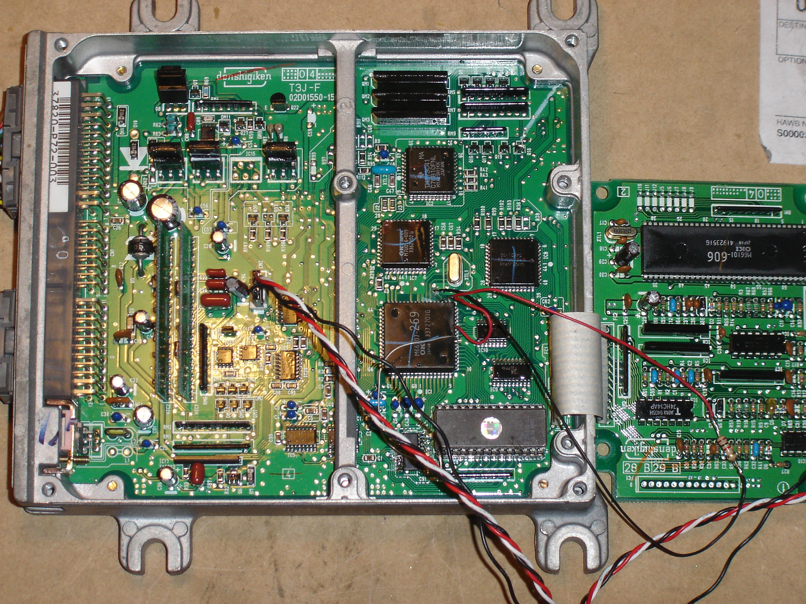

# OBD1 Oki66207 Reader-PLCC68

After doing Doc's mod to read out the stock rom from a Australian P30 ECU with the `66207` in a 64 pin dip config, I started thinking that somewhere on the web I saw a [JDM](/cars/sensors/jdm) [ECU](/cars/ecu/ecu) with the socket for the external rom bare with no `74HC373`. I have in my posesion a [JDM](/cars/sensors/jdm) P30 with external Eprom and wondered if I could read this [ECU](/cars/ecu/ecu) using [Docs method](/cars/wiring/obd1-oki66207-reader-dip64). After converting everything to work off the `66207` in a 68 pin PLCC configuration, I was able to read out the contents of the [MCU](/cars/rom/mcu) the same way as you would on the 64 pin Dip ECU. Anyways, to do this you just follow [Doc's method](/cars/wiring/obd1-oki66207-reader-dip64) BUT you need to chane a few things: Quote: ([Doc's method](/cars/wiring/obd1-oki66207-reader-dip64) with changes) We need to modify the [ECU](/cars/ecu/ecu) a bit to have a nice `66207` reader, here is a short description:

- If your [ECU](/cars/ecu/ecu) isn't chipped, you need to add the `74HC373`, the [EPROM](/cars/rom/eprom) socket and the 1k Ohm resistor (`R54`).
- Connect a wire from the `66207` pin 17 (A15) to the Eprom Pin 1 (A15). DON'T PUT THE PIN 1 OF THE [EPROM](/cars/rom/eprom) IN THE SOCKET! JUST CONNECT THE WIRE TO IT.
- Connect a wire from the `66207` Pin 21 (P2.2) to the `66207` Pin 29 (-EA).
- Cut the track on [PCB](/cars/wiring/pcb) from pin 29 (see pic `66207`-1.bmp) and replace it with a 1k Ohm resistor.
- Put in the 27C512 Eprom, programmed with my "ROMREADER" program on it.
- Connect your PC via a RS232<->TTL converter to the [ECU](/cars/ecu/ecu) (see more informations in the datalogging section).

Let's read a `66207`: - Switch off your [ECU](/cars/ecu/ecu), or leave it off.
- Start the program on the PC: DOWNLOADER
- if the Address display isn't 0000, then click on RESET.
- Switch on your [ECU](/cars/ecu/ecu)
- After around 1 secound you should see the address counter running
- after almost a minute (i never stopped it) the address counter should show 8001
- now click SAVE to save your rom.

If something dosn't work, retry the procedure but don't forget to click on RESET. Now have fun with your own `66207` reader. Doc Thats It Dont forget to Solder the track you cut when finished to enable the external rom. - Hi Res of the overall setup: 
     
