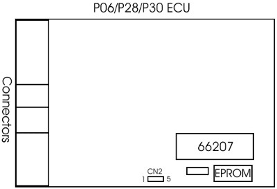

# OBD1CN2

`CN2` is the connector to the serial port on an [OBD1](/cars/wiring/obd1) [ECU](/cars/ecu/ecu). Here's the pinout of the Dataconnector *IN* a Honda [ECU](/cars/ecu/ecu):

- 1: GND
- 2: RX (send Data from the PC to the [ECU](/cars/ecu/ecu))
- 3: +5 Volt
- 4: TX (send Data from [ECU](/cars/ecu/ecu) to the PC)
- 5: N.C. (not connected)

This port is half-duplex (RX and TX are connected) in stock form. See [OBD1 J12](/cars/wiring/obd1j12) for more information about full-duplex modification. A good pin header for `CN2` is digikey part# 640456-4 ***Question From [Web Geek](/cars/electronics/web-geek)_*** "There are 3 search results for that part #, which is the right one?" For more information see this excellent post by Jim Truett: [https://web.archive.org/web/http://forum.pgmfi.org/viewtopic.php?t=1663](/pgmfi/forum/topic.php?id=1663)
