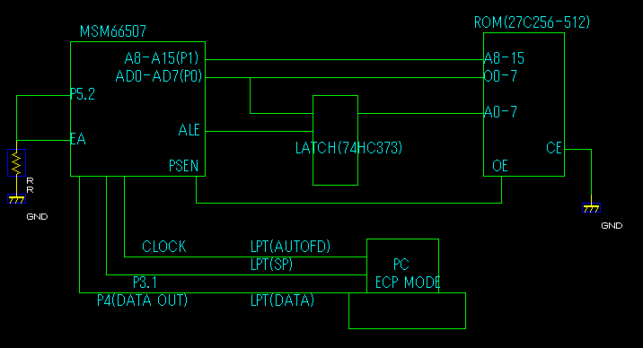

# OBD2 Oki66507 Reader Nico

Author: HRED (ABordeaux-103-1-10-174.abo.wanadoo.fr)
Date: 09-30-02 13:13
Here you can readout `66P507`... Nico

- Block diagram of dumper: 
     

| **Attachment:** | **Modify:** | **Size:** | **Date:** | **Who:** | **Comment:** | | :--- | :--- | :--- | :--- | :--- | :--- | |  [ROM-PGM.txt](ROM-PGM.txt) | mod | 1637 | 05 Mar 2004 - 17:36 | blundar | source code for [ROM](/cars/rom/rom) dumper |
