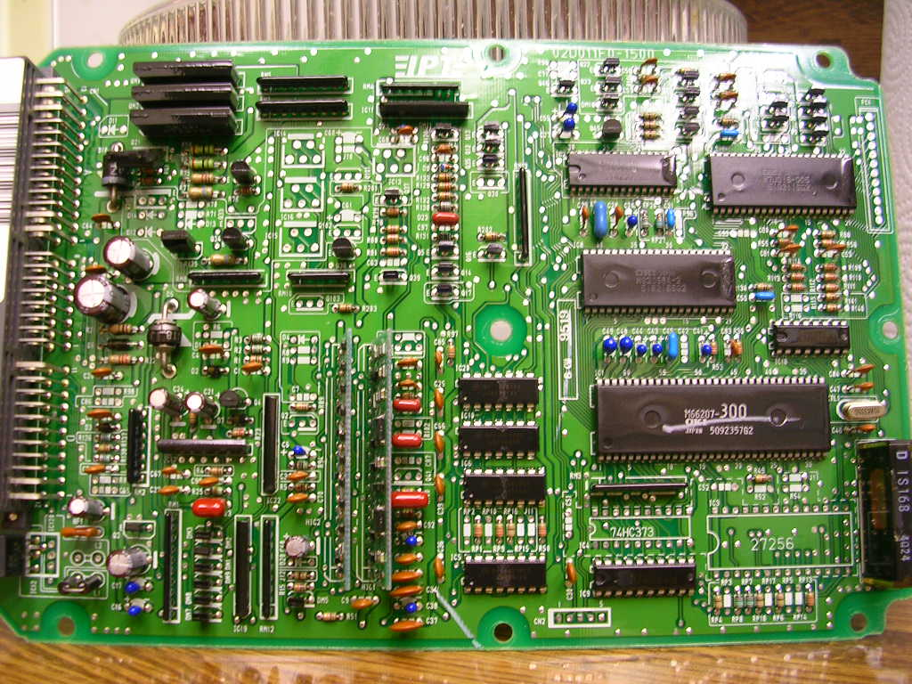

# P05

P05 92-95 [OBD1](/cars/wiring/obd1) Civic CX (D15B8) The P05 [ECU](/cars/ecu/ecu) came with the D15 [SOHC](/cars/sensors/sohc) non-vtec motor with close-coupled cat and a 1-wire O2 sensor in the 92-95 Civic CX. Basically an [OBD1](/cars/wiring/obd1) version of the 88-91 HF motor. FUEL ECONOMY!!! Heres a pic i took from a Stock P05. 
