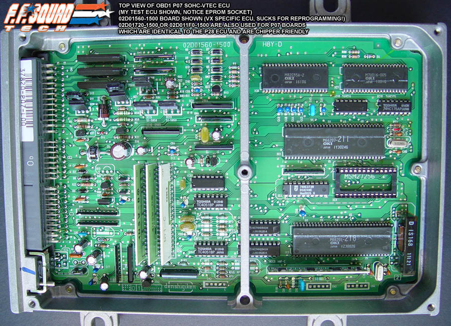
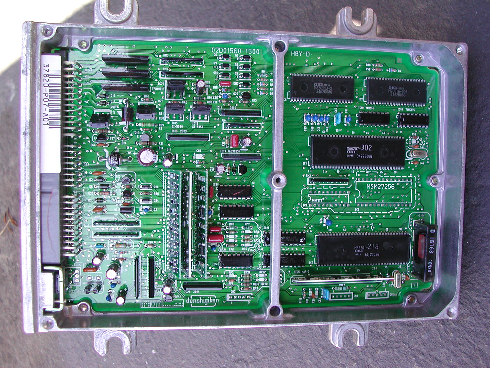
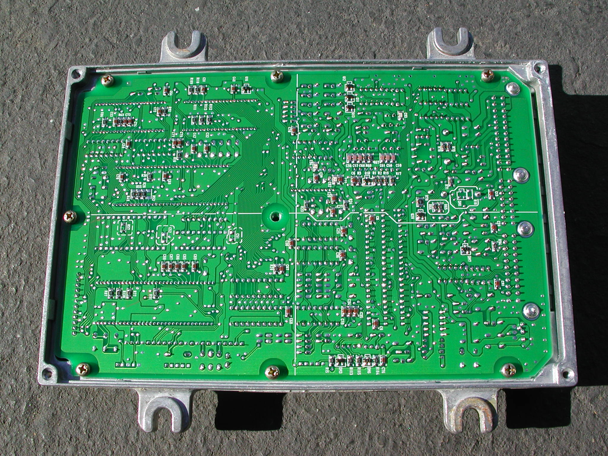
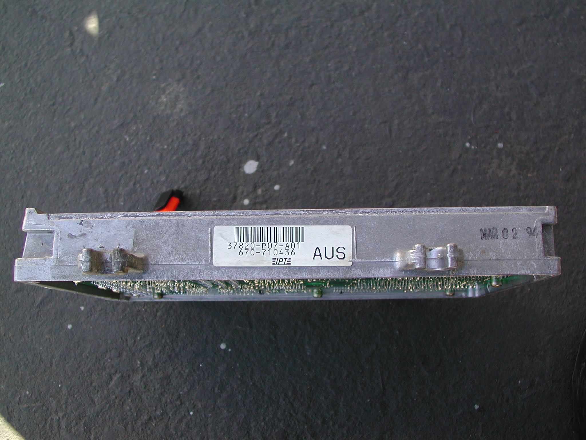

# P07

P07 92-95 [OBD1](/cars/wiring/obd1) Civic VX (D15Z1) Unique in that it has two `66207` processors (one presumably for the wideband O2) Note: 303 P07 Code is very similar to 304 P28-A01 Code, at least vectors are the same!

###  [RAM](/cars/reference/ram) 

| **Location** | **Bytes** | **Description** | **Notes** | | :--- | :--- | :--- | :--- | | 00CC | 1 | Speed sensor | Km/h | | 00D9 | 1 | [ECT](/cars/sensors/ect) sensor | 0v-5v `0x00`-`0xFF` | ###  [ROM](/cars/rom/rom) 

| **Location** | **Bytes** | **Description** | **Notes** | | :--- | :--- | :--- | :--- | | 1292 | 1 | VTEC Coolant Temp Check | (`0xD8` enables, `0xFF` disables) | | 1997 | 1 | Speed limiter Value | B7 is 183 km/h (114mph); FE is 254 km/h (158 mph) | | 1998 | 2 | Speed Limiter Routine Bypass | Change from jge label\\_something to two NOPs (00 00) to disable speed limiter | | 2BA3 | 2 | Checksum Jump Instruction | Change JEQ 2BB6 (`C9` 10) to SJ 2BB6 (CB ??) to disable checksum | | 60E6 | 1 | VTEC Enable | (`0xFF` enables, `0x00` disables) need to verify ? | | 60E7 | 1 | Knock Enable | (`0xFF` enables, `0x00` disables) need to verify ? | | 60FA | 1 | VTEC [VSS](/cars/sensors/vss) Check | (`0x00` enables, `0xFF` disables) need to verify ? | | 60FB | 1 | Debug Mode | (`0xFF` enables, `0x00` disables) need to verify ? | 
<figure>
    
    <figcaption>thanks Katman</figcaption>
</figure>

<figure>
    
    <figcaption>Thanks RaVer Motorsports</figcaption>
</figure>

<figure>
    
    <figcaption>Thanks RaVer Motorsports</figcaption>
</figure>

<figure>
    
    <figcaption>Thanks RaVer Motorsports</figcaption>
</figure>
