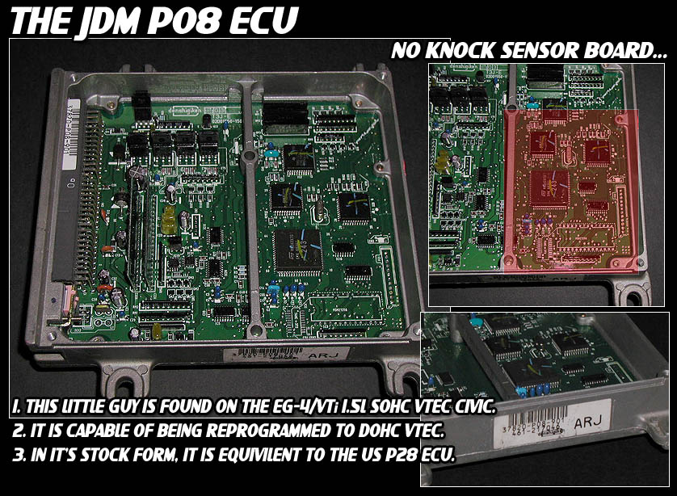
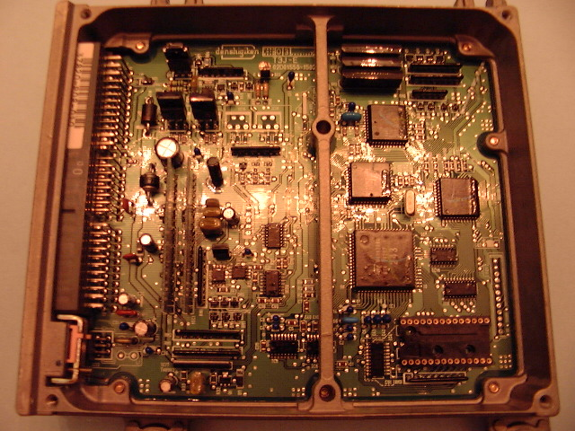
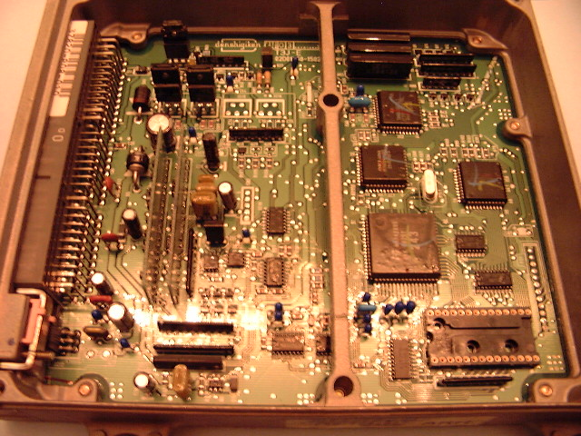
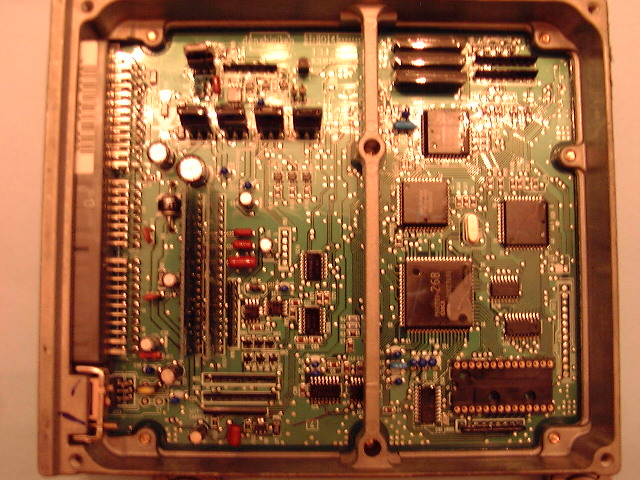
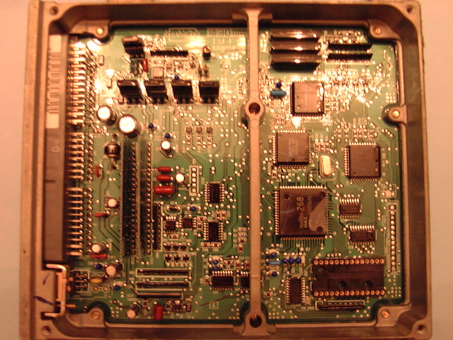
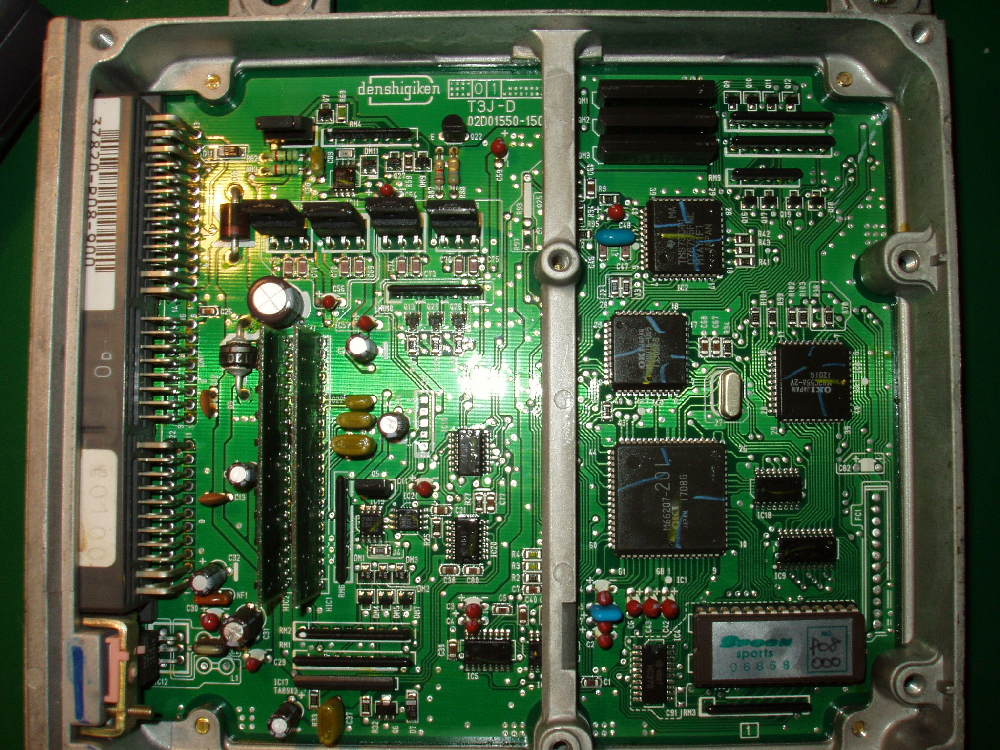

# P08

P08 92-95 [OBD1](/cars/wiring/obd1) Civic/CRX VTi/VXi (D15B SOHC VTEC) 1 Wire O2, otherwise pretty similar to [P28](/cars/sensors/p28).

<figure>
    
    <figcaption>thanks Katman</figcaption>
</figure>

<figure>
    
    <figcaption>manual [ECU](/cars/ecu/ecu) - thanks eg6ajk</figcaption>
</figure>

<figure>
    
    <figcaption>manual [ECU](/cars/ecu/ecu) - thanks eg6ajk</figcaption>
</figure>

<figure>
    
    <figcaption>auto [ECU](/cars/ecu/ecu) - thanks eg6ajk</figcaption>
</figure>

<figure>
    
    <figcaption>auto [ECU](/cars/ecu/ecu) - thanks eg6ajk</figcaption>
</figure>

<figure>
    
</figure>

<figure>
    
</figure>
