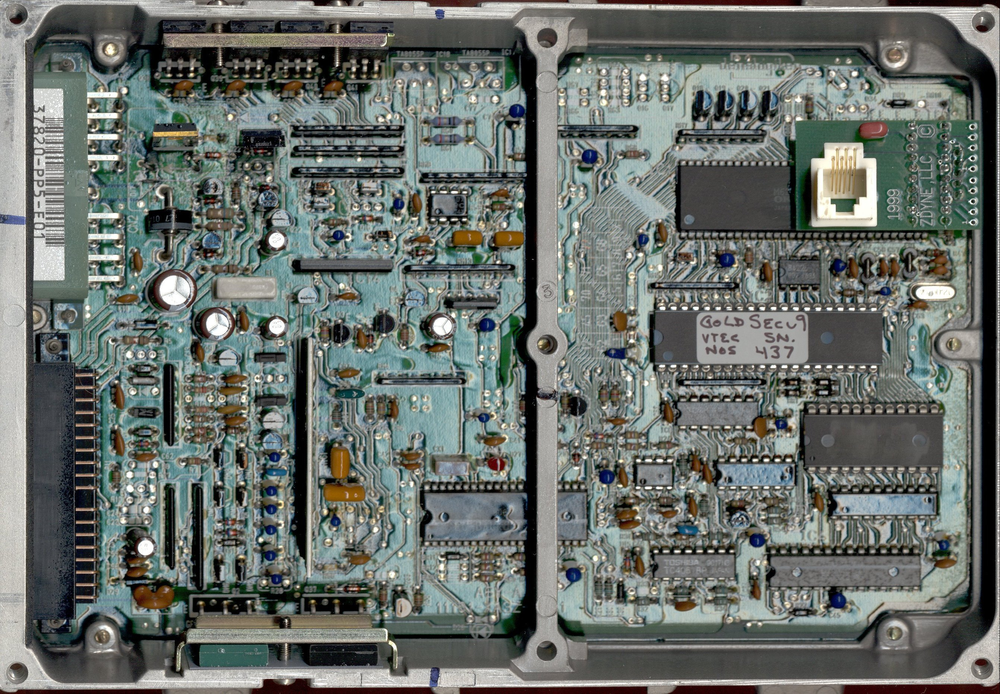
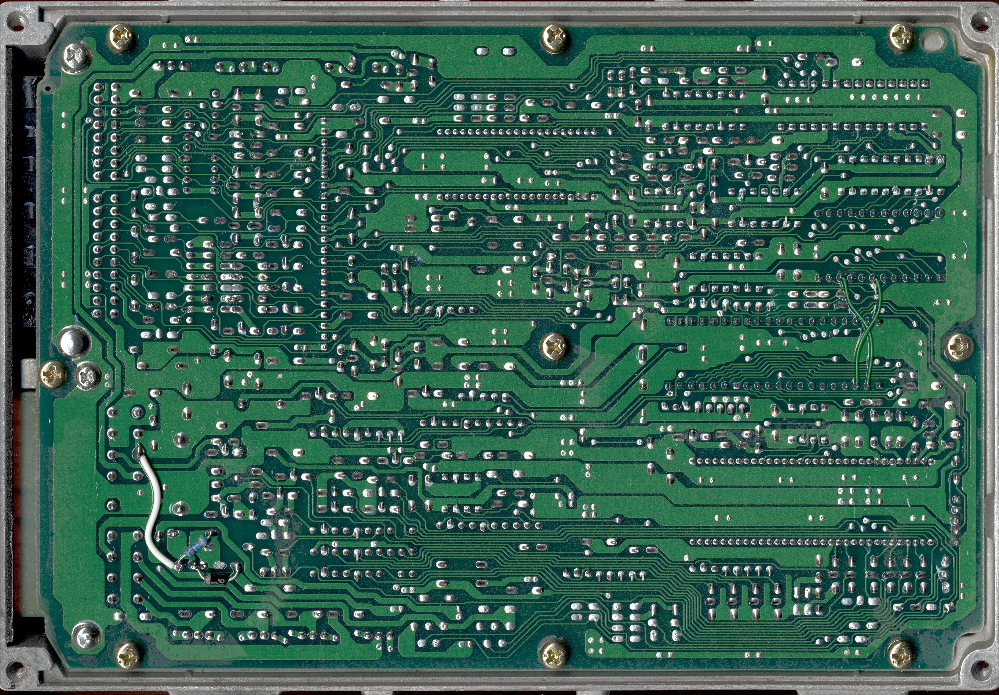
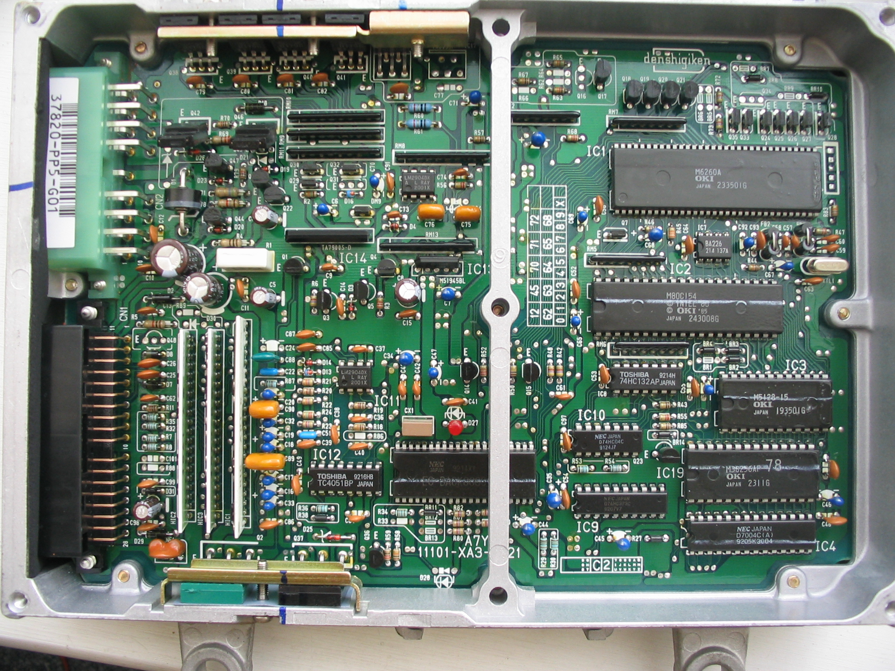

# PP5

##  PP5 : 90-93 (??) UK Rover 216 Cabrio
 

Rover (UK) had an agreement with honda where honda engines (ZC, most notably) ended up in Rover cars. They continued to use [OBD0](/cars/rom/obd0) style plugs and distributors into the early 90s apparently. They seem to be quite similar to most [ECU](/cars/ecu/ecu)s of the era.

The PP5-E01 is a romless ECU which ran the early Rover 216 , 416 , GSi , Gti and possibly the 220 and 420, these early romless [ECU](/cars/ecu/ecu)'s are mostly fitted to rovers without Lambda sensors. The early ECU's are difficult to chip and require some form of adapter like the romless PM6's and PM7's.
The alternatives are PP5-G01, PP4-`R00` or PP4-G01 which I beleive to all be external [ROM](/cars/rom/rom)'d ECU's and common place in the UK. They are all ODB0 non VTEC ECU's, and should be swappable with PM7, PM6, etc. Some of these [ECU](/cars/ecu/ecu)'s use an APS which may give [CEL](/cars/wiring/cel)/Limp when not present. 

PP5-E01 Rover 216 GTi (no lambda)
PP5-G01 Rover 216 GTi (with lambda), Honda Concerto 1.6 litre (DOHC) 93-96
PP4-G01 Rover 216 16V (with lambda), Honda Concerto 1.6 litre (SOHC) 92-96 
PP4-`R00` Rover 220 Coupe (with lambda), Honda Concerto 1.6 litre (SOHC) 93-96 
PP5-`R00` Honda Concerto 1.6 litre (DOHC) 93-96 

<figure>
    
    <figcaption>Mark Lamond's PP5 [ECU](/cars/ecu/ecu) top-side scan - Zdyne SECU</figcaption>
</figure>

<figure>
    
    <figcaption>Mark Lamond's PP5 bottom scan - Zdyne SECU</figcaption>
</figure>

<figure>
    
    <figcaption>PP5-G01</figcaption>
</figure>

<figure>
    
    <figcaption>PP5-G01</figcaption>
</figure>
