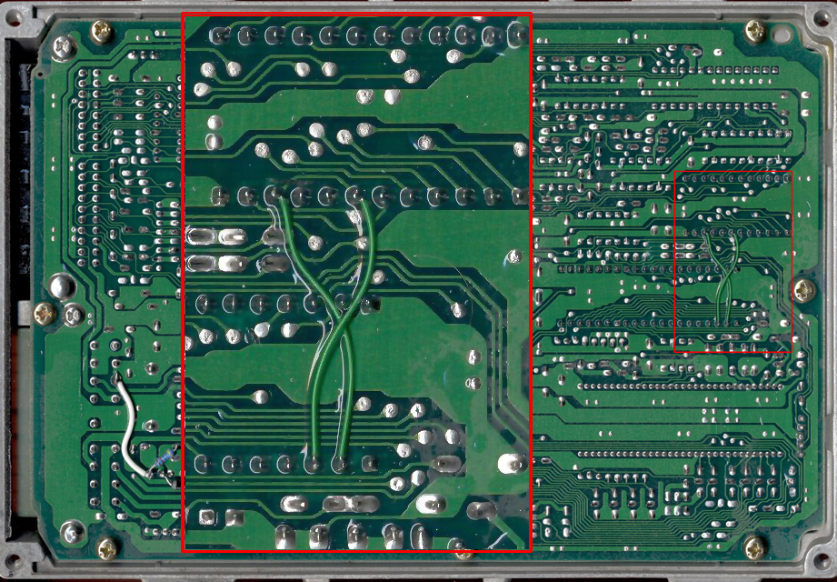
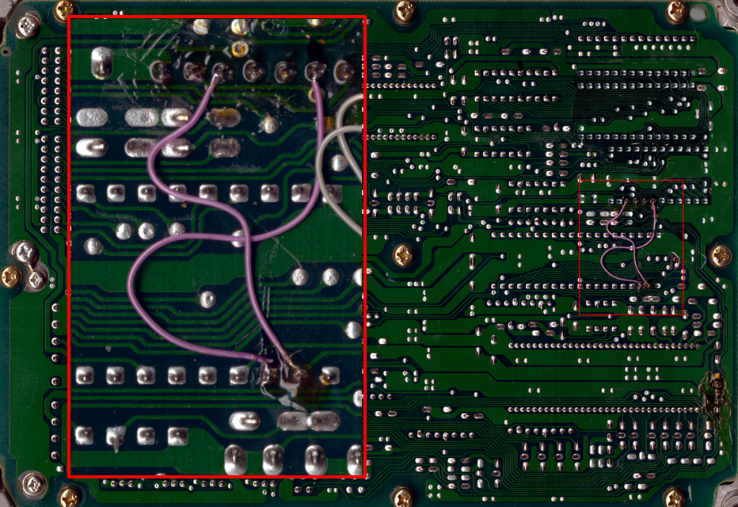
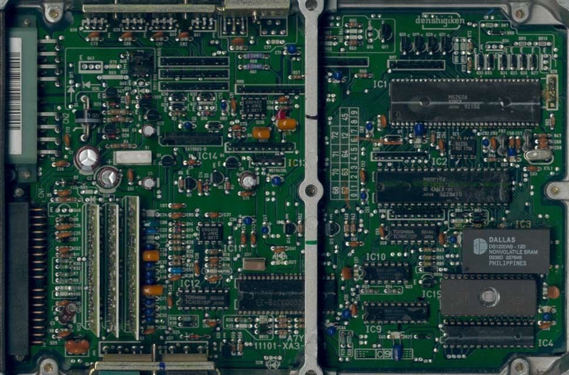

# Replace `M5128`

This page explain how to replace the current [5128 XRAM](/cars/rom/5128xram) 2K [SRAM](/cars/sensors/sram) chip by a `DS1220` [NVSRAM](/cars/wiring/nvsram) for future [RTP](/cars/sensors/rtp) solution.

- Brief Explanation
- Parts list:
- Construction:
- Step by step:
- Note:

###  Brief Explanation 

 The `M5128` chip is used to store and calculate values while the car is running. By default pin 19 and 22 are grounded, thus preventing full 2k addressing. Also, it is a good idea to replace the current `M5128` by a `DS1220` [NVSRAM](/cars/wiring/nvsram) module. This module behave like a normal ram, but its [RAM](/cars/reference/ram) content will remain when power is cut. ###  Parts list: 

- 1x DS1220AB
- 1x 24 pin IC socket
- 22 gauge wire (or smaller)

###  Construction: 

 It is pretty simple, but required a bit of dexterity. First you need to unsolder the `M5128`. Then, you should cut the traces of pin 19 an dpin 22 as they both connect to the ground. Solder the 24 pin IC socket. Then, solder a wire from `M5128` pin 19 to [MCU](/cars/rom/mcu) pin 23 and solder a wire from `M5128` pin 22 to [MCU](/cars/rom/mcu) pin 22 too. ###  Step by step: 

- Desolder `M5128`
- Cut traces to ground of pin 19 and pin 22
- Solder 24 pin IC socket
- Solder wire from `M5128` pin 19 to [MCU](/cars/rom/mcu) pin 23
- Solder wired from `M5128` pin 22 to [MCU](/cars/rom/mcu) pin 22
- Put in the DS1220AB

###  Note: 

The traces to be cut on a 90-91 [ECU](/cars/ecu/ecu) are on the component side. On the 88-89, there is 1 trace on the solder side, and 1 on the component side. You can check out the scans to help you out. 
<figure>
    
    <figcaption>Solder side of a 1988 - 1989 [ECU](/cars/ecu/ecu)</figcaption>
</figure>

<figure>
    
    <figcaption>Solder side of a 1990 - 1991 [ECU](/cars/ecu/ecu)</figcaption>
</figure>

<figure>
    
    <figcaption>Component side of a 1990 - 1991 [ECU](/cars/ecu/ecu)</figcaption>
</figure>
