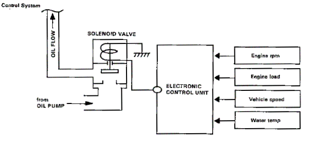

# VTEC Solenoid

The VTEC spool valve solenoid is an electronically controlled hydraulic valve that activates Honda's Variable Valve Timing and Lift Electronic Control (VTEC) system. When triggered by the ECU, the solenoid opens, routing high-pressure engine oil into the rocker arms to lock the low-speed and high-speed rocker cams together, engaging the high-lift camshaft profiles.

*Cross-section view showing how the VTEC solenoid routes oil pressure to lock rocker arms.*

## Overview

For the ECU to activate VTEC (typically by sending a +12V signal to the VTEC solenoid), several parameters must be met simultaneously:
1.  **Engine RPM:** Must exceed the VTEC engagement threshold (usually between 4,500 and 6,000 RPM depending on the engine code).
2.  **Engine Load (MAP):** Must indicate the engine is under load (not revving in neutral).
3.  **Vehicle Speed (VSS):** Must be above a minimum speed (typically 15 mph / 24 km/h).
4.  **Engine Coolant Temperature (ECT):** Must be warmed up to normal operating temperature (typically above 60°C / 140°F).
5.  **Oil Pressure:** Must be sufficient to actuate the rocker arm pins.

### VTEC Pressure Switch
On most OBD0 and OBD1 engines, the VTEC assembly includes a VTEC Oil Pressure Switch (located just below the solenoid). This switch verifies that sufficient oil pressure has reached the assembly before the ECU changes its fuel and ignition mapping to high-cam profiles. If oil pressure is too low, the ECU triggers Code 22 and halts VTEC engagement to protect the valvetrain.

## Wiring Reference

### OBD1 VTEC Solenoid and Pressure Switch Pinout

| Component | Pin | ECU Terminal | Description |
| :--- | :--- | :--- | :--- |
| **VTEC Solenoid** | 1-Pin Plug (Green) | **A4** | Solenoid control wire (+12V output from ECU to trigger VTEC) |
| **VTEC Pressure Switch** | Pin 1 (Light Blue/Blue) | **D6** | Pressure switch input (sent to ECU to verify oil pressure) |
| **VTEC Pressure Switch** | Pin 2 (Black) | Chassis Ground | Ground return for the pressure switch |

## Troubleshooting

### VTEC Will Not Engage (Common Causes)

1.  **Low Engine Oil Level:** This is the most common cause of VTEC failure. If oil is low, manifold oil pressure will drop under load, preventing the VTEC pressure switch from closing.
2.  **Clogged Spool Valve Screen:** The VTEC solenoid assembly sits on a metal gasket with an integrated fine wire screen. Over time, debris or engine sludge can clog this screen, restricting oil flow to the switch.
    *   *Fix:* Remove the three 10mm bolts holding the VTEC solenoid, clean the screen with brake cleaner, or replace the gasket/screen assembly.
3.  **VTEC Pressure Switch Troubleshooting (Code 22):** If your ECU is programmed to require the pressure switch, but your engine or wiring harness does not have one (e.g., JDMP30 or JDM B18C swaps), VTEC will not engage and will trigger Code 22.
    *   *Fix:* You can disable the VTEC pressure switch check inside the ECU's ROM program using a BIN editor, or jumper the ECU pins.

## Related

*   [Vehicle Speed Sensor (VSS)](/cars/wiring/vehicle-speed-sensor)
*   [ECU Trouble Codes](/cars/diagnostics/ecu-trouble-codes)
*   [Introduction to ECU Chipping](/cars/rom/introduction-to-ecu-chipping)
