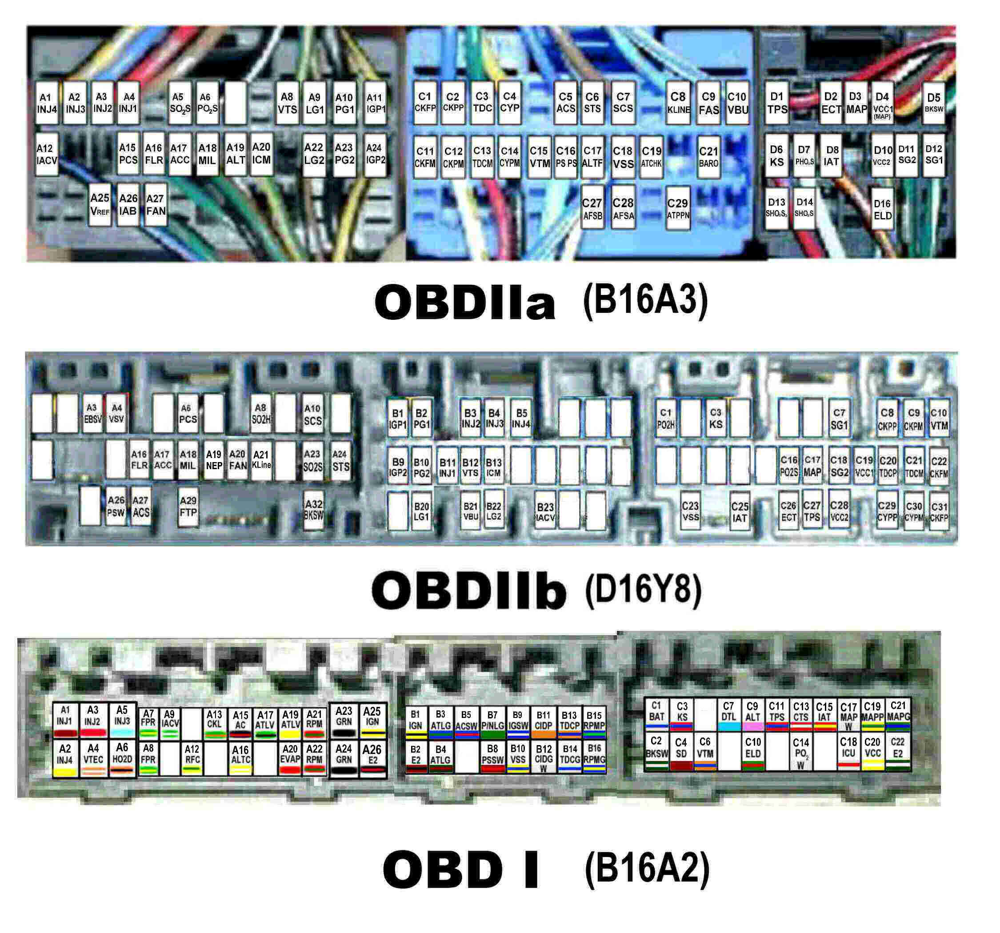

# Wire Harness

A wire harness is the set of connectors and wires attached to an [ECU](/cars/ecu/ecu). [OBD0](/cars/rom/obd0), [OBD1](/cars/wiring/obd1), and [OBD2](/cars/wiring/obd2) systems use different connectors and wiring layouts.

## ECU connector pinout

The following image compares OBD1, OBD2A, and OBD2B ECU connector pinouts:

[View the archived high-resolution image](http://web.archive.org/web/20070625073443/http://kl2.smugmug.com/photos/64116307-O.jpg)

> [!WARNING]
> The source referenced factory-manual OBD1 Integra ECU connector scans that may have been associated with the [P72 ECU](/cars/sensors/p72), but those scans are not currently available.
